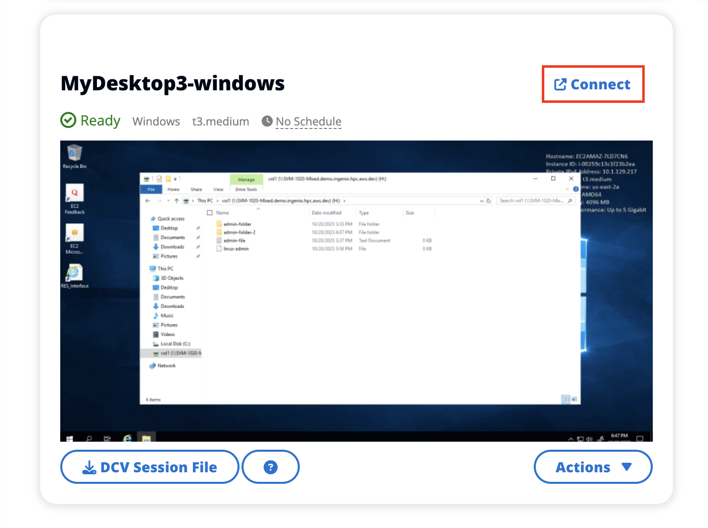
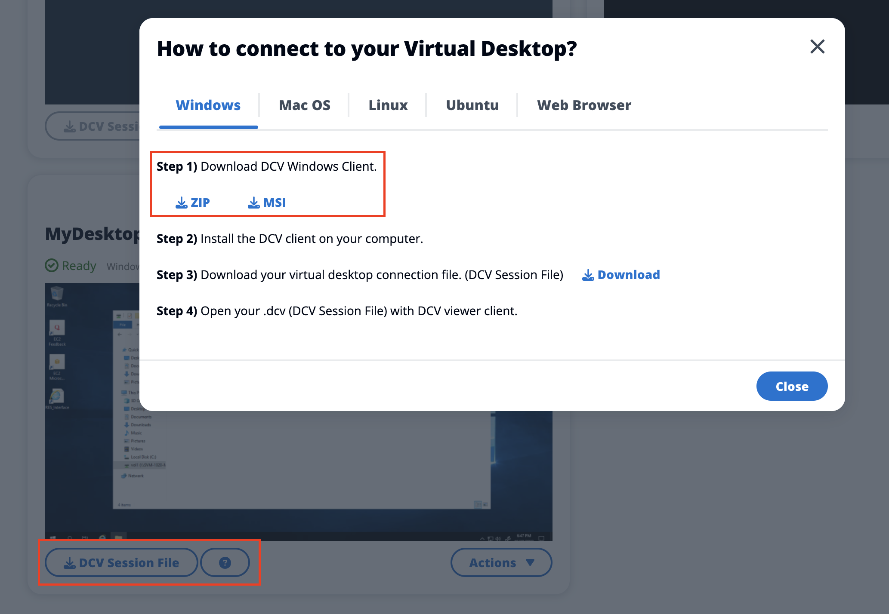

# Access your desktop

To access a virtual desktop, choose the card for the desktop and connect using either
the web or a DCV client.

Web connection
Accessing your desktop through the web browser is the easiest method of
connection.

- Choose **Connect**, or choose the
  thumbnail to access your desktop directly through your browser.

DCV connection
Accessing your desktop through a DCV client offers the best performance.
To access via DCV:

1. Choose **DCV Session File** to download
   the `.dcv` file. You will need a DCV client installed
   on your system.

 2. For installation instructions, choose the **?**
icon.

