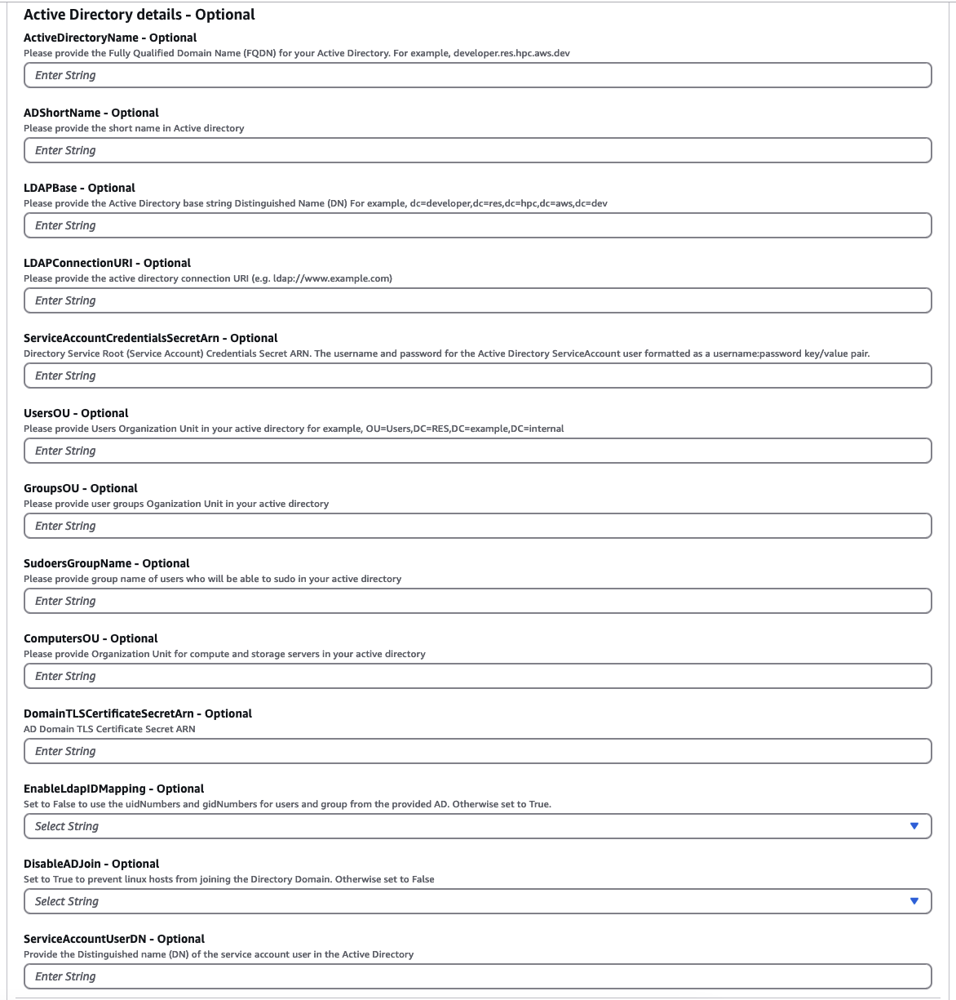
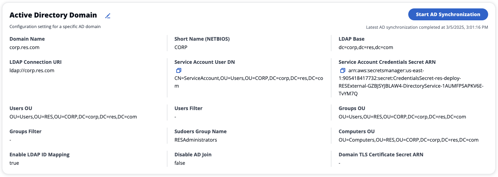
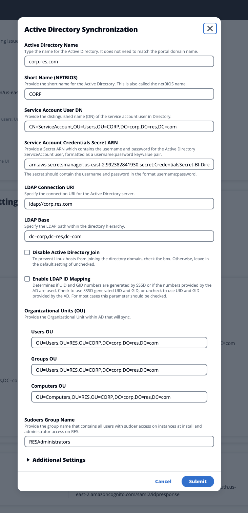
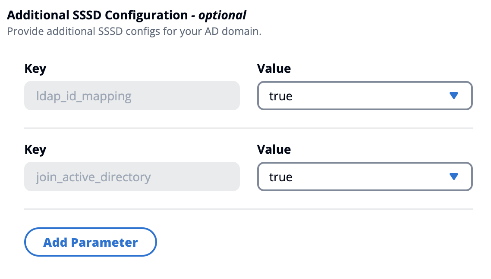
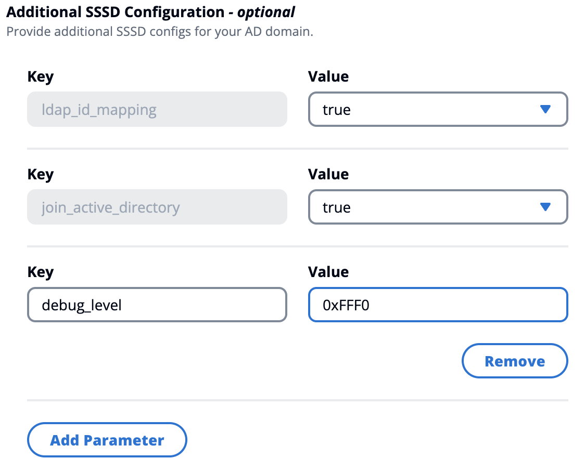
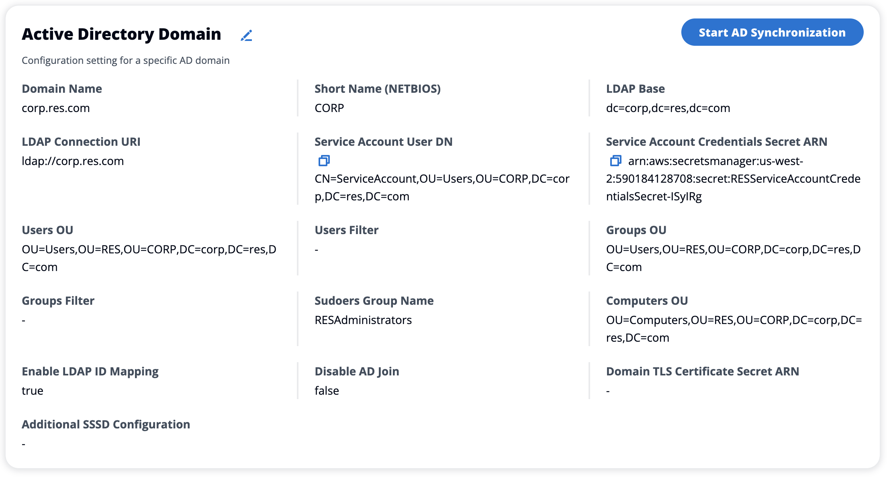
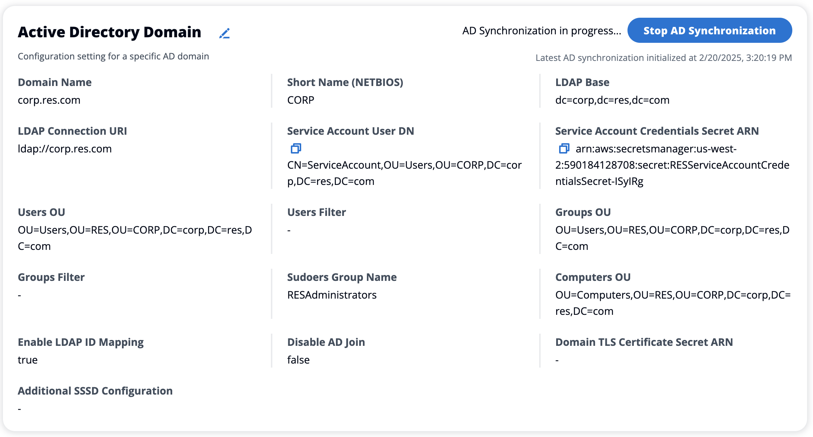
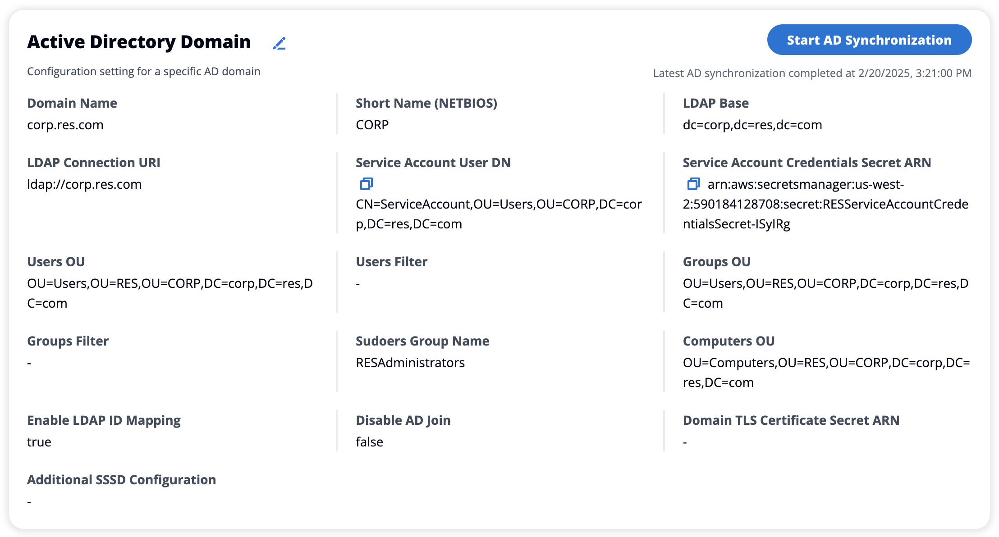

# Active Directory Synchronization

## Runtime Configuration

All the CFN parameters related to Active Directory (AD) are optional during installation.



For any secret ARN provided at runtime (for example, `ServiceAccountCredentialsSecretArn`
or `DomainTLSCertificateSecretArn`), make sure to add the following tags to
the secret for RES to get permissions to read the secret value:

- key: `res:EnvironmentName`, value:
  `<your RES environment name>`
- key: `res:ModuleName`, value:
  `directoryservice`

Any AD configuration updates in the web portal will be picked up automatically during
the next scheduled AD sync (hourly). Users may need to re-configure SSO after changing
the AD configuration (for example, if they switch to a different AD).

After the initial installation, administrators can view or edit the AD configuration
in the RES web portal under the **Identity management** page:





### Additional settings

**Filters**

Administrators can filter the users or groups to sync using the **Users
Filter** and **Groups Filter** options. The filters must
follow the [LDAP filter syntax](https://ldap.com/ldap-filters/ "https://ldap.com/ldap-filters/").
An example filter is:

```
(sAMAccountname=`<user>`)
```

**Custom SSSD parameters**

Administrators can provide a dictionary of key-value pairs containing SSSD parameters and
values to write to the `[domain_type/DOMAIN_NAME]` section of the SSSD config
file on cluster instances. RES applies the SSSD updates automatically– it restarts
the SSSD service on cluster instances and triggers the AD sync process.

Some common custom SSSD settings are:

- `enumerate` - Set to 'true' to cache all user and group entries
  from the directory service. Disabling this could add a short delay to users' first
  login.
- `ldap_id_mapping` - Set to 'true' to map LDAP/AD user and group
  IDs to local UIDs and GIDs on the Linux system. Enabling this can improve compatibility
  with existing POSIX scripts and applications.

For a full description of the SSSD configuration file, see the Linux man pages for
`SSSD`.



The SSSD parameters and values must be compatible with the RES SSSD configuration as
described here:

- `id_provider` is set internally by RES and must not be modified.
- AD related configs including `ldap_uri`, `ldap_search_base`,
  `ldap_default_bind_dn` and `ldap_default_authtok` are set based
  on the other provided AD configurations and must not be modified.

The following example enables debug level for SSSD logs:



## Email Update after Initial AD Sync (release 2025.09)

If an email address of an active directory user has changed, administrators can manually
start the AD sync or wait for the next scheduled AD sync for the change to be picked up
and synced to RES.

## How to manually start or stop the sync

(release 2025.03 and later)

Navigate to the **Identity management** page, and choose the
**Start AD Synchronization** button in the **Active
Directory Domain** container to trigger an AD sync on demand.



To stop an ongoing AD sync, select the **Stop AD Synchronization**
button in the **Active Directory Domain** container.



You can also check the AD sync status and the latest sync time in the **Active
Directory Domain** container.



## How to manually run the sync (release

2024.12 and 2024.12.01)

The Active Directory synchronization process has been moved from the Cluster Manager
infra host to a one-off Amazon Elastic Container Service (ECS) task behind the scenes. The process is scheduled
to run every hour and you can find a running ECS task in the Amazon ECS console under the
``<res-environment-name>`-ad-sync-cluster`
cluster while it is in progress.

###### To launch it manually:

1. Navigate to the [Lambda console](https://console.aws.amazon.com/lambda "https://console.aws.amazon.com/lambda")
   and search for the lambda called
   ``<res-environment>`-scheduled-ad-sync`.
2. Open the Lambda function and go to **Test**
3. In the **Event JSON** enter the following:

```
{
    "detail-type": "Scheduled Event"
}
```

4. Choose **Test**.
5. Observe the logs of the running AD Sync task under **CloudWatch** →
   **Log Groups** → `/`<environment-name>`/ad-sync`.
   You'll see logs from each of the running ECS tasks. Select the most recent
   to view the logs.

###### Note

- If you change the AD parameters or add AD filters, RES will add the new
  users given the newly specified parameters and remove users that were
  previously synced and are no longer included in the LDAP search space.
- RES cannot remove a user/group that is actively assigned to a project.
  You must remove users from projects in order to have RES remove them from
  the environment.

## SSO configuration

After AD configuration is provided, users must set up Single Sign-On (SSO) to be
able to login to the RES web portal as an AD user. SSO configuration has been moved
from the **General Settings** page to the new **Identity
management** page. For more information about setting up SSO, see
[Identity management](manage-users.md "manage-users.md").
