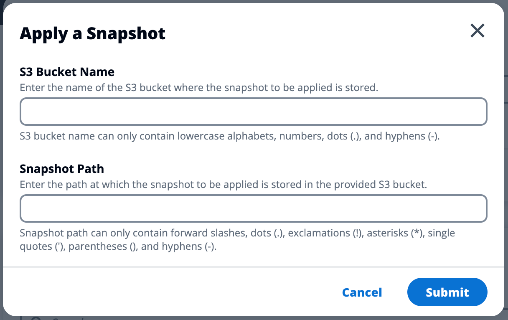

# Apply a snapshot

Once you have created a snapshot of an environment, you can apply that snapshot to a
new environment to migrate data. You will need to add a new policy to the bucket allowing
the environment to read the snapshot.

Applying a snapshot copies data such as user permissions, projects, software stacks,
permission profiles, and file systems with their associations to a new environment. User
sessions will not be replicated. When the snapshot is applied, it checks the basic
information of each resource record to determine if it already exists. For duplicate
records, the snapshot skips resource creation in the new environment. For records that are
similar, such as share a name or key, but other basic resource information varies, it will
create a new record with a modified name and key using the following convention:
`RecordName_SnapshotRESVersion_ApplySnapshotID`. The
`ApplySnapshotID` looks like a timestamp and identifies each attempt to apply
a snapshot.

During the snapshot application, the snapshot checks for the availability of resources.
Resource not available to the new environment will not be created. For resources with a
dependent resource, the snapshot checks for the availability of the dependent resource.
If the dependent resource is not available, it will create the main resource without the
dependent resource.

If the new environment is not as expected or fails, you can check the CloudWatch logs found
in the log group `/res-<env-name>/cluster-manager` for details. Each log
will have the [apply snapshot] tag. Once you have applied a snapshot, you can check its
status from the [Snapshot management](snapshots.md "snapshots.md") page.

###### To add permissions to the bucket:

1. Select the bucket you created from the **Buckets** list.
2. Select the **Permissions** tab.
3. Under **Bucket policy**, choose **Edit**.
4. Add the following statement to the bucket policy. Replace these values with
   your own:
   - `111122223333` -> your AWS Account ID
   - `{RES_ENVIRONMENT_NAME}` -> your RES environment name
   - `amzn-s3-demo-bucket` -> your S3 bucket name

JSON

```
`{
 "Version":"2012-10-17",
 "Statement": [
 {
 "Sid": "Export-Snapshot-Policy",
 "Effect": "Allow",
 "Principal": {
 "AWS": "arn:aws:iam::`111122223333`:role/`{RES_ENVIRONMENT_NAME}`-cluster-manager-role"
 },
 "Action": [
 "s3:GetObject",
 "s3:ListBucket"
 ],
 "Resource": [
 "arn:aws:s3:::`amzn-s3-demo-bucket`",
 "arn:aws:s3:::`amzn-s3-demo-bucket`/*"
 ]
 },
 {
 "Sid": "AllowSSLRequestsOnly",
 "Action": "s3:*",
 "Effect": "Deny",
 "Resource": [
 "arn:aws:s3:::`amzn-s3-demo-bucket`",
 "arn:aws:s3:::`amzn-s3-demo-bucket`/*"
 ],
 "Condition": {
 "Bool": {
 "aws:SecureTransport": "false"
 }
 },
 "Principal": "*"
 }
 ]
}`

```

###### To apply snapshot:

1. Choose **Apply snapshot**.
2. Enter the name of the Amazon S3 bucket containing the snapshot.
3. Enter the file path to the snapshot within the bucket.
4. Choose **Submit**.

 5. After five to ten minutes, choose **Refresh** on the Snapshot
management page to check the status.
