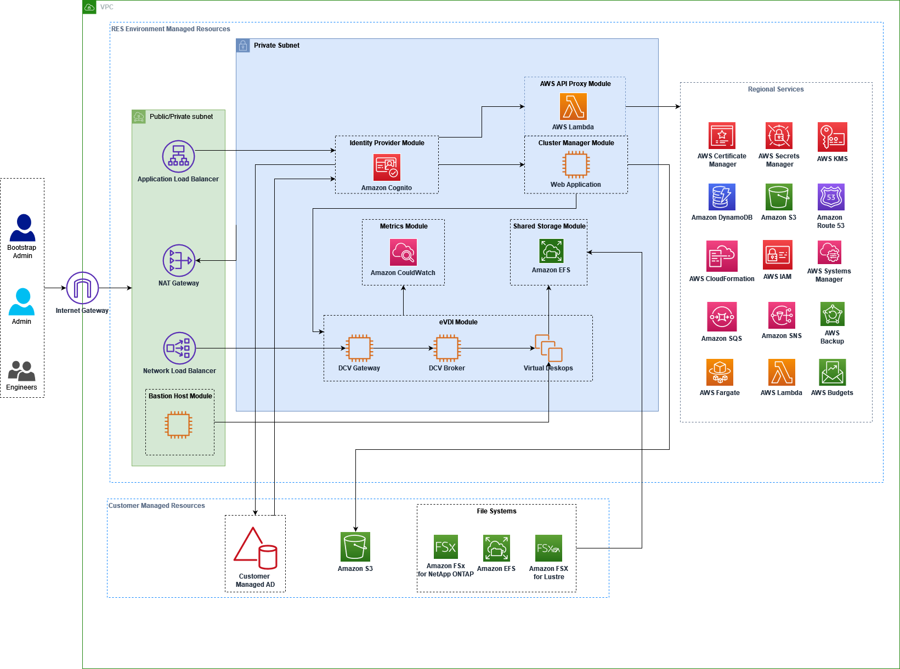

# Architecture overview

This section provides an architecture diagram for the components deployed with this
product.

## Architecture diagram

Deploying this product with the default parameters deploys the following components in
your AWS account.

_Figure 1: Research and Engineering Studio on AWS architecture_

###### Note

AWS CloudFormation resources are created from AWS Cloud Development Kit (AWS CDK) constructs.

The high-level process flow for the product components deployed with the AWS CloudFormation
template is as follows:

1. RES installs components for the web portal as well as:
   1. Engineering Virtual Desktop (eVDI) component for interactive workloads
   2. Metrics component

   Amazon CloudWatch receives metrics from the eVDI components. 3. Bastion Host component

   Administrators may use SSH to connect to the bastion host component to manage the
   underlying infrastructure.

2. RES installs components in private subnets behind a NAT gateway.
   Administrators access the private subnets via the Application Load Balancer (ALB) or the
   Bastion Host component.
3. Amazon DynamoDB stores the environment configuration.
4. AWS Certificate Manager (ACM) generates and stores a public certificate for the
   Application Load Balancer (ALB).

###### Note

We recommend using AWS Certificate Manager to generate a trusted certificate for your domain. 5. Amazon Elastic File System (EFS) hosts the default `/home` file system mounted on
all applicable infrastructure hosts and eVDI Linux sessions. 6. RES uses Amazon Cognito to create an initial bootstrap user called 'clusteradmin' within and
sends temporary credentials to the email address provided during installation. The
'clusteradmin' must change the password the first time they login. 7. Amazon Cognito integrates with your organization's Active Directory and user identities for
permissions management. 8. Security zones allow administrators to restrict access to specific components within
the product based on permissions.

## AWS services in this product

| AWS service                                                                                                           | Type       | Description                                                                                                                                                     |
| --------------------------------------------------------------------------------------------------------------------- | ---------- | --------------------------------------------------------------------------------------------------------------------------------------------------------------- |
| [Amazon Elastic Compute Cloud](https://aws.amazon.com/ec2/ "https://aws.amazon.com/ec2/")                             | Core       | Provides the underlying compute services to create virtual desktops with their chosen operating system and software stack.                                      |
| [Elastic Load Balancing](https://aws.amazon.com/elasticloadbalancing/ "https://aws.amazon.com/elasticloadbalancing/") | Core       | Bastion, cluster-manager, and VDI hosts are created in Auto Scaling groups behind the load balancer. ELB balances traffic from the web portal across RES hosts. |
| [Amazon Virtual Private Cloud](https://aws.amazon.com/vpc/ "https://aws.amazon.com/vpc/")                             | Core       | All core product components are created within your VPC.                                                                                                        |
| [Amazon Cognito](https://aws.amazon.com/cognito/ "https://aws.amazon.com/cognito/")                                   | Core       | Manages user identities and authentication. Active Directory users are mapped to Amazon Cognito users and groups to authenticate access levels.                 |
| [Amazon Elastic File System](https://aws.amazon.com/efs/ "https://aws.amazon.com/efs/")                               | Core       | Provides the `/home` file system for the file browser and VDI hosts, as well as shared external file systems.                                                   |
| [Amazon DynamoDB](https://aws.amazon.com/dynamodb/ "https://aws.amazon.com/dynamodb/")                                | Core       | Stores configuration data such as users, groups, projects, file systems, and component settings.                                                                |
| [AWS Systems Manager](https://aws.amazon.com/systems-manager/ "https://aws.amazon.com/systems-manager/")              | Core       | Stores documents for performing commands for VDI session management.                                                                                            |
| [AWS Lambda](https://aws.amazon.com/lambda/ "https://aws.amazon.com/lambda/")                                         | Core       | Supports product functionalities such as updating settings within the DynamoDB table, starting Active Directory sync workflows, and updating the prefix list.   |
| [Amazon CloudWatch](https://aws.amazon.com/cloudwatch/ "https://aws.amazon.com/cloudwatch/")                          | Supporting | Provides metrics and activity logs for all Amazon EC2 hosts and Lambda functions.                                                                               |
| [Amazon Simple Storage Service](https://aws.amazon.com/s3/ "https://aws.amazon.com/s3/")                              | Supporting | Stores application binaries for host bootstrapping and configuration.                                                                                           |
| [AWS Key Management Service](https://aws.amazon.com/kms/ "https://aws.amazon.com/kms/")                               | Supporting | Used for encryption at rest with Amazon SQS queues, DynamoDB tables, and Amazon SNS topics.                                                                     |
| [AWS Secrets Manager](https://aws.amazon.com/secrets-manager/ "https://aws.amazon.com/secrets-manager/")              | Supporting | Stores service account credentials in Active Directory and self-signed certificates for VDIs.                                                                   |
| [AWS CloudFormation](https://aws.amazon.com/cloudformation/ "https://aws.amazon.com/cloudformation/")                 | Supporting | Provides a deployment mechanism for the product.                                                                                                                |
| [AWS Identity and Access Management](https://aws.amazon.com/iam/ "https://aws.amazon.com/iam/")                       | Supporting | Restricts the access level for hosts.                                                                                                                           |
| [Amazon Route 53](https://aws.amazon.com/route53/ "https://aws.amazon.com/route53/")                                  | Supporting | Creates private hosted zone for resolving the internal load balancer and the bastion host domain name.                                                          |
| [Amazon Simple Queue Service](https://aws.amazon.com/sqs/ "https://aws.amazon.com/sqs/")                              | Supporting | Creates task queues to support asynchronous executions.                                                                                                         |
| [Amazon Simple Notification Service](https://aws.amazon.com/sns/ "https://aws.amazon.com/sns/")                       | Supporting | Supports the publication-subscriber model between VDI components such as the controller and hosts.                                                              |
| [AWS Fargate](https://aws.amazon.com/fargate/ "https://aws.amazon.com/fargate/")                                      | Supporting | Installs, updates, and deletes environments using Fargate tasks.                                                                                                |
| [Amazon FSx File Gateway](https://aws.amazon.com/fsx/ "https://aws.amazon.com/fsx/")                                  | Optional   | Provides external shared file system.                                                                                                                           |
| [Amazon FSx for NetApp ONTAP](https://aws.amazon.com/fsx/netapp-ontap/ "https://aws.amazon.com/fsx/netapp-ontap/")    | Optional   | Provides external shared file system.                                                                                                                           |
| [AWS Certificate Manager](https://aws.amazon.com/certificate-manager/ "https://aws.amazon.com/certificate-manager/")  | Optional   | Generates a trusted certificate for your custom domain.                                                                                                         |
| [AWS Backup](https://aws.amazon.com/backup/ "https://aws.amazon.com/backup/")                                         | Optional   | Offers backup capabilities for Amazon EC2 hosts, file systems, and DynamoDB.                                                                                    |
