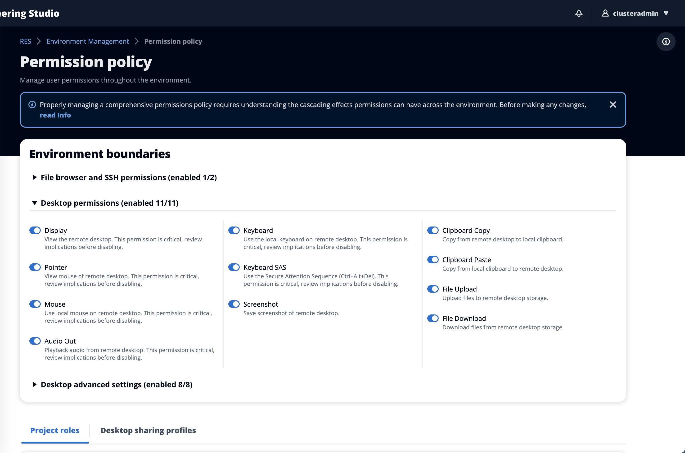

# Configuring Desktop Permissions

Administrators can toggle **Desktop permissions** on or off to globally
manage the VDI functionality of all session owners. All of these permissions, or a subset,
can be used to create **Desktop sharing profiles** that determine which
actions the users with whom a desktop is shared can perform. If any desktop permission
is disabled, this will automatically disable the corresponding permissions in the
**Desktop sharing profiles**. These permissions will be labeled as
"Disabled Globally". Even if the administrator enables this desktop permission again,
the permission in the desktop sharing profile will remain disabled until the administrator
manually enables it.

