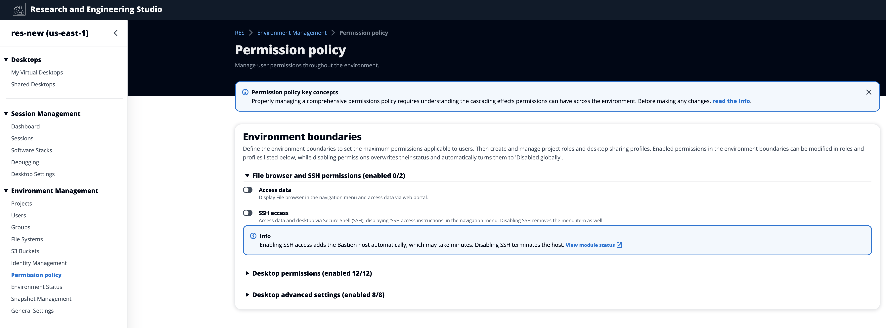
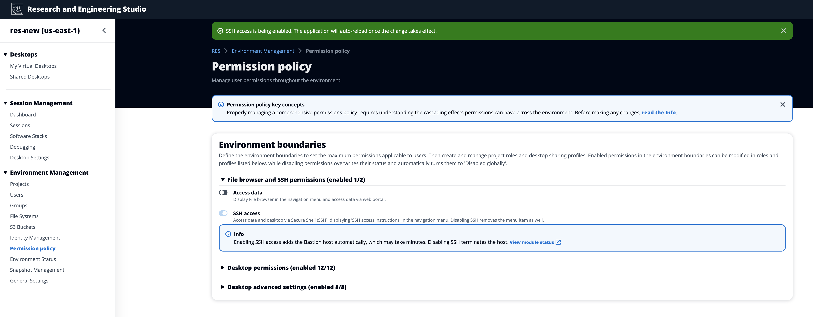
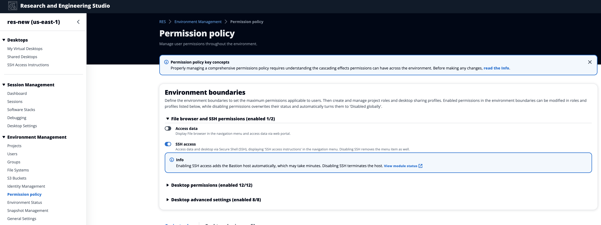
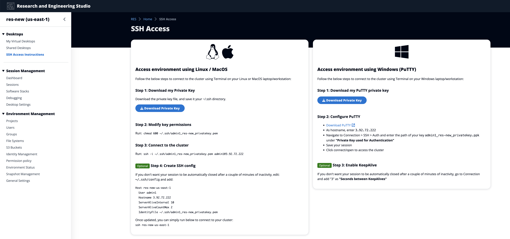
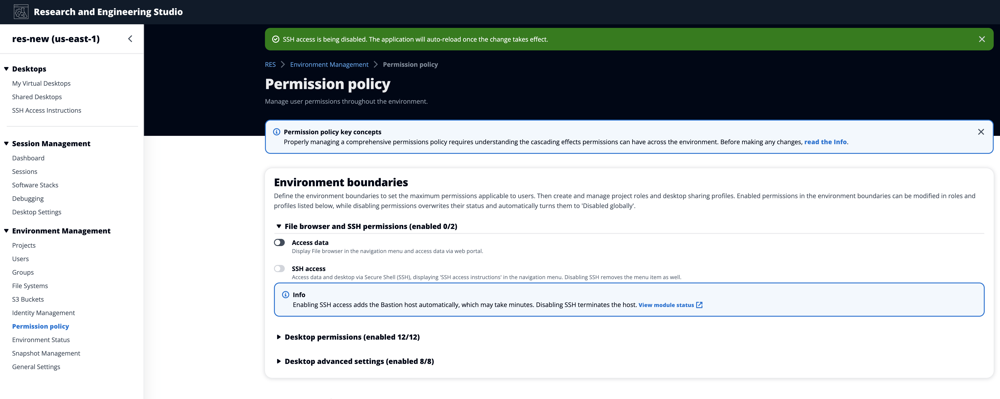

# Configuring SSH access

Administrators can enable or disable SSH for the RES environment from the
**Environment boundaries** section. SSH Access to VDIs is
facilitated through a bastion host. When you activate this toggle, RES deploys
a bastion host and makes the SSH Access Instructions page visible for users.
When you deactivate the toggle, RES disables SSH access, terminates the bastion
host and removes the SSH access instructions page for users. This toggle is
deactivated by default.

###### Note

When RES deploys a bastion host it adds a `t3.medium` Amazon EC2
instance in your AWS account. You are responsible for all charges associated with
this instance. See the [Amazon EC2 pricing page](https://aws.amazon.com/ec2/pricing/on-demand/ "https://aws.amazon.com/ec2/pricing/on-demand/") for more information.

###### To enable SSH access

1. In the RES console, on the left navigation pane, choose **Environment
   Management**, then **Permission Policy**. Under
   **Environment boundaries** select the **SSH access**
   toggle.

 2. Wait for SSH access to be enabled.

 3. Once the Bastion host is added, SSH access is enabled.

The **SSH Access Instructions** page is visible to users
from their left navigation pane.

###### To disable SSH access

1. In the RES console, on the left navigation pane, choose **Environment
   Management**, then **Permission Policy**. Under
   **Environment boundaries** select the **SSH access**
   toggle.

 2. Wait for SSH access to be disabled.

 3. Once the process is complete, SSH access is disabled.

