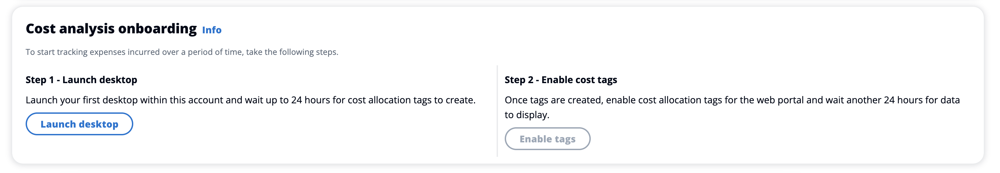
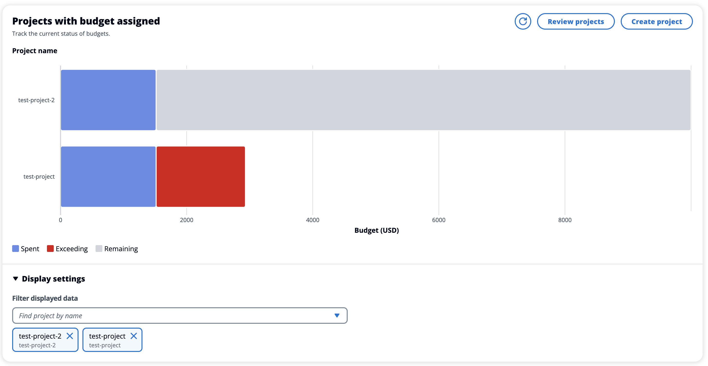
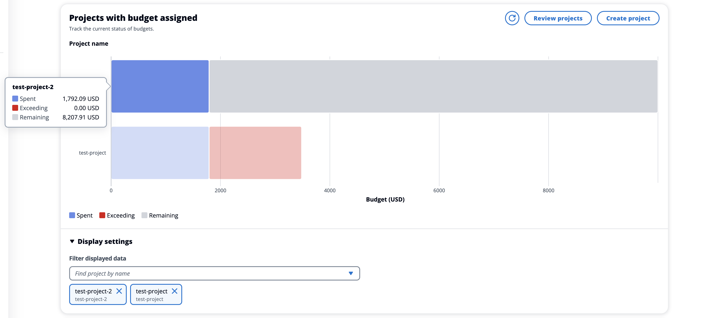
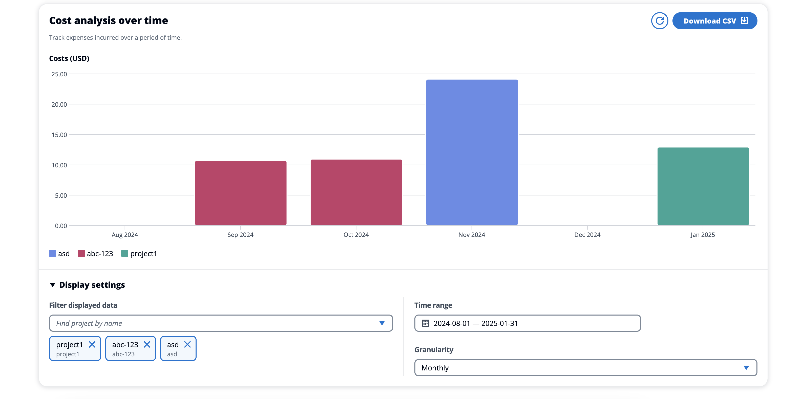
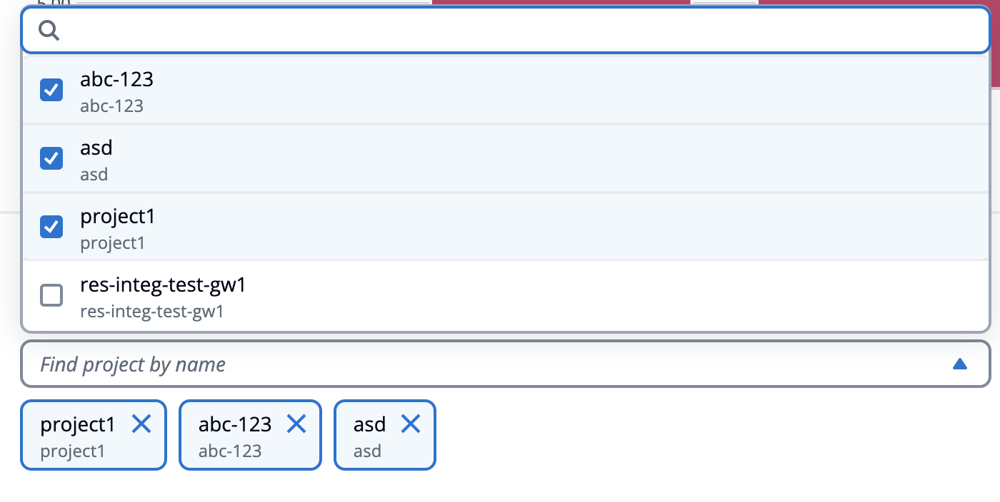
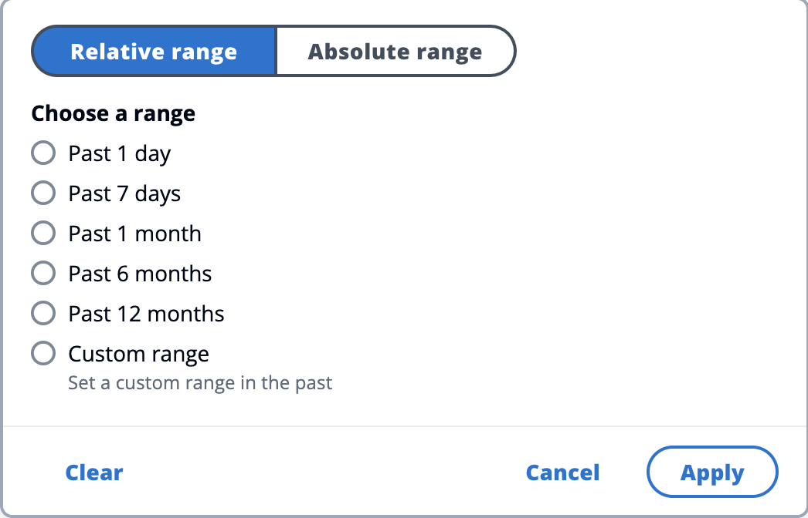
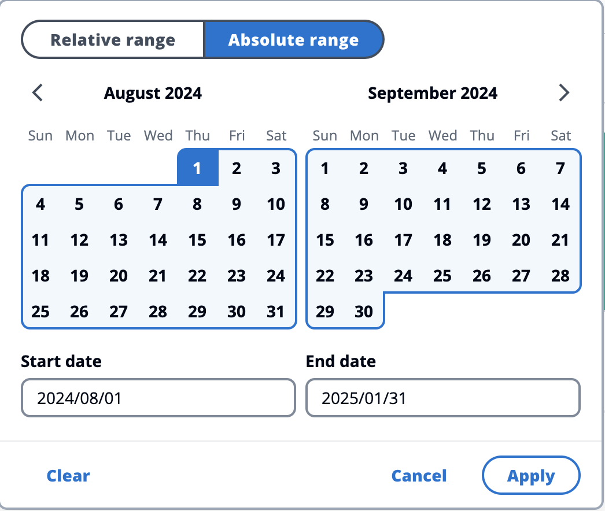
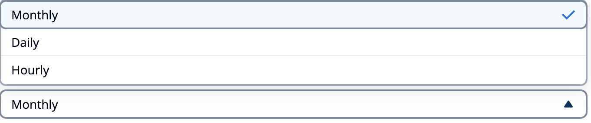
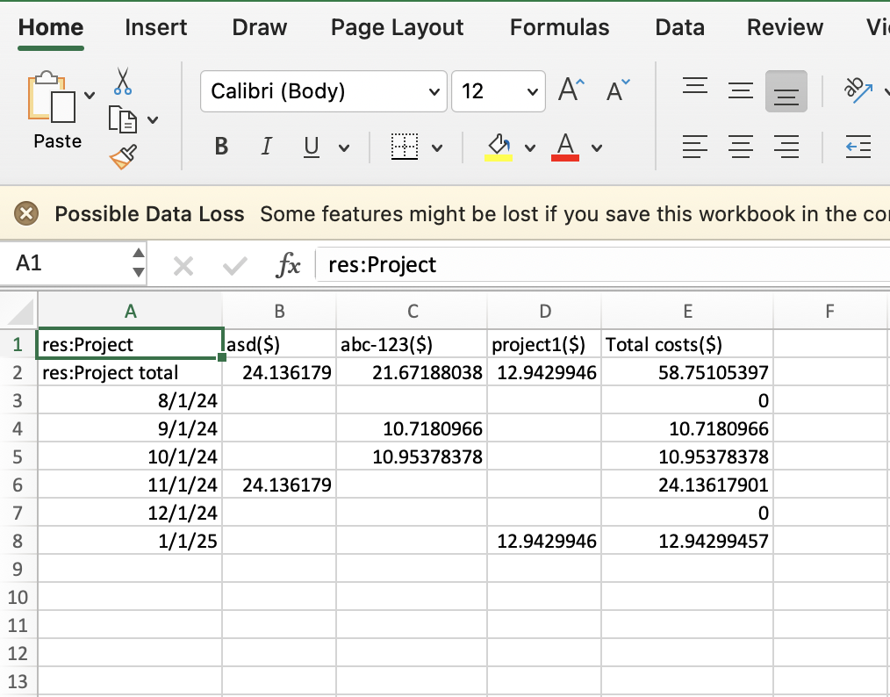

# Cost analysis dashboard

The cost analysis dashboard allows RES administrators to monitor project budgets and project
costs over time from the RES portal. Costs can be filtered at the project level.

###### Topics

- [Prerequisites](#cost-analysis-dashboard-prerequisites "#cost-analysis-dashboard-prerequisites")
- [Projects with budget assigned chart](#cost-analysis-dashboard-projects-chart "#cost-analysis-dashboard-projects-chart")
- [Cost analysis over time chart](#cost-analysis-dashboard-over-time "#cost-analysis-dashboard-over-time")
- [Download CSV](#cost-analysis-dashboard-download-csv "#cost-analysis-dashboard-download-csv")

## Prerequisites

To use the cost dashboard for Research and Engineering Studio, you must first:

- [Create a project](create-project.md "create-project.md").
- Create a [budget](../../../cost-management/latest/userguide/budgets-create.md "../../../cost-management/latest/userguide/budgets-create.md") in the
  [AWS Billing and Cost Management
  console](https://console.aws.amazon.com/costmanagement/home "https://console.aws.amazon.com/costmanagement/home").
- Attach the budget to the project (see [Edit a project](edit-project.md "edit-project.md")).
- Activate the cost analysis chart for accounts with new RES deployments. To do this,
  follow these steps:
  1.  Deploy a [VDI](virtual-desktops.md "virtual-desktops.md") for the project you
      created. This provisions the `res:Project` tag in the [AWS Cost
      Explorer](https://aws.amazon.com/aws-cost-management/aws-cost-explorer/ "https://aws.amazon.com/aws-cost-management/aws-cost-explorer/"), which can take up to 24 hours.
  2.  After the tag is created, the **Enable tags** button is
      activated. Choose the button to activate the tags in Cost Explorer.
      This process may take an additional 24 hours.

  

## Projects with budget assigned chart

The **Projects with budget assigned** chart displays the budget status of
projects in the RES environment that have budgets assigned to them. By default, the chart
displays the top 5 projects by budget amount. You can select specific projects in the
**Filter displayed data** dropdown that loads the complete list of
budget-assigned projects.

The chart displays spent, remaining, and exceeding amounts for each budget in USD currency.
Hover over a bar to show the exact USD amounts for each category. You can also open the Projects
and Create Project pages by choosing the **Review projects** and **Create
project** buttons in the top right corner, respectively.

## Cost analysis over time chart

The **Cost analysis over time** chart displays the cost breakdown by project
over a specified period of time. By default, the chart displays data for each of the past 6 months.
It displays the top 5 projects by total cost over the selected **Time range**
with the **Granularity** you select. All other selected projects besides the
top 5 are aggregated under an **Other** category.

### Filters

You can filter by project, time range, and granularity to customize the **Cost
analysis over time** chart view. If any invalid filter combinations are selected, a
modal window will pop up that gives you the option to either revert to the previous configuration
or accept a suggestion for the updated filter combination.

**Project**

When you choose the **Filter displayed data** dropdown you see a complete
list of projects in your current RES environment. You see the project name, with the project
code displayed beneath.

**Specifying the time range**

You can choose to use an **Absolute range** or a **Relative
range** when you specify a date range. When you select a relative range, the
dates are calculated using complete time units. For example, if you select the **Past
6 months** option in February 2025, this will result in a time range of 8/1/25 -
1/31/25.

**Granularity**

You can choose to view data with a **Monthly**, **Daily**,
or **Hourly** granularity. **Hourly** granularity only
supports a date range of up to 14 days. **Daily** granularity only supports
a date range of up to 14 months.

## Download CSV

To export the current cost analysis view, choose **Download CSV** at the
top right of the **Cost analysis over time** chart. The downloaded CSV contains
the cost information for each selected project for the time period specified, as well as cost
totals by project and by time period.

