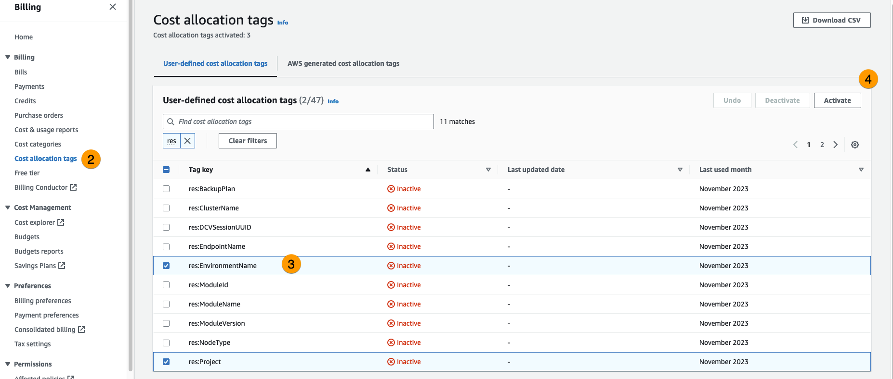
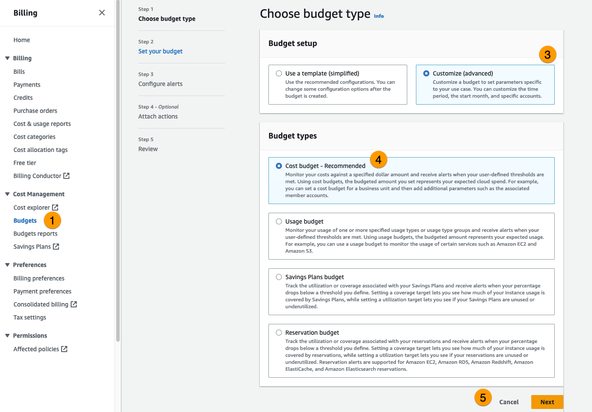
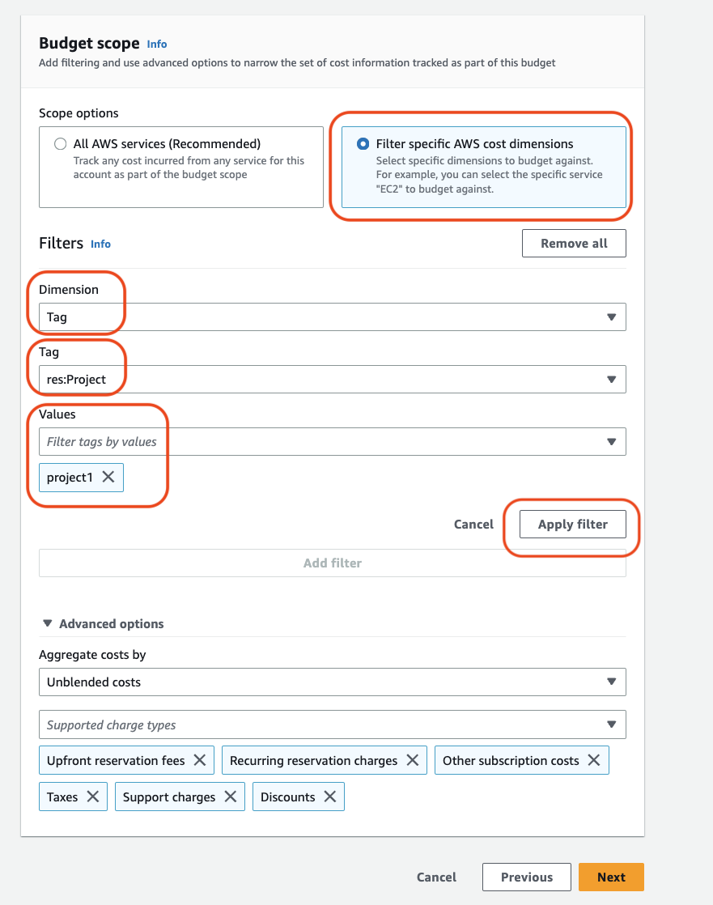
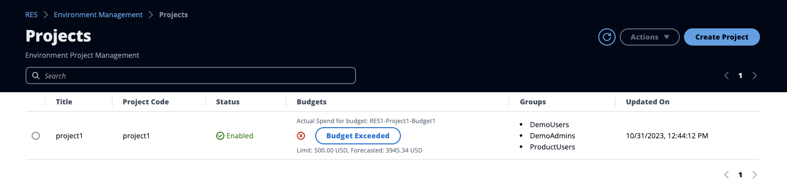

# Cost monitoring and control

###### Note

Associating Research and Engineering Studio projects to AWS Budgets is not supported in AWS GovCloud (US).

We recommend creating a [budget](../../../cost-management/latest/userguide/budgets-create.md "../../../cost-management/latest/userguide/budgets-create.md") through [AWS Cost Explorer](https://aws.amazon.com/aws-cost-management/aws-cost-explorer/ "https://aws.amazon.com/aws-cost-management/aws-cost-explorer/") to
help manage costs. Prices are subject to change. For full details, see the pricing webpage for
each of the [AWS services in this product](architecture-overview.md#aws-services-in-this-product "architecture-overview.md#aws-services-in-this-product").

To assist with cost tracking, you can associate RES projects to budgets
created within AWS Budgets. You will first need to activate the environment tags within the
billing cost allocation tags.

1. Sign in to the AWS Management Console and open the [AWS Billing and Cost Management console](https://console.aws.amazon.com/costmanagement/home "https://console.aws.amazon.com/costmanagement/home").
2. Choose **Cost allocation tags**.
3. Search for and select the `res:Project` and
   `res:EnvironmentName` tags.
4. Choose **Activate**.

###### Note

It may take up to a day for RES tags to appear following deployment.

To create a budget for RES resources:

1. From the Billing console, choose **Budgets**.
2. Choose **Create a budget**.
3. Under **Budget setup**, choose **Customize (advanced)**.
4. Under **Budget types**, choose **Cost budget - Recommended**.
5. Choose **Next**.

 6. Under **Details**, enter a meaningful **Budget name**
for your budget to distinguish it from other budgets in your account. For example,
`<EnvironmentName>-<ProjectName>-<BudgetName>`. 7. Under **Set budget amount**, enter the amount budgeted for your
project. 8. Under **Budget scope**, choose **Filter specific AWS
cost dimensions**. 9. Choose **Add filter**. 10. Under **Dimension**, choose **Tag**. 11. Under **Tag**, select **res:Project**.

###### Note

It may take up to two days for tags and values to become available. You can create
a budget once the project name becomes available. 12. Under **Values**, select the project name. 13. Choose **Apply filter** to attach the project filter to the budget. 14. Choose **Next**.

 15. (Optional.) Add an alert threshold. 16. Choose **Next**. 17. (Optional.) If an alert was configured, use **Attach actions**
to configure desired actions with the alert. 18. Choose **Next**. 19. Review the budget configuration and confirm the correct tag was set under
**Additional budget parameters**. 20. Choose **Create budget**.
Now that the budget has been created, you can enable the budget for projects. To turn on
budgets for a project, see [Edit a project](edit-project.md "edit-project.md"). Virtual desktops will be blocked
from launching if the budget is exceeded. If the budget is exceeded while a desktop is launched,
the desktop will continue to operate.

If you need to change your budget, return to the console to edit the budget amount. It
may take up to fifteen minutes for the change to take effect within RES. Alternatively,
you may edit a project to disable a budget.
