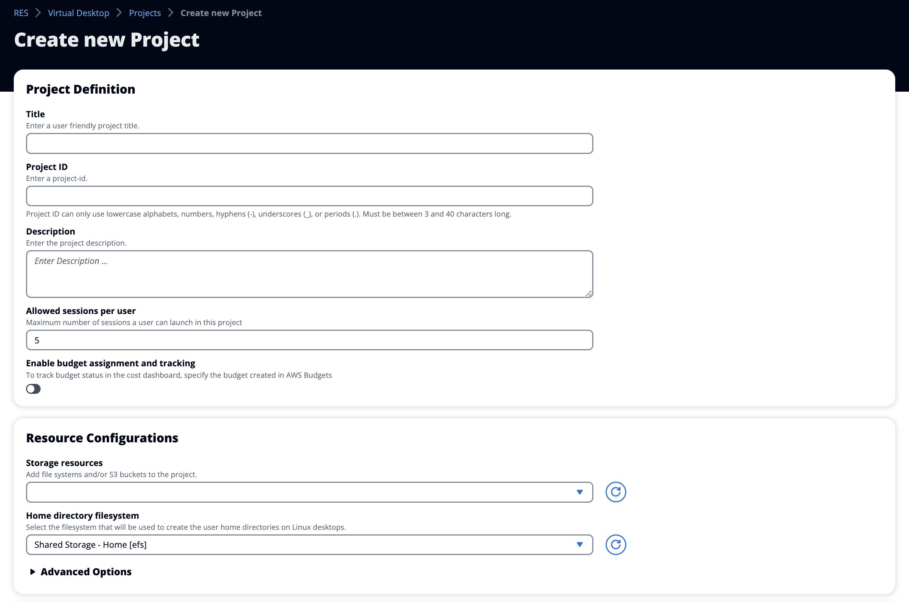

# Create a project

1. Choose **Create Project**.
2. Enter project details.

The Project ID is a resource tag that can be used to track cost allocation in
AWS Cost Explorer Service. For more information, see [Activating user-defined
cost allocation tags](../../../awsaccountbilling/latest/aboutv2/activating-tags.md "../../../awsaccountbilling/latest/aboutv2/activating-tags.md").

###### Important

The project ID cannot be changed after creation.

For information on **Advanced Options**, see [Add a launch template](project-launch-template.md "project-launch-template.md"). 3. (Optional) Turn on budgets for the project. For more information on budgets,
see [Cost monitoring and control](cost-management.md "cost-management.md"). 4. The home directory filesystem may either use the Shared Home Filesystem (default),
EFS, FSx for Lustre, FSx NetApp ONTAP, or EBS volume storage.

It is important to note that the shared home filesystem, EFS, FSx for Lustre, and
FSx NetApp ONTAP can be shared across multiple projects and VDIs. However, the EBS
volume storage option will require every VDI in that project to have their own home
directory that is not shared between other VDIs or projects.

 5. Assign users and/or groups the appropriate role ("Project Member" or "Project
Owner"). See [Default permissions profiles](permission-matrix.md "permission-matrix.md")
for the actions each role can take. 6. Choose **Submit**.
