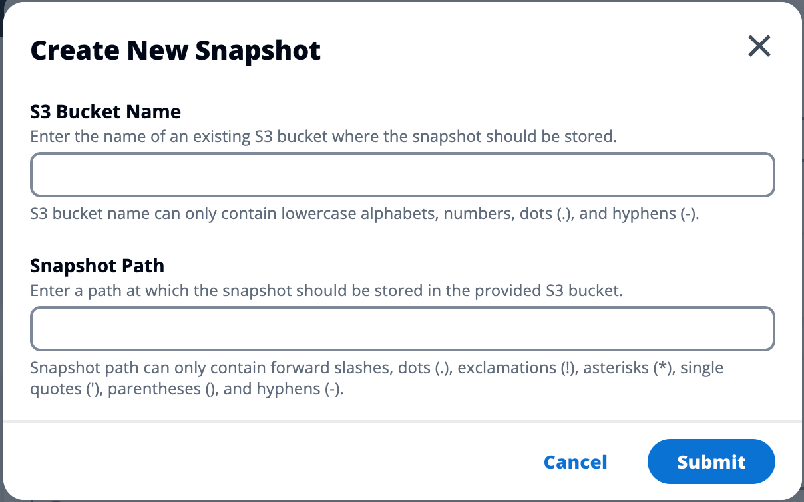

# Create a snapshot

Before you can create a snapshot, you must provide an Amazon S3 bucket with the necessary
permissions. For information on creating a bucket, see [Creating a bucket](../../../AmazonS3/latest/userguide/create-bucket-overview.md "../../../AmazonS3/latest/userguide/create-bucket-overview.md").
We recommend enabling bucket versioning and server access logging. These settings can be
enabled from the bucket's **Properties** tab after provisioning.

###### Note

This Amazon S3 bucket's lifecycle will not be managed within the product. You will need
to manage the bucket lifecycle from the console.

###### To add permissions to the bucket:

1. Select the bucket you created from the **Buckets** list.
2. Select the **Permissions** tab.
3. Under **Bucket policy**, choose **Edit**.
4. Add the following statement to the bucket policy. Replace these values with
   your own:
   - `111122223333` -> your AWS Account ID
   - `{RES_ENVIRONMENT_NAME}` -> your RES environment name
   - `us-east-1` -> your AWS region
   - `amzn-s3-demo-bucket` -> your S3 bucket name

###### Important

There are limited version strings supported by AWS. For more information,
see [https://docs.aws.amazon.com/IAM/latest/UserGuide/reference_policies_elements_version.html](../../../IAM/latest/UserGuide/reference_policies_elements_version.md "../../../IAM/latest/UserGuide/reference_policies_elements_version.md").

JSON

```
`{
 "Version":"2012-10-17",
 "Statement": [
 {
 "Sid": "Export-Snapshot-Policy",
 "Effect": "Allow",
 "Principal": {
 "AWS": "arn:aws:iam::`111122223333`:role/`{RES_ENVIRONMENT_NAME}`-cluster-manager-role"
 },
 "Action": [
 "s3:GetObject",
 "s3:ListBucket",
 "s3:AbortMultipartUpload",
 "s3:PutObject",
 "s3:PutObjectAcl"
 ],
 "Resource": [
 "arn:aws:s3:::`amzn-s3-demo-bucket`",
 "arn:aws:s3:::`amzn-s3-demo-bucket`/*"
 ]
 },
 {
 "Sid": "AllowSSLRequestsOnly",
 "Action": "s3:*",
 "Effect": "Deny",
 "Resource": [
 "arn:aws:s3:::`amzn-s3-demo-bucket`",
 "arn:aws:s3:::`amzn-s3-demo-bucket`/*"
 ],
 "Condition": {
 "Bool": {
 "aws:SecureTransport": "false"
 }
 },
 "Principal": "*"
 }
 ]
}`

```

###### To create the snapshot:

1. Choose **Create Snapshot**.
2. Enter the name of the Amazon S3 bucket you created.
3. Enter the path where you would like the snapshot stored within the bucket.
   For example, `october2023/23`.
4. Choose **Submit**.

 5. After five to ten minutes, choose **Refresh** on the Snapshots
page to check the status. A snapshot will not be valid until the status changes
from IN_PROGRESS to COMPLETED.
