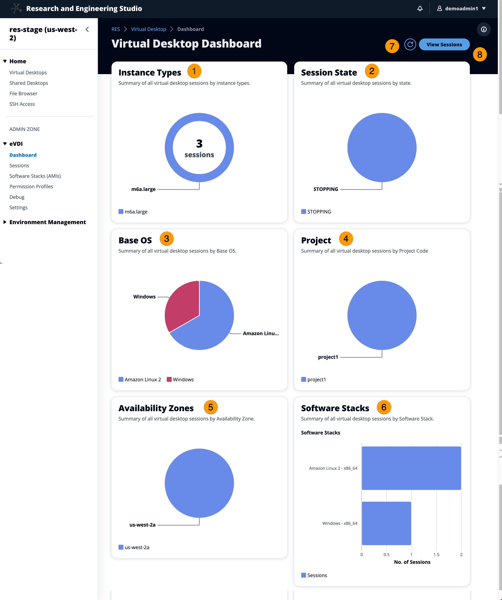

# Dashboard

The Session Management Dashboard provides administrators with a quick view into:

1. Instance types
2. Session states
3. Base OS
4. Projects
5. Availability zones
6. Software stacks
   Additionally, administrators can:

7. Refresh the dashboard to update information.
8. Choose **View Sessions** to
   navigate to Sessions.
