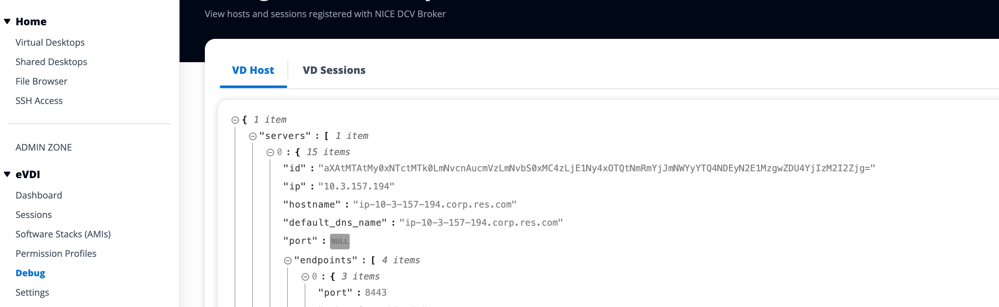

# Debugging

The debugging panel displays message traffic associated with the virtual desktops.
You can use this panel to observe activity between hosts. The VD Host tab displays
instance specific activity, and the VD Sessions tab displays in-progress session
activity.

