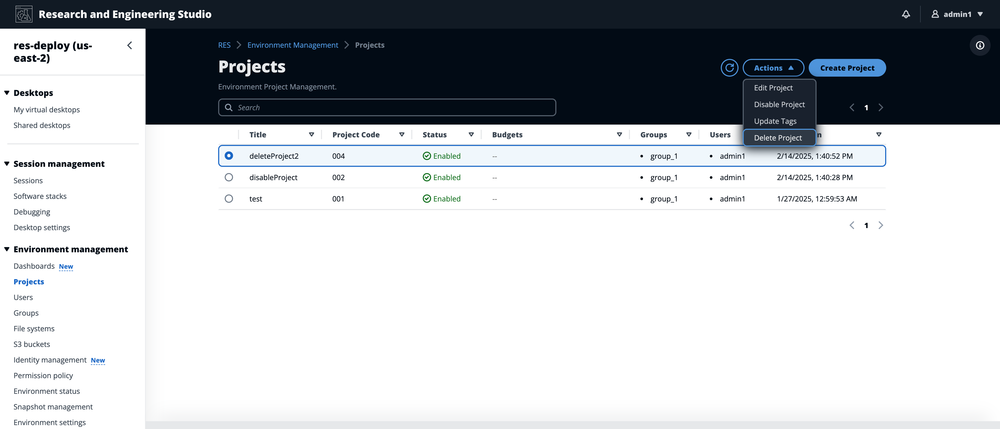
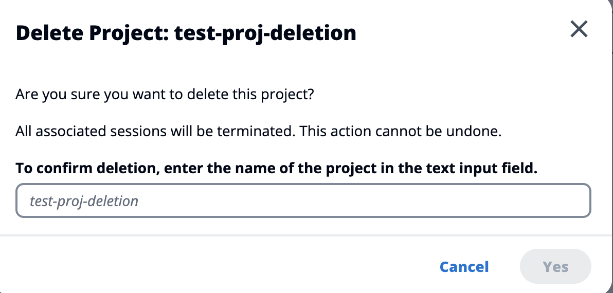
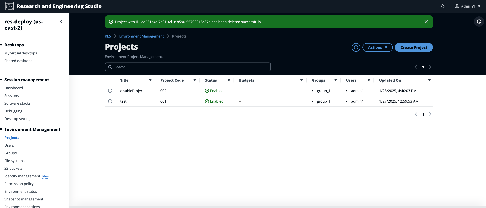

# Delete a project

To delete a project:

1. Select a project in the project list.
2. From the **Actions** menu, choose **Delete Project**.

 3. A confirmation pop-up appears. Enter the name of the project, then choose
**Yes** to delete it.

 4. If a project is deleted, all VDI sessions associated with that project are terminated.

