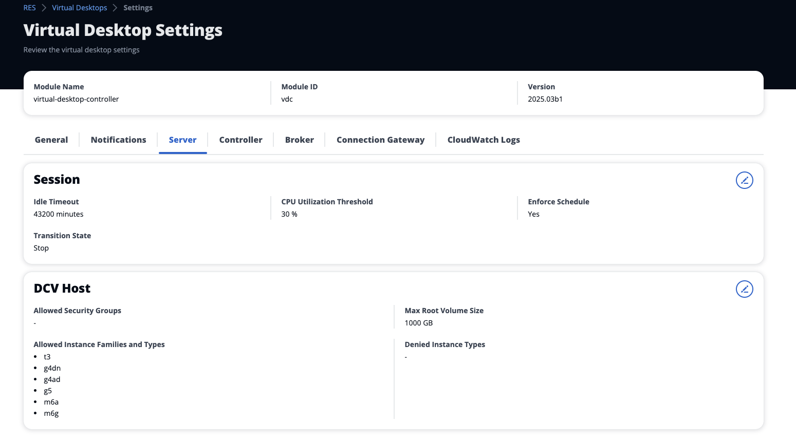
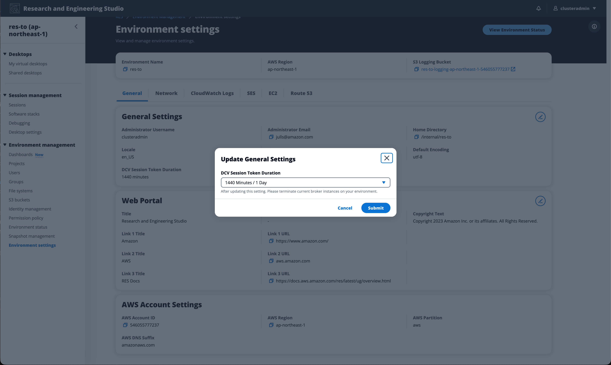
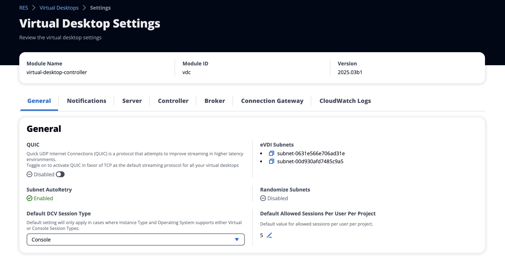

# Desktop settings

You can use the Desktop Settings page to configure resources associated with virtual
desktops.

**General**

The **General** tab provides access to settings such as:

**QUIC**

Enables QUIC in favor of TCP as the default streaming protocol for all your
virtual desktops.

**Default DCV Session Type**

The default DCV Session Type used for all virtual desktops. This setting will
not apply to previously created desktops. This will only apply in cases where the
Instance Type and Operating System supports either Virtual or Console Session
types.

###### Virtual session type deprecated

Starting with the 2026.06 release, the _Virtual_ session
type is no longer supported. All sessions now use the
_Console_ session type. If your configuration or
automation specifies the Virtual session type, update it to use Console.

**Default Allowed Sessions Per User Per Project**

The default value for the allowed number of VDI sessions per user per project.

**DCV Session Token Expiration**

The duration for which a DCV session token remains valid.
When a token expires, users must re-download the DCV connection file
from the web portal to continue accessing their virtual desktop session. The available options are:

- 1,440 minutes (1 day)
- 10,080 minutes (7 days)
- 43,200 minutes (30 days)

**Server**

The **Server** tab provides access to settings such as:

**DCV session idle timeout**

The time after which the DCV session will be automatically disconnected. This
does not change the state of the desktop session, it only closes the session from
either the DCV client or the web browser.

**Idle timeout warning**

The time after which an idle warning will be provided to the client.

**CPU utilization threshold**

The CPU utilization to be considered idle.

**Max root volume size**

The default size of the root volume on virtual desktop sessions.

**Allowed instance types**

The list of instance families and sizes that can be launched for this RES
environment. Instance family and instance size combinations are both accepted.
For example, if you specify 'm7a', all sizes of the m7a family will be available
to launch as VDI sessions. If you specify 'm7a.24xlarge', only m7a.24xlarge will
be available to launch as a VDI session. This list affects all projects in
the environment.

