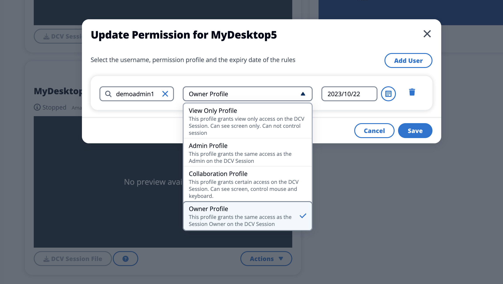

# Share a desktop

1. From your desktop session, choose **Actions**.

 2. Select **Session Permissions**. 3. Select the user and permission level. You may also set an expiration time. 4. Choose **Save**.

For more information on permissions, see [Permission policy](permission-profiles.md "permission-profiles.md").
