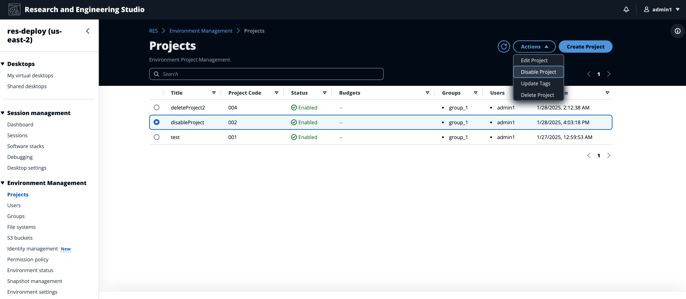
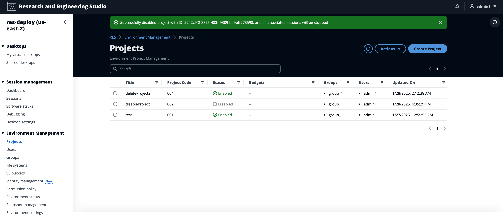

# Disable a project

To disable a project:

1. Select a project in the project list.
2. From the **Actions** menu, choose **Disable Project**.

 3. If a project is disabled, all VDI sessions associated with that project are stopped.
Those sessions cannot be restarted while the project is disabled.

