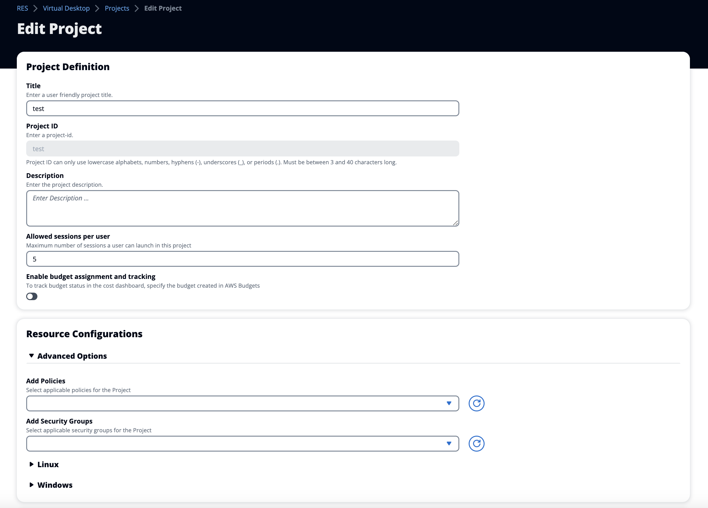

# Edit a project

1. Select a project in the project list.
2. From the **Actions** menu, choose **Edit Project**.
3. Enter your updates.

If you intend to enable budgets, see [Cost monitoring and control](cost-management.md "cost-management.md") for more information. When you choose a budget
for the project, there could be a few seconds delay for the budget dropdown options
to load— if you do not see the budget you just created, please select the
refresh button next to the dropdown.

For information on **Advanced Options**, see [Add a launch template](project-launch-template.md "project-launch-template.md"). 4. Choose **Submit**.

