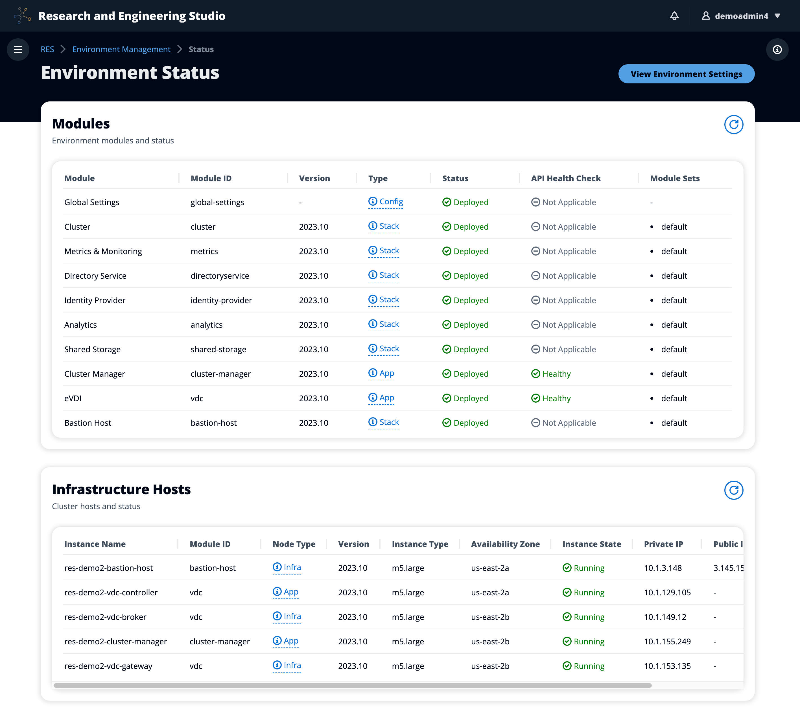

# Environment status

The **Environment Status** page displays the deployed software and hosts
within the product. It includes information such as software version, module names, and
other system information.

