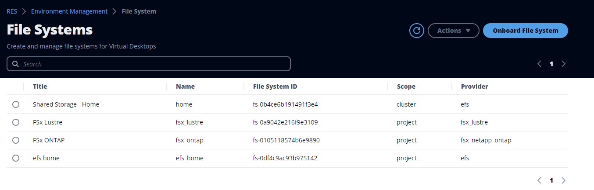

# File Systems

From the File Systems page, you can:

1. Search for file systems.
2. When a file system is selected, use the **Actions** menu to:
   1. Add the file system to a project.
   2. Remove the file system from a project

3. Onboard a new file system.
4. When a file system is selected, you can expand the pane at the bottom of the screen
   to view file system details.

###### Topics

- [Onboard a file system](onboard-file-system.md "onboard-file-system.md")
