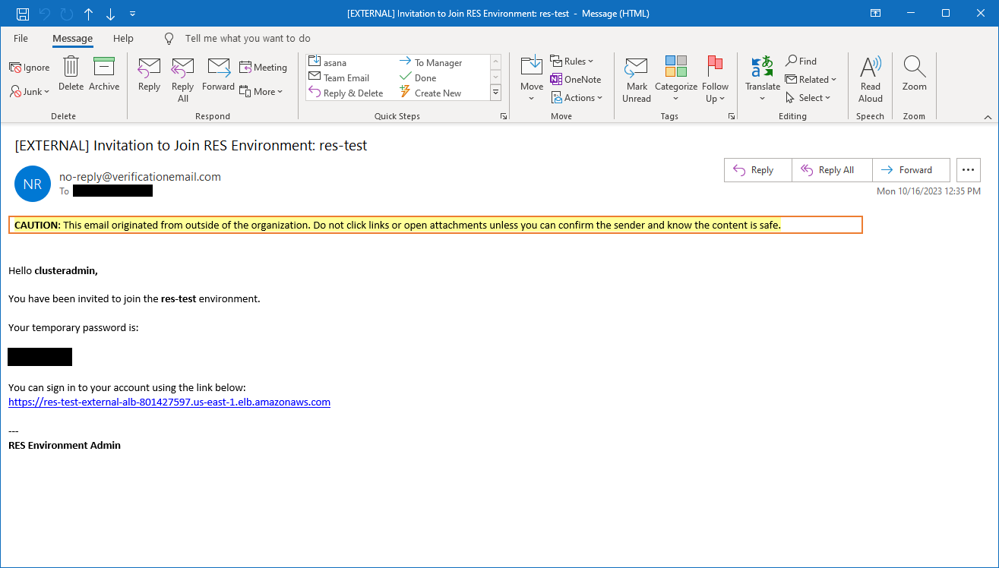

# Step 2: Sign in for the first time

Once the product stack has deployed in your account, you will receive an email with your
credentials. Use the URL to sign in to your account and configure the workspace for other
users.

Once you have signed in for the first time, you can configure settings in the web portal
to connect to the SSO provider. For post-deployment configuration information, see the [Configuration guide](configuration-guide.md "configuration-guide.md"). Note that `clusteradmin` is a break-glass account—
you can use it to create projects and assign user or group membership to those projects; it
cannot assign software stacks or deploy a desktop for itself.
