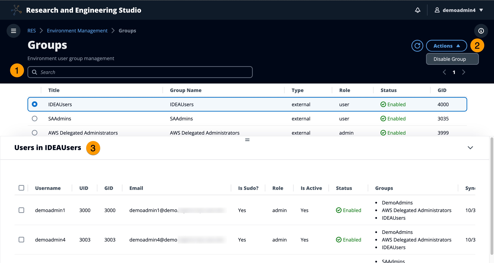

# Groups

All Groups synced from the active directory appear on the Groups page. For more information
on group configuration and management, see the [Configuration guide](configuration-guide.md "configuration-guide.md").

From the **Groups** page, you can:

1. Search for user groups.
2. When a user group is selected, use the **Actions**
   menu to disable or enable a group.
3. When a user group is selected, you can expand the **Users**
   pane at the bottom of the screen to view users in the group.
