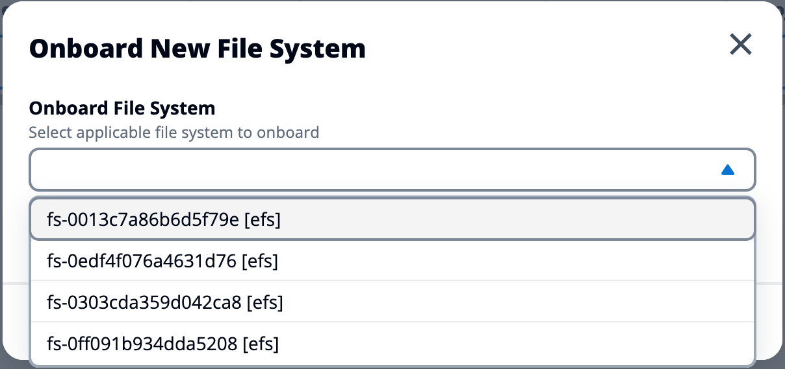
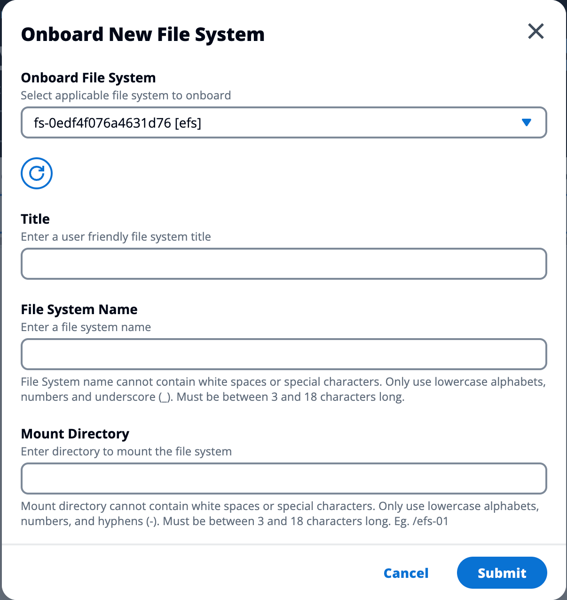

# Onboard a file system

###### Note

To successfully onboard a file system, it must share the same VPC and at least
one of your RES subnets. You must also ensure you have the security group configured
properly so your VDIs have access to the file system's contents.

1. Choose **Onboard File System**.
2. Select a file system from the drop down. The modal will expand with additional
   detail entries.

 3. Enter file system details.

###### Note

By default, administrators and project owners have the ability to choose
a home filesystem when creating a new project, which cannot be edited
afterwards.

File systems intended to be used as home directories on projects must
be onboarded by setting their **Mount Directory** path to
`/home`. This will populate the onboarded filesystem on the home
directory filesystem dropdown options. This feature helps to keep the data
isolated across projects since only users associated with the project will
have access to the filesystem through their VDIs. VDIs will mount the
filesystem at the mount point selected during onboarding of a filesystem. 4. Choose **Submit**.

