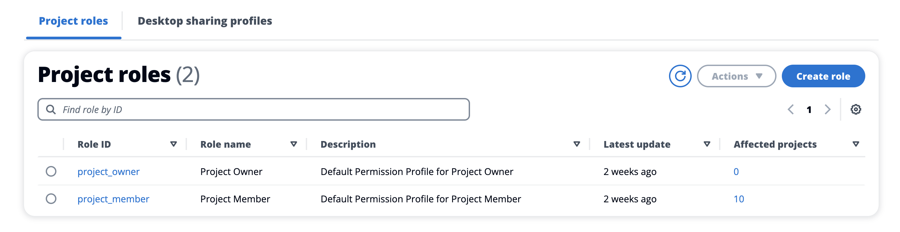
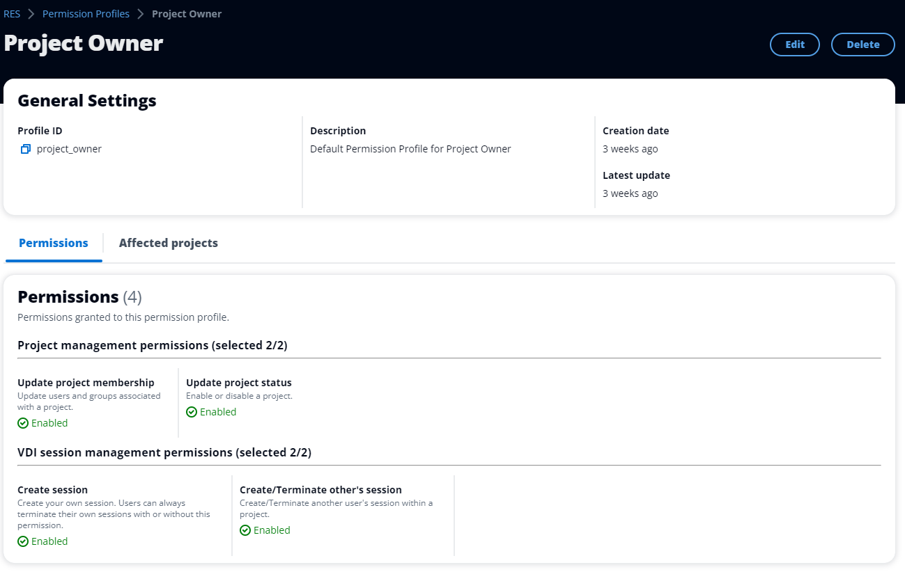
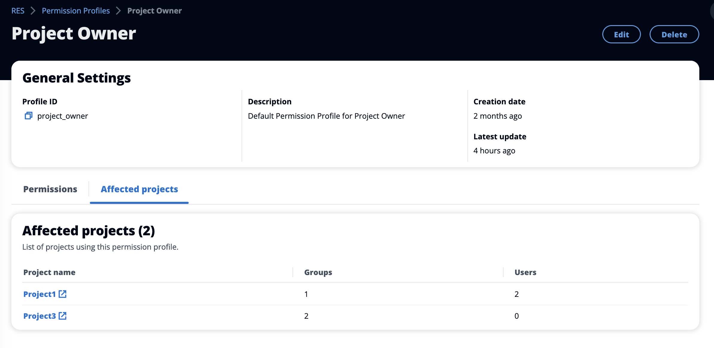
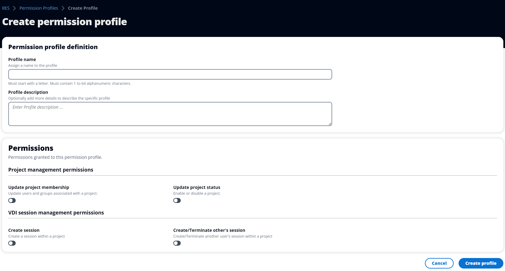
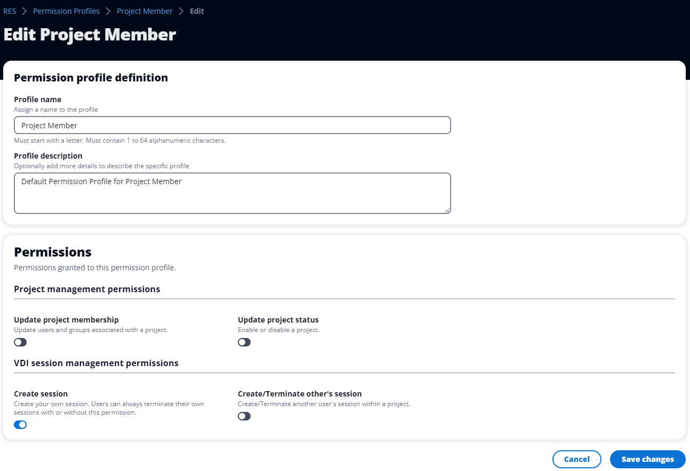
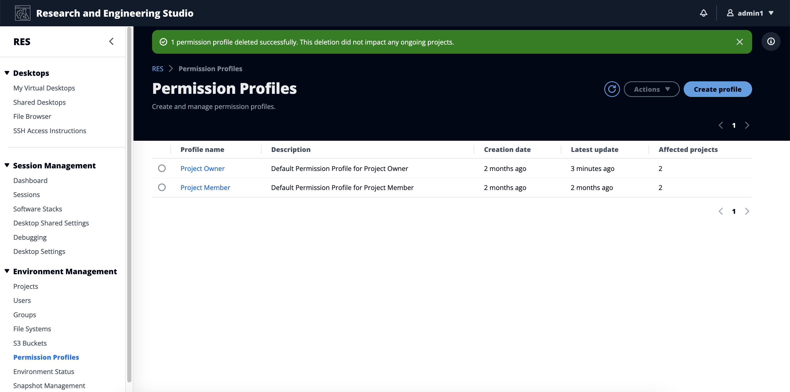

# Managing permission profiles

As a RES administrator, you can perform the following actions to manage permission
profiles.

###### List permission profiles

- From the Research and Engineering Studio console page, choose **Permission policy**
  in the left-hand navigation pane. From this page you can create, update, list, view and
  delete permission profiles.

###### View permission profiles

1. On the main **Permission Profiles** page, select the name of the
   permission profile you want to view. From this page you can edit or delete the
   selected permission profile.

 2. Select the **Affected projects** tab to view the projects that
currently use the permission profile.

###### Create permission profiles

1. On the main **Permission Profiles** page, choose **Create
   profile** to create a permission profile.
2. Enter a permission profile name and description, then select the permissions to grant
   to the users or groups that you assign to this profile.

###### Edit permission profiles

- On the main **Permission Profiles** page, select a profile by
  clicking the circle next to it, choose **Actions**, then choose
  **Edit profile** to update that permission profile.

###### Delete permission profiles

- On the main **Permission Profiles** page, select a profile by
  clicking the circle next to it, choose **Actions**, then choose
  **Delete profile**. You cannot delete a permission profile that
  is used by any existing project.

