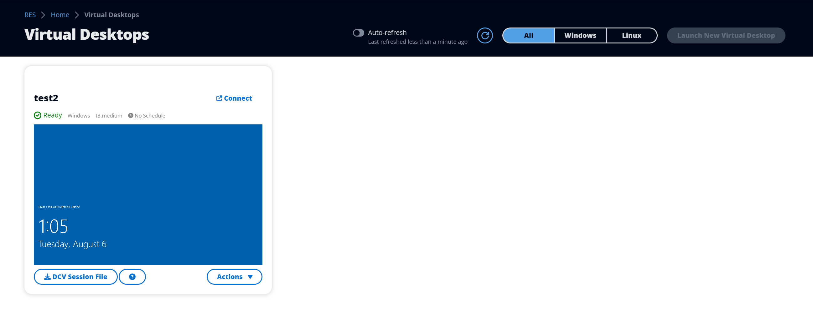
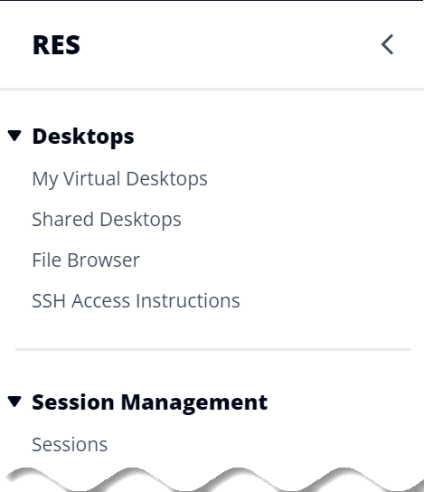
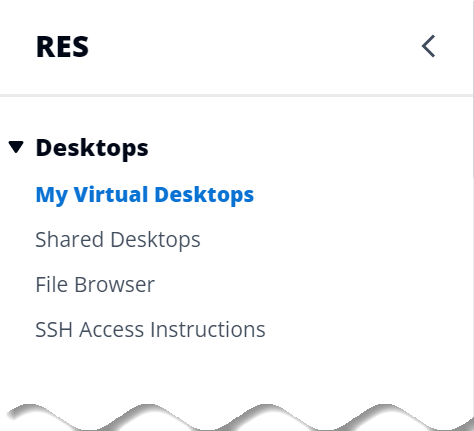

# VDI session management

permissions

**Create a session**

Controls whether or not a user is allowed to launch their own VDI session
from the **My Virtual Desktops** page. Disable this to deny
non-admin users the ability to launch their own VDI sessions. Users can always
stop and terminate their own VDI sessions.

If a non-admin user does not have permissions to create a session,
the **Launch New Virtual Desktop** button will be disabled for
them as shown here:

**Create or Terminate the sessions of others**

Allows non-admin users to access the **Sessions**
page from the left-hand navigation pane. These users will be able to
launch VDI sessions for other users in the projects where they have
been granted this permission.

If a non-admin user has permission to launch sessions for other users,
their left-hand navigation pane will display the **Sessions**
link under **Session Management** as shown here:

If a non-admin user does not have permission to create sessions for
others, their left-hand navigation pane will not display **Session
Management** as shown here:

