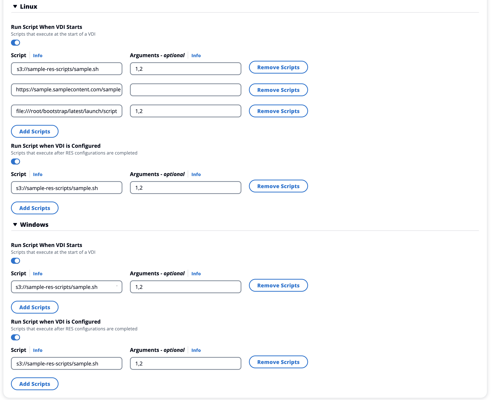

# Add a launch template

When creating or editing a project, you can add launch templates using the
**Advanced Options** within the project configuration. Launch
templates provide additional configurations, such as security groups, IAM policies, and
launch scripts to all VDI instances within the project.

## Add policies

You can add an IAM policy to control VDI access for all instances deployed under your
project. To onboard a policy, tag the policy with the following key-value pair:

```
res:Resource/vdi-host-policy
```

For more information on IAM roles, see [Policies and permissions in IAM](../../../IAM/latest/UserGuide/access_policies.md "../../../IAM/latest/UserGuide/access_policies.md").

### Add security groups

You can add a security group to control the egress and ingress data for all VDI
instances under your project. To onboard a security group, tag the security group
with the following key-value pair:

```
res:Resource/vdi-security-group
```

For more information on security groups, see [Control traffic to your AWS
resources using security groups](../../../vpc/latest/userguide/vpc-security-groups.md "../../../vpc/latest/userguide/vpc-security-groups.md") in the _Amazon VPC User Guide_.

### Add launch scripts

You can add launch scripts that will initiate on all VDI sessions within your project.
RES supports script initiation for Linux and Windows. For script initiation,
you can choose either:

**Run Script When VDI Starts**

This option initiates the script at the beginning of a VDI instance
before any RES configurations or installations run.

**Run Script when VDI is Configured**

This option initiates the script after RES configurations
complete.

Scripts support the following options:

| Script configuration | Example                                 |
| -------------------- | --------------------------------------- | ------------------------------------------------------------------------------------------------------------------------------------------------------------------------------------------------------------------------------------------------------------------------------------------------------------------------------ |
| S3 URI               | s3://bucketname/script.sh               |
| HTTPS URL            | https://sample.samplecontent.com/sample |
| Local file           | file:///user/scripts/example.sh         | All custom scripts that are hosted on a S3 buckets need to be provisioned with the following tag: `` res:EnvironmentName/`<res-environment>` `` For **Arguments**, provide any arguments separated by a comma.  _Example of a project configuration_ |
