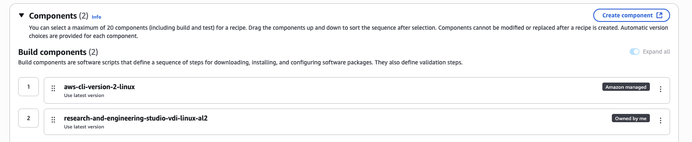

# Configure RES-ready AMIs

With RES-ready Amazon Machine Images (AMIs), you can pre-install RES
dependencies for virtual desktop instances (VDIs) on your custom AMIs. Using RES-ready
AMIs improve boot times for VDI instances using the pre-baked images. Using EC2 Image Builder, you can
build and register your AMIs as new software stacks. For more information on Image Builder, see the
[Image Builder User Guide](../../../imagebuilder/latest/userguide/what-is-image-builder.md "../../../imagebuilder/latest/userguide/what-is-image-builder.md").

Before you begin, you must [deploy the latest version of
RES](update-the-product.md "update-the-product.md").

###### Topics

- [Prepare an IAM role to access RES environment](#prepare-role "#prepare-role")
- [Create EC2 Image Builder component](#image-builder-component "#image-builder-component")
- [Prepare your EC2 Image Builder recipe](#prepare-recipe "#prepare-recipe")
- [Configure EC2 Image Builder infrastructure](#configure-ib-infrastructure "#configure-ib-infrastructure")
- [Configure Image Builder image pipeline](#image-builder-pipeline "#image-builder-pipeline")
- [Run Image Builder image pipeline](#run-image-pipeline "#run-image-pipeline")
- [Register a new software stack in RES](#register-res-ready-stack "#register-res-ready-stack")

## Prepare an IAM role to access RES environment

To access the RES environment service from EC2 Image Builder, you must create or modify
an IAM role called RES-EC2InstanceProfileForImageBuilder. For information on
configuring an IAM role for use in Image Builder, see [AWS Identity and Access Management (IAM)](../../../imagebuilder/latest/userguide/image-builder-setting-up.md#image-builder-IAM-prereq "../../../imagebuilder/latest/userguide/image-builder-setting-up.md#image-builder-IAM-prereq") in the _Image Builder User Guide_.

###### Your role requires:

- Trusted relationships that include the Amazon EC2 service.
- AmazonS3ReadOnlyAccess, AmazonSSMManagedInstanceCore and EC2InstanceProfileForImageBuilder
  policies.

## Create EC2 Image Builder component

Follow the directions to [Create a component using
the Image Builder console](../../../imagebuilder/latest/userguide/create-component-console.md "../../../imagebuilder/latest/userguide/create-component-console.md") in the _Image Builder User Guide_.

###### Enter your component details:

1. For **Type**, choose **Build**.
2. For **Image operating system (OS)**, choose either Linux or Windows.
3. For **Component name**, enter a meaningful name such as
   `research-and-engineering-studio-vdi-<operating-system>`.
4. Enter your component's version number and optionally add a description.

```
key : value
```

5. For the **Definition document**, enter the following definition
   file. If you encounter any errors, the YAML file is space sensitive and is the most
   likely cause.

###### Important

In the definition file, replace `latest` in the download URI
(`- source: 's3://research-engineering-studio-us-east-1/releases/`latest`/res-installation-scripts.tar.gz'`)
with with the exact version number (for example, `2025.06`) if
your RES environment version is not the latest.

Linux

```
#  Copyright Amazon.com, Inc. or its affiliates. All Rights Reserved.
#
#  Licensed under the Apache License, Version 2.0 (the "License"). You may not use this file except in compliance
#  with the License. A copy of the License is located at
#
#      http://www.apache.org/licenses/LICENSE-2.0
#
#  or in the 'license' file accompanying this file. This file is distributed on an 'AS IS' BASIS, WITHOUT WARRANTIES
#  OR CONDITIONS OF ANY KIND, express or implied. See the License for the specific language governing permissions
#  and limitations under the License.
name: research-and-engineering-studio-vdi-linux
description: An RES EC2 Image Builder component to install required RES software dependencies for Linux VDI.
schemaVersion: 1.0
parameters:
  - GPUFamily:
      type: string
      description: GPU family (NONE, NVIDIA, or AMD)
      default: NONE
phases:
  - name: build
    steps:
      - name: PrepareRESBootstrap
        action: ExecuteBash
        onFailure: Abort
        maxAttempts: 3
        inputs:
          commands:
            - "mkdir -p /root/bootstrap/logs"
            - "mkdir -p /root/bootstrap/latest"
      - name: DownloadRESLinuxInstallPackage
        action: S3Download
        onFailure: Abort
        maxAttempts: 3
        inputs:
          - source: "s3://research-engineering-studio-us-east-1/releases/latest/res-installation-scripts.tar.gz"
            destination: "/root/bootstrap/res-installation-scripts/res-installation-scripts.tar.gz"
      - name: RunInstallScript
        action: ExecuteBash
        onFailure: Abort
        maxAttempts: 3
        inputs:
          commands:
            - "cd /root/bootstrap/res-installation-scripts"
            - "tar -xf res-installation-scripts.tar.gz"
            - "cd scripts/virtual-desktop-host/linux"
            - "/bin/bash install.sh -g {{ GPUFamily }}"
      - name: RunInstallPostRebootScript
        action: ExecuteBash
        onFailure: Abort
        maxAttempts: 3
        inputs:
          commands:
            - "cd /root/bootstrap/res-installation-scripts/scripts/virtual-desktop-host/linux"
            - 'sed -i ''/^export AWS_DEFAULT_PROFILE="bootstrap_profile"$/d'' install_post_reboot.sh'
            - "/bin/bash install_post_reboot.sh -g {{ GPUFamily }}"
      - name: PreventAL2023FromUninstallingCronie
        action: ExecuteBash
        onFailure: Abort
        maxAttempts: 3
        inputs:
          commands:
            - "rm -f /tmp/imagebuilder_service/crontab_installed"
```

Windows

```
#  Copyright Amazon.com, Inc. or its affiliates. All Rights Reserved.
#
#  Licensed under the Apache License, Version 2.0 (the "License"). You may not use this file except in compliance
#  with the License. A copy of the License is located at
#
#      http://www.apache.org/licenses/LICENSE-2.0
#
#  or in the 'license' file accompanying this file. This file is distributed on an 'AS IS' BASIS, WITHOUT WARRANTIES
#  OR CONDITIONS OF ANY KIND, express or implied. See the License for the specific language governing permissions
#  and limitations under the License.
name: research-and-engineering-studio-vdi-windows
description: An RES EC2 Image Builder component to install required RES software dependencies for Windows VDI.
schemaVersion: 1.0

phases:
  - name: build
    steps:
       - name: CreateRESBootstrapFolder
         action: CreateFolder
         onFailure: Abort
         maxAttempts: 3
         inputs:
            - path: 'C:\Users\Administrator\RES\Bootstrap'
              overwrite: true
       - name: DownloadRESWindowsInstallPackage
         action: S3Download
         onFailure: Abort
         maxAttempts: 3
         inputs:
            - source: 's3://research-engineering-studio-us-east-1/releases/latest/res-installation-scripts.tar.gz'
              destination: '{{ build.CreateRESBootstrapFolder.inputs[0].path }}\res-installation-scripts.tar.gz'
       - name: RunInstallScript
         action: ExecutePowerShell
         onFailure: Abort
         maxAttempts: 3
         inputs:
            commands:
                - 'cd {{ build.CreateRESBootstrapFolder.inputs[0].path }}'
                - 'tar -xf res-installation-scripts.tar.gz'
                - 'Import-Module .\scripts\virtual-desktop-host\windows\Install.ps1'
                - 'Install-WindowsEC2Instance -PrebakeAMI'
```

6. Create any optional tags and choose **Create component**.

## Prepare your EC2 Image Builder recipe

An EC2 Image Builder recipe defines the base image to use as your starting point to create a new
image, along with the set of components that you add to customize your image and verify that
everything works as expected. You must either create or modify a recipe to construct the target
AMI with the necessary RES software dependencies. For more information on recipes,
see [Manage
recipes](../../../imagebuilder/latest/userguide/manage-recipes.md "../../../imagebuilder/latest/userguide/manage-recipes.md").

RES supports the following image operating systems:

- Amazon Linux 2 (x86 and ARM64)
- Amazon Linux 2023 (x86 and ARM64)
- RHEL 8 (x86), and 9 (x86)
- Rocky Linux 9 (x86)
- Ubuntu 22.04.3 (x86)
- Windows Server 2019, 2022 (x86)
- Windows 10, 11 (x86)

Create a new recipe

1. Open the EC2 Image Builder console at [https://console.aws.amazon.com/imagebuilder](https://console.aws.amazon.com/imagebuilder "https://console.aws.amazon.com/imagebuilder").
2. Under **Saved resources**, choose **Image
   recipes**.
3. Choose **Create image recipe**.
4. Enter a unique name and a version number.
5. Select a base image supported by RES.
6. Under **Instance configuration**, install an SSM agent
   if one does not come pre-installed. Enter the information in **User
   data** and any other needed user data.

###### Note

For information on how to install an SSM agent, see:

    * [Manually installing SSM Agent on EC2 instances for Linux](../../../systems-manager/latest/userguide/sysman-manual-agent-install.md "../../../systems-manager/latest/userguide/sysman-manual-agent-install.md").
    * [Manually installing and uninstalling SSM Agent on EC2 instances
     for Windows Server](../../../systems-manager/latest/userguide/sysman-install-win.md "../../../systems-manager/latest/userguide/sysman-install-win.md").

7. For Linux based recipes, add the Amazon-managed `aws-cli-version-2-linux`
   build component to the recipe. For Windows based recipes, add the Amazon-managed
   `aws-cli-version-2-windows` build component to the recipe.
   RES installation scripts use the AWS CLI to provide VDI access to
   configuration values for the DynamoDB cluster-settings.
8. Add the EC2 Image Builder component created for your Linux or Windows environment.

###### Important

You must add these components in order with the
`aws-cli-version-2-linux` (for Linux) or
`aws-cli-version-2-windows` (for Windows) build component added first.

 9. (Recommended) Add the Amazon-managed
`simple-boot-test-<linux-or-windows>` test component to
verify that the AMI can be launched. This is a minimum recommendation. You
may select other test components that meet your requirements. 10. Complete any optional sections if needed, add any other desired components,
and choose **Create recipe**.

Modify a recipe
If you have an existing EC2 Image Builder recipe, you can use it by adding the following
components:

1. For Linux based recipes, add the Amazon-managed `aws-cli-version-2-linux`
   build component to the recipe. For Windows based recipes, add the Amazon-managed
   `aws-cli-version-2-windows` build component to the recipe.
   RES installation scripts use the AWS CLI to provide VDI access to
   configuration values for the DynamoDB cluster-settings.
2. Add the EC2 Image Builder component created for your Linux or Windows environment.

###### Important

You must add these components in order with the
`aws-cli-version-2-linux` (for Linux) or
`aws-cli-version-2-windows` (for Windows) build component added first.

 3. Complete any optional sections if needed, add any other desired components,
and choose **Create recipe**.

## Configure EC2 Image Builder infrastructure

You can use infrastructure configurations to specify the Amazon EC2 infrastructure that Image Builder uses
to build and test your Image Builder image. For use with RES, you can choose to create a new
infrastructure configuration, or use an existing one.

- To create a new infrastructure configuration, see [Create an infrastructure
  configuration](../../../imagebuilder/latest/userguide/create-infra-config.md "../../../imagebuilder/latest/userguide/create-infra-config.md").
- To use an existing infrastructure configuration, [Update an infrastructure
  configuration](../../../imagebuilder/latest/userguide/update-infra-config.md "../../../imagebuilder/latest/userguide/update-infra-config.md").

###### To configure your Image Builder infrastructure:

1. For **IAM role**, enter the role you previously configured
   in [Prepare an IAM role to access RES environment](#prepare-role "#prepare-role").
2. For **Instance type**, choose a type with at least 4 GB of memory
   and supports your chosen base AMI architecture. See [Amazon EC2 Instance types](https://aws.amazon.com/ec2/instance-types/ "https://aws.amazon.com/ec2/instance-types/").
3. For **VPC, subnet, and security groups**, you must permit internet
   access to download software packages. Access must also be allowed to the
   `cluster-settings` DynamoDB table and Amazon S3 cluster bucket of the
   RES environment.

## Configure Image Builder image pipeline

The Image Builder image pipeline assembles the base image, components for building and testing,
infrastructure configuration, and distribution settings. To configure an image pipeline
for RES-ready AMIs, you can choose to create a new pipeline, or use an existing
one. For more information, see [Create and update AMI image
pipelines](../../../imagebuilder/latest/userguide/ami-image-pipelines.md "../../../imagebuilder/latest/userguide/ami-image-pipelines.md") in the _Image Builder User Guide_.

Create a new Image Builder pipeline

1. Open the Image Builder console at [https://console.aws.amazon.com/imagebuilder](https://console.aws.amazon.com/imagebuilder "https://console.aws.amazon.com/imagebuilder").
2. From the navigation pane, choose **Image pipelines**.
3. Choose **Create image pipeline**.
4. Specify your pipeline details by entering a unique name, optional description,
   schedule, and frequency.
5. For **Choose recipe**, choose **Use existing
   recipe** and select the recipe created in [Prepare your EC2 Image Builder recipe](#prepare-recipe "#prepare-recipe"). Verify that your recipe details are
   correct.
6. For **Define image creation process**, choose either the
   default or custom workflow depending on the use case. In most cases, the
   default workflows are sufficient. For more information, see [Configure image workflows for your EC2 Image Builder pipeline](../../../imagebuilder/latest/userguide/pipeline-workflows.md "../../../imagebuilder/latest/userguide/pipeline-workflows.md").
7. For **Define infrastructure configuration**, choose
   **Choose existing infrastructure configuration** and
   select the infrastructure configuration created in [Configure EC2 Image Builder infrastructure](#configure-ib-infrastructure "#configure-ib-infrastructure").
   Verify that your infrastructure details are correct.
8. For **Define distribution settings**, choose
   **Create distribution settings using service defaults**.
   The output image must reside in the same AWS Region as your RES
   environment. Using service defaults, the image will be created in the
   Region where Image Builder is used.
9. Review the pipeline details and choose **Create pipeline**.

Modify an existing Image Builder pipeline

1. To use an existing pipeline, modify the details to use the recipe created
   in [Prepare your EC2 Image Builder recipe](#prepare-recipe "#prepare-recipe").
2. Choose **Save changes**.

## Run Image Builder image pipeline

To produce the output image configured, you must initiate the image pipeline. The building
process can potentially take up to an hour depending on the number of components in the image
recipe.

###### To run the image pipeline:

1. From **Image pipelines**, select the pipeline created in [Configure Image Builder image pipeline](#image-builder-pipeline "#image-builder-pipeline").
2. From **Actions**, choose **Run pipeline**.

## Register a new software stack in RES

1. Follow the directions in [Software Stacks (AMIs)](software-stacks.md "software-stacks.md") to register a
   software stack.
2. For **AMI ID**, enter the AMI ID of the output image built in
   [Run Image Builder image pipeline](#run-image-pipeline "#run-image-pipeline").
