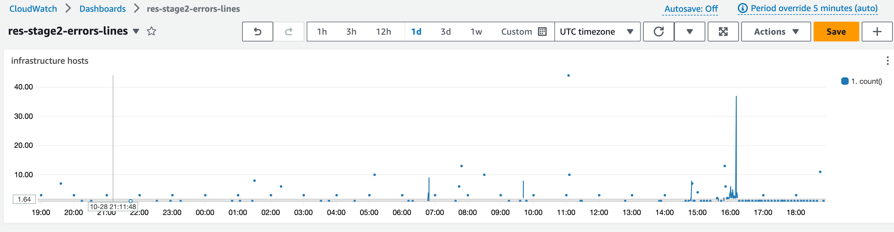
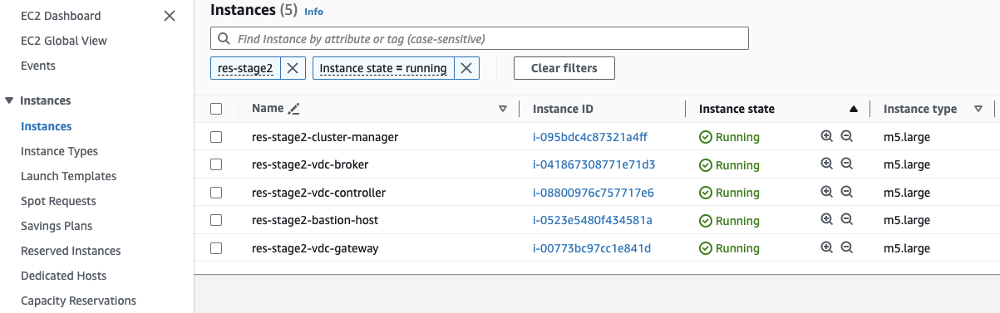
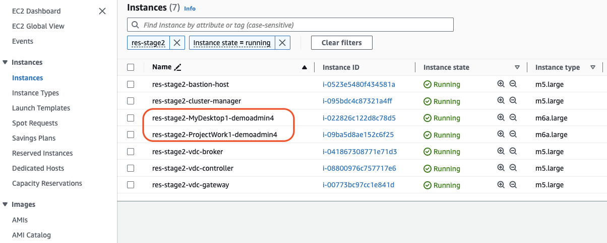
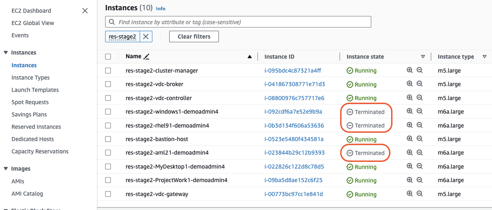

# General Debugging and Monitoring

This section contains information about where information can be found within RES.

- [Useful log and event information sources](#res-troubleshooting-general-info "#res-troubleshooting-general-info")
  - [Where to find environment variables](#res-troubleshooting-general-info-env-vars "#res-troubleshooting-general-info-env-vars")
  - [Log files on the environment Amazon EC2
    instances](#res-troubleshooting-general-info-logs "#res-troubleshooting-general-info-logs")
  - [CloudFormation Stacks](#res-troubleshooting-cf-stacks "#res-troubleshooting-cf-stacks")
  - [System failures due to an issue and
    reflected by Amazon EC2 Auto Scaling Group Activity](#res-troubleshooting-asg-activity "#res-troubleshooting-asg-activity")

- [Typical Amazon EC2 Console Appearance](#res-troubleshooting-ec2-console "#res-troubleshooting-ec2-console")
  - [Infrastructure hosts](#res-troubleshooting-ec2-console-infra "#res-troubleshooting-ec2-console-infra")
  - [Infrastructure hosts and
    virtual desktops](#res-troubleshooting-ec2-console-virtual "#res-troubleshooting-ec2-console-virtual")
  - [Hosts in a terminated state](#res-troubleshooting-ec2-console-hosts-terminated "#res-troubleshooting-ec2-console-hosts-terminated")
  - [Useful Active Directory (AD)
    related commands for reference](#res-troubleshooting-ec2-console-active-dir "#res-troubleshooting-ec2-console-active-dir")

- [Windows DCV debugging](#res-troubleshooting-windows-dcv "#res-troubleshooting-windows-dcv")
- [Find Amazon DCV Version Information](#res-troubleshooting-find-nice-dcv "#res-troubleshooting-find-nice-dcv")

## Useful log and event information sources

There are various sources of information retained that can be referenced for troubleshooting
and monitoring uses.

### Where to find environment variables

By default, you can find environment variables, such as the session owner username,
in the following locations:

- Linux: `/etc/environment`
- Windows: `C:\Users\Administrator\RES\Bootstrap\virtual-desktop-host-windows\environment_variables.json`

### Log files on the environment Amazon EC2

instances

Log files exist on the Amazon EC2 instances in use by RES. The SSM Session Manager
can be used to open a session to the instance for examining these files.

On infrastructure instances such as the cluster-manager and vdc-controller, application
and other logs can be found at the following locations.

- /opt/idea/app/logs/application.log
- /root/bootstrap/logs/
- /var/log/
- /var/log/sssd/
- /var/log/messages
- /var/log/user-data.log
- /var/log/cloud-init.log
- /var/log/cloud-init-output.log

On a Linux virtual desktop, the following contain useful log files

- /var/log/dcv/
- /root/bootstrap/logs/userdata.log
- /var/log/messages
- /opt/idea/app/logs/
- /opt/res/logs/vdi_idle_check.log

On Windows virtual desktop instances logs can be found at

- PS C:\ProgramData\nice\dcv\log
- PS C:\ProgramData\nice\DCVSessionManagerAgent\log
- PS C:\IDEA\Logs\RESIdleCheckVDI\
- C:\Program Files\RES\app\

On Windows, some applications logging can be found at:

- PS C:\Program Files\NICE\DCV\Server\bin

On Windows, the NICE DCV certificate files can be found in:

- C:\Windows\System32\config\systemprofile\AppData\Local\NICE\dcv\

**Amazon CloudWatch Log Groups**

The Amazon EC2 and AWS Lambda compute resources log information to Amazon CloudWatch Log
Groups. The log entries within them can provide useful information when troubleshooting
potential issues or for general information.

Those groups are named as follows:

- `/aws/lambda/`<envname>`-/ - lambda related`
- `/`<envname>`/`
  - `cluster-manager/ - main infrastructure host`
  - `virtual-desktop-app/ - virtual desktop bootstrap and DCV related`
  - `vdc/ - virtual desktop related`
    - `dcv-broker/ - desktop related`
    - `dcv-connection-gateway/ - desktop related`
    - `controller/ - main desktop controller host`
    - `dcv-session/ - desktop session related`

When examining log groups, it can be helpful to filter using upper and lower case
strings such as the following. This will output only those messages containing the
noted strings.

```
?"ERROR" ?"error"
```

Another method of monitoring for issues is to create Amazon CloudWatch Dashboards that contain
widgets that display the data of interest.

An example is to create a widget that counts the occurrence of the strings error and
ERROR and graph them as lines. This method makes it easier to detect the occurrence of
potential issues or trends indicating a pattern change has occurred.

The following is an example of that for the infrastructure hosts. To use this,
concatenate the query lines and replace the `<envname>` and
`<region>` attributes with the appropriate values.

```
{
    "widgets": [
        {
            "type": "log",
            "x": 0,
            "y": 0,
            "width": 24,
            "height": 6,
            "properties": {
                "query": "SOURCE '/`<envname>`/vdc/controller' |
                    SOURCE '/`<envname>`/cluster-manager' |
                    SOURCE '/`<envname>`/vdc/dcv-broker' |
                   SOURCE '/`<envname>`/vdc/dcv-connection-gateway' |
                    fields @timestamp, @message, @logStream, @log\n|
                    filter @message like /(?i)(error|ERROR)/\n|
                    sort @timestamp desc|
                    stats count() by bin(30s)",
                "region": "`<region>`",
                "title": "infrastructure hosts",
                "view": "timeSeries",
                "stacked": false
            }
        }
    ]
}
```

An example of the Dashboard might appear as follows:



### CloudFormation Stacks

The CloudFormation stacks created during environment creation contain resources,
event, and output information associated with the configuration of the environment.

For each of the stacks, the Events, Resources, and Outputs tab can be referred to
for information about the stacks.

RES stacks:

- <envname>-bootstrap
- <envname>-cluster
- <envname>-metrics
- <envname>-directoryservice
- <envname>-identity-provider
- <envname>-shared-storage
- <envname>-cluster-manager
- <envname>-vdc
- <envname>-bastion-host

Demo Environment Stack (If you are deploying a demo environment and do not have
these external resources available, you can use AWS High Performance Compute recipes
to generate resources for a demo environment.)

- <envname>
- <envname>-Networking
- <envname>-DirectoryService
- <envname>-Storage
- <envname>-WindowsManagementHost

### System failures due to an issue and

reflected by Amazon EC2 Auto Scaling Group Activity

If the RES UIs indicate server errors, the cause may be an application software
or other issue.

Each of the infrastructure Amazon EC2 instance autoscaling groups (ASGs) contains an Activity
tab that can be useful for detecting scaling activity for the instances. If UI pages
note any errors or are not accessible, check the Amazon EC2 console for multiple terminated
instances and check the Auto Scaling Group Activity tab for the related ASG to determine
if Amazon EC2 instances are cycling.

If so, use the related Amazon CloudWatch log group for the instance to determine if errors
are being logged that might indicate the cause of the issue. It may also be possible
to use the SSM Session console to open a session to a running instance of that type
and examine the log files on the instance to determine a cause before the instance
is marked as unhealthy and terminated by the ASG.

The ASG console may show activity similar to the following if this issue is occurring.


## Typical Amazon EC2 Console Appearance

This section contains screenshots of the system operating in various states.

### Infrastructure hosts

The Amazon EC2 console, when no desktops are running, typically looks similar to the
following. The instances that are shown are the RES infrastructure Amazon EC2 hosts. The
prefix in an instance name is the RES environment name.



### Infrastructure hosts and

virtual desktops

In the Amazon EC2 console, when virtual desktops are running, they appear similar to
the following. In this case, the virtual desktops are noted in red. The suffix to
the instance name is the user that created the desktop. The name in the center
is the Session Name set at launch time and is either be the default "MyDesktop"
or the name set by the user.



### Hosts in a terminated state

When the Amazon EC2 console shows terminated instances, they are generally desktop
hosts that have been terminated. If the console includes infrastructure hosts in a
terminated state, particularly if there are multiple of the same type, that may indicate
a system issue in progress.

The following image shows desktop instances that have been terminated.



### Useful Active Directory (AD)

related commands for reference

The following are examples of ldap related commands that can be entered on infrastructure
hosts to view AD configuration related information. The domain and other parameters used
should reflect those entered at environment creation time.

```
ldapsearch "(cn=AWS Delegated Add Workstations To Domain Users)" -x -h corp.res.com
    -b "DC=corp,DC=res,DC=com" -D "CN=Admin,OU=Users,OU=CORP,DC=corp,DC=res,DC=com"
    -w `<password>`

ldapsearch "(&(objectClass=group))" -x -h corp.res.com
    -b "DC=corp,DC=res,DC=com" -D "CN=Admin,OU=Users,OU=CORP,DC=corp,DC=res,DC=com"
    -w `<password>`
```

## Windows DCV debugging

On a Windows desktop, you can list the session associated with it using the following:

```
PS C:\Windows\System32\config\systemprofile\AppData\Local\NICE\dcv> & 'C:\Program Files\NICE\DCV\Server\bin\dcv.exe'list-sessions
Session: 'a7953489-9dbf-492b-8135-7709dccc4cab' (owner:admin2 type:console name:windows1)
```

## Find Amazon DCV Version Information

Amazon DCV is utilized for virtual desktop sessions. [AWS Amazon DCV](https://aws.amazon.com/hpc/dcv/ "https://aws.amazon.com/hpc/dcv/"). The following examples show how to determine the version
of the DCV software installed.

Linux

```
[root@ip-10-3-157-194 ~]# /usr/bin/dcv version

Amazon DCV 2023.0 (r14852)
Copyright (C) 2010-2023 NICE s.r.l.
All rights reserved.

This product is protected by copyright and
licenses restricting use, copying, distribution, and decompilation.
```

Windows

```
PS C:\Windows\System32\config\systemprofile\AppData\Local\NICE\dcv> & 'C:\Program Files\NICE\DCV\Server\bin\dcv.exe' version

Amazon DCV 2023.0 (r15065)
Copyright (C) 2010-2023 NICE s.r.l.
All rights reserved.

This product is protected by copyright and
licenses restricting use, copying, distribution, and decompilation.
```
