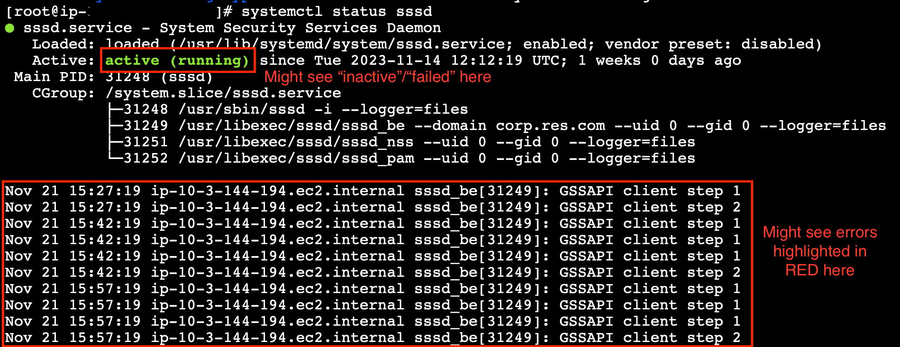
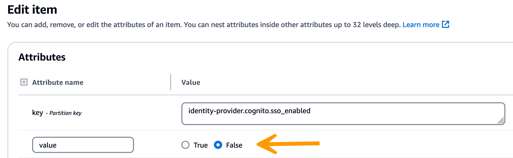
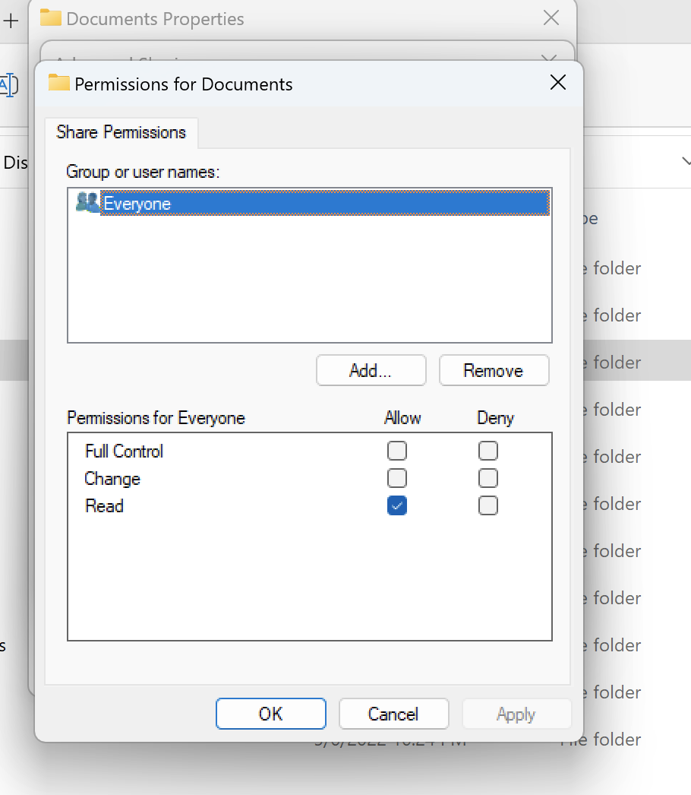
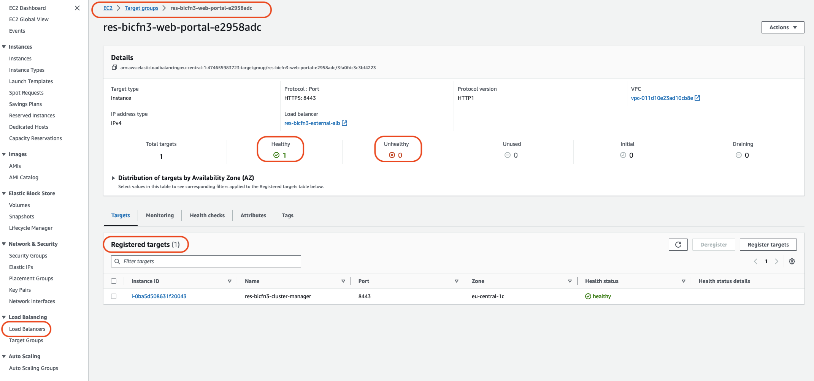
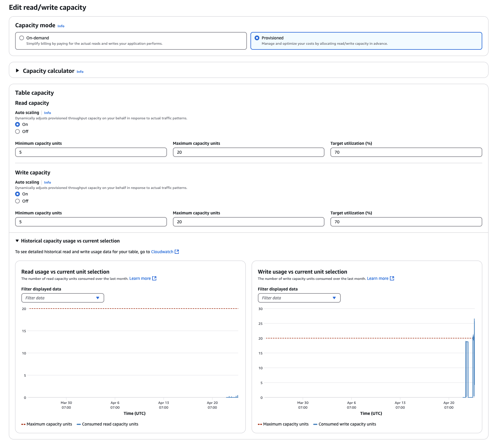

# Issue RunBooks

The following section contains issues that may occur, how to detect them, and suggestions
on how to resolve the issue.

- [Installation issues](#installation-issues "#installation-issues")
  - [AWS CloudFormation stack fails to create with message "WaitCondition
    received failed message. Error:States.TaskFailed"](#cf-stack-fails "#cf-stack-fails")
  - [Email notification not received after AWS CloudFormation
    stacks created successfully](#email-invitation-not-received "#email-invitation-not-received")
  - [Instances cycling or vdc-controller in failed state](#instances-cycling "#instances-cycling")
  - [Environment CloudFormation stack fails to delete due to dependent object error](#object-error "#object-error")
  - [Error encountered for CIDR block parameter during environment creation](#cidr-block-error "#cidr-block-error")
  - [CloudFormation stack creation failure during environment creation](#cf-stack-creation-fails "#cf-stack-creation-fails")
  - [Creation of external resources (demo) stack
    fails with AdDomainAdminNode CREATE_FAILED](#demo-environment-stack-fails "#demo-environment-stack-fails")

- [Identity management issues](#troubleshooting-identity-management "#troubleshooting-identity-management")
  - [I am not authorized to
    perform iam:PassRole](#res-troubleshooting-issue-runbooks-unauth-passrole "#res-troubleshooting-issue-runbooks-unauth-passrole")
  - [I want to allow people
    outside of my AWS account to access my Research and Engineering Studio on AWS
    resources](#res-troubleshooting-issue-runbooks-outside-acct "#res-troubleshooting-issue-runbooks-outside-acct")
  - [When logging into the environment, I immediately return
    to the login page](#return-to-login "#return-to-login")
  - ["User not found" error when trying to log in](#user-not-found "#user-not-found")
  - [User added in Active Directory, but missing from RES](#user-missing "#user-missing")
  - [User unavailable when creating a session](#session-user-unavailable "#session-user-unavailable")
  - [Size limit exceeded error in CloudWatch cluster-manager
    log](#sizelimit-exceeded-error "#sizelimit-exceeded-error")

- [Storage](#res-troubleshooting-storage "#res-troubleshooting-storage")
  - [I created file system through RES
    but it doesn't mount on the VDI hosts](#res-troubleshooting-storage-created "#res-troubleshooting-storage-created")
  - [I onboarded a file system through
    RES but it doesn't mount on the VDI hosts](#res-troubleshooting-storage-onboarded "#res-troubleshooting-storage-onboarded")
  - [I am not able to read/write on
    from VDI hosts](#res-troubleshooting-storage-rw "#res-troubleshooting-storage-rw")
    - [Example permission handling
      use cases](#res-troubleshooting-storage-rw-example "#res-troubleshooting-storage-rw-example")

  - [I created Amazon FSx for NetApp ONTAP from RES
    but it did not join my domain](#res-troubleshooting-storage-join "#res-troubleshooting-storage-join")

- [Snapshots](#res-troubleshooting-snapshots "#res-troubleshooting-snapshots")
  - [A Snapshot has a status of Failed](#res-troubleshooting-snapshots-failed "#res-troubleshooting-snapshots-failed")
  - [A Snapshot fails to apply
    with logs indicating that the tables could not be imported.](#res-troubleshooting-snapshots-not-imported "#res-troubleshooting-snapshots-not-imported")

- [Infrastructure](#res-troubleshooting-infrastructure "#res-troubleshooting-infrastructure")
  - [Load balancer target
    groups without healthy instances](#res-troubleshooting-infrastructure-load-balancer "#res-troubleshooting-infrastructure-load-balancer")

- [Launching Virtual Desktops](#res-troubleshooting-virtual-desktops "#res-troubleshooting-virtual-desktops")
  - [I need to launch / resume a large number
    of VDIs in the RES web portal](#res-troubleshooting-virtual-desktops-resume-vdis "#res-troubleshooting-virtual-desktops-resume-vdis")
  - [Login account for Windows
    Virtual Desktop is set to Administrator](#res-troubleshooting-virtual-desktops-windows-admin "#res-troubleshooting-virtual-desktops-windows-admin")
  - [Certificate expires
    when using external resource CertificateRenewalNode](#res-troubleshooting-virtual-desktops-certificate-expires "#res-troubleshooting-virtual-desktops-certificate-expires")
  - [A virtual desktop that
    was previously working is no longer able to connect successfully](#res-troubleshooting-virtual-desktops-was-working "#res-troubleshooting-virtual-desktops-was-working")
  - [I am only able to launch
    5 virtual desktops](#res-troubleshooting-virtual-desktops-only-five "#res-troubleshooting-virtual-desktops-only-five")
  - [Desktop Windows
    connect attempts fail with "The connection has been closed. Transport error"](#res-troubleshooting-virtual-desktops-transport-error "#res-troubleshooting-virtual-desktops-transport-error")
  - [VDIs stuck in Provisioning
    state](#res-troubleshooting-virtual-desktops-stuck-prov "#res-troubleshooting-virtual-desktops-stuck-prov")
  - [VDIs get into Error
    state after launching](#res-troubleshooting-virtual-desktops-error-after "#res-troubleshooting-virtual-desktops-error-after")
  - [VDI session goes to a blank screen
    after logging in](#res-troubleshooting-virtual-desktops-vdi-blank-screen "#res-troubleshooting-virtual-desktops-vdi-blank-screen")

- [Virtual Desktop Component](#res-troubleshooting-vd-component "#res-troubleshooting-vd-component")
  - [Amazon EC2 instance is repeatedly
    showing terminated in the console](#res-troubleshooting-vd-component-ec2-terminated "#res-troubleshooting-vd-component-ec2-terminated")
  - [vdc-controller instance is
    cycling due to failing to join AD / eVDI module shows Failed API Health Check](#res-troubleshooting-vd-component-cycling "#res-troubleshooting-vd-component-cycling")
  - [Project does not appear
    in the pull down when editing the Software Stack to add it](#res-troubleshooting-vd-component-not-in-pulldown "#res-troubleshooting-vd-component-not-in-pulldown")
  - [cluster-manager Amazon CloudWatch
    log shows "<user-home-init> account not available yet. waiting for user to be synced"
    (where the account is a user name)](#res-troubleshooting-vd-component-acct-unavailable "#res-troubleshooting-vd-component-acct-unavailable")
  - [Windows desktop on login attempt
    says "Your account has been disabled. Please see your administrator"](#res-troubleshooting-vd-component-acct-disabled "#res-troubleshooting-vd-component-acct-disabled")
  - [DHCP Options issues with
    external/customer AD configuration](#res-troubleshooting-vd-component-dhcp "#res-troubleshooting-vd-component-dhcp")
  - [Firefox error MOZILLA_PKIX_ERROR_REQUIRED_TLS_FEATURE_MISSING](#res-troubleshooting-vd-firefox "#res-troubleshooting-vd-firefox")

- [Env deletion](#res-troubleshooting-env-deletion "#res-troubleshooting-env-deletion")
  - [res-xxx-cluster stack in
    "DELETE_FAILED" state and cannot be deleted manually due to "Role is invalid or cannot
    be assumed" error](#res-troubleshooting-env-deletion-role-invalid "#res-troubleshooting-env-deletion-role-invalid")
  - [Collecting Logs](#res-troubleshooting-env-deletion-collect-logs "#res-troubleshooting-env-deletion-collect-logs")
  - [Downloading VDI Logs](#res-troubleshooting-env-deletion-download-logs "#res-troubleshooting-env-deletion-download-logs")
  - [Downloading logs from Linux
    EC2 instances](#res-troubleshooting-env-deletion-linux-ec2-logs "#res-troubleshooting-env-deletion-linux-ec2-logs")
  - [Downloading logs from
    Windows EC2 instances](#res-troubleshooting-env-deletion-windows-ec2-logs "#res-troubleshooting-env-deletion-windows-ec2-logs")
  - [Collecting ECS logs for
    the WaitCondition error](#res-troubleshooting-env-deletion-waitcondition "#res-troubleshooting-env-deletion-waitcondition")

- [Demo environment](#res-troubleshooting-demo-env "#res-troubleshooting-demo-env")
  - [Demo environment login error when handling
    authentication request to identity provider](#demo-environment-login-error "#demo-environment-login-error")
  - [Demo stack keycloak not working](#demo-environment-stack-keycloak "#demo-environment-stack-keycloak")

- [Active Directory issues](#active-directory-issues "#active-directory-issues")
  - [My VDI is stuck in the provisioning state for
    a long time, or I cannot login my VDI as an AD user after the VDI is ready](#active-directory-issues-vdi-stuck "#active-directory-issues-vdi-stuck")
  - [I cannot login the RES web portal after configuring SSO](#active-directory-issues-res-web-portal "#active-directory-issues-res-web-portal")
  - [AD user cannot access the
    home directory using File Browser even after launching Linux VDIs successfully](#active-directory-issues-home-directory-access "#active-directory-issues-home-directory-access")
  - [AD admin user cannot access the
    Bastion Host after SSH access is enabled](#active-directory-issues-bastion-host-access "#active-directory-issues-bastion-host-access")
  - [View and manage my Active
    Directory deployed by RES external resource stack](#active-directory-issues-external-resource-stack "#active-directory-issues-external-resource-stack")

## Installation issues

###### Topics

- [AWS CloudFormation stack fails to create with message "WaitCondition
  received failed message. Error:States.TaskFailed"](#cf-stack-fails "#cf-stack-fails")
- [Email notification not received after AWS CloudFormation
  stacks created successfully](#email-invitation-not-received "#email-invitation-not-received")
- [Instances cycling or vdc-controller in failed state](#instances-cycling "#instances-cycling")
- [Environment CloudFormation stack fails to delete due to dependent object error](#object-error "#object-error")
- [Error encountered for CIDR block parameter during environment creation](#cidr-block-error "#cidr-block-error")
- [CloudFormation stack creation failure during environment creation](#cf-stack-creation-fails "#cf-stack-creation-fails")
- [Creation of external resources (demo) stack
  fails with AdDomainAdminNode CREATE_FAILED](#demo-environment-stack-fails "#demo-environment-stack-fails")

........................

### AWS CloudFormation stack fails to create with message "WaitCondition

received failed message. Error:States.TaskFailed"

To identify the issue, examine the Amazon CloudWatch log group named
`<stack-name>-InstallerTasksCreateTaskDefCreateContainerLogGroup<nonce>-<nonce>`.
If there are multiple log groups with the same name, examine the first available. An
error message within the logs will provide more information on the issue.

###### Note

Confirm that the parameter values do not have spaces.

........................

### Email notification not received after AWS CloudFormation

stacks created successfully

If an email invitation was not received after the AWS CloudFormation stacks were created successfully,
verify the following:

1. Confirm the email address parameter was entered correctly.

If the email address is incorrect or cannot be accessed, delete and redeploy the
Research and Engineering Studio environment. 2. Check Amazon EC2 console for evidence of cycling instances.

If there are Amazon EC2 instances with the `<envname>` prefix
that appear as terminated and then are replaced with a new instance, there may
be an issue with the network or Active Directory configuration. 3. If you deployed the AWS High Performance Compute recipes to create your
external resources, confirm that the VPC, private and public subnets, and other
selected parameters were created by the stack.

If any of the parameters are incorrect, you may need to delete and redeploy the
RES environment. For more information, see
[Uninstall the product](uninstall-the-product.md "uninstall-the-product.md"). 4. If you deployed the product with your own external resources, confirm the
networking and Active Directory match the expected configuration.

Confirming that infrastructure instances successfully joined the Active Directory
is critical. Try the steps in [Instances cycling or vdc-controller in failed state](#instances-cycling "#instances-cycling") to resolve the
issue.

........................

### Instances cycling or vdc-controller in failed state

The most probable cause of this issue is the inability of resource(s) to connect or join
the Active Directory.

###### To verify the issue:

1. From the command line, start a session with SSM on the running instance of
   the vdc-controller.
2. Run `sudo su -`.
3. Run `systemctl status sssd`.

If the status is inactive, failed, or you see errors in the logs, then the instance
was unable to join Active Directory.



_SSM error log_

###### To solve the issue:

- From the same command line instance, run `cat /root/bootstrap/logs/userdata.log`
  to investigate the logs.

The issue could have one of three possible root causes.

Review the logs. If you see the following repeated multiple times, the instance
was unable to join the Active Directory.

```
+ local AD_AUTHORIZATION_ENTRY=
+ [[ -z '' ]]
+ [[ 0 -le 180 ]]
+ local SLEEP_TIME=34
+ log_info '(0 of 180) waiting for AD authorization, retrying in 34 seconds ...'
++ date '+%Y-%m-%d %H:%M:%S,%3N'
+ echo '[2024-01-16 22:02:19,802] [INFO] (0 of 180) waiting for AD authorization, retrying in 34 seconds ...'
[2024-01-16 22:02:19,802] [INFO] (0 of 180) waiting for AD authorization, retrying in 34 seconds ...
+ sleep 34
+ (( ATTEMPT_COUNT++ ))
```

1. Verify the parameter values for the following were entered correctly
   during RES stack creation.
   - directoryservice.ldap_connection_uri
   - directoryservice.ldap_base
   - directoryservice.users.ou
   - directoryservice.groups.ou
   - directoryservice.sudoers.ou
   - directoryservice.computers.ou
   - directoryservice.name

2. Update any incorrect values in the DynamoDB table. The table is found in the
   DynamoDB console under **Tables**. The table name should be
   ``<stack name>`.cluster-settings`.
3. After you update the table, delete the cluster-manager and vdc-controller
   currently running the environment instances. Auto scaling will start new
   instances using the latest values from the DynamoDB table.
   If the logs return `Insufficient permissions to modify computer account`,
   the ServiceAccount name entered during stack creation could be incorrect.

4. From the AWS Console, open Secrets Manager.
5. Search for `directoryserviceServiceAccountUsername`. The
   secret should be
   ``<stack name>`-directoryservice-ServiceAccountUsername`.
6. Open the secret to view the details page. Under **Secret Value**,
   choose **Retrieve secret value** and choose
   **Plaintext**.
7. If the value was updated, delete the currently running cluster-manager
   and vdc-controller instances of the environment. Auto scaling will start
   new instances using the latest value from Secrets Manager.
   If the logs display `Invalid credentials`, the ServiceAccount password
   entered during stack creation might be incorrect.

8. From the AWS Console, open Secrets Manager.
9. Search for `directoryserviceServiceAccountPassword`. The
   secret should be
   ``<stack name>`-directoryservice-ServiceAccountPassword`.
10. Open the secret to view the details page. Under **Secret
    Value**, choose **Retrieve secret value**
    and choose **Plaintext**.
11. If you forgot the password or you are unsure if the entered password is correct,
    you can reset the password in Active Directory and Secrets Manager.
    1. To reset the password in AWS Managed Microsoft AD:
       1. Open the AWS Console and go to AWS Directory Service.
       2. Select the **Directory ID**
          for your RES directory, and choose
          **Actions**.
       3. Select **Reset user password**.
       4. Enter the ServiceAccount username.
       5. Enter a new password, and choose **Reset
          password**.

    2. To reset the password in Secrets Manager:
       1. Open the AWS Console and go to Secrets Manager.
       2. Search for `directoryserviceServiceAccountPassword`.
          The secret should be
          ``<stack name>`-directoryservice-ServiceAccountPassword`.
       3. Open the secret to view the details page. Under **Secret
          Value**, choose **Retrieve secret value**
          then choose **Plaintext**.
       4. Choose **Edit**.
       5. Set a new password for the ServiceAccount user and
          choose **Save**.

12. If you updated the value, delete the currently running cluster-manager and
    vdc-controller instances of the environment. Auto scaling will start new
    instances using the latest value.

........................

### Environment CloudFormation stack fails to delete due to dependent object error

If the deletion of the ``<env-name>`-vdc`CloudFormation
 stack fails due to a dependent object error such as the
`vdcdcvhostsecuritygroup`, this could be due to an Amazon EC2 instance that was
launched into a RES-created subnet or security group using the AWS
Console.

To resolve the issue, find and terminate all Amazon EC2 instances launched in this manner.
You can then resume the environment deletion.

........................

### Error encountered for CIDR block parameter during environment creation

When creating an environment, an error appears for the CIDR block parameter with a
response status of [FAILED].

Example of error:

```
Failed to update cluster prefix list:
        An error occurred (InvalidParameterValue) when calling the ModifyManagedPrefixList operation:
        The specified CIDR (52.94.133.132/24) is not valid. For example, specify a CIDR in the following form: 10.0.0.0/16.
```

To resolve the issue, the expected format is x.x.x.0/24 or x.x.x.0/32.

........................

### CloudFormation stack creation failure during environment creation

Creating an environment involves a series of resource creation operations. In some Regions,
a capacity issue may occur which causes a CloudFormation stack creation to fail.

If this occurs, delete the environment and retry the creation. Alternatively, you can retry
the creation in a different Region.

........................

### Creation of external resources (demo) stack

fails with AdDomainAdminNode CREATE_FAILED

If the demo environment stack creation fails with the following error, it may be due
to Amazon EC2 patching occurring unexpectedly during the provisioning after instance launch.

```
AdDomainAdminNode CREATE_FAILED  Failed to receive 1 resource signal(s) within the specified duration
```

###### To determine the cause of failure:

1. In the SSM State Manager, check if patching is configured and if it is configured
   for all instances.
2. In the SSM RunCommand/Automation execution history, check if execution of a
   patching-related SSM document coincides with an instance launch.
3. In the log files for the environment's Amazon EC2 instances, review the local instance
   logging to determine if the instance rebooted during provisioning.

If the issue was caused by patching, delay patching for the RES instances
at least 15 minutes post-launch.

........................

## Identity management issues

Most issues with single sign-on (SSO) and identity management occur due to misconfiguration.
For information on setting up your SSO configuration, see:

- [Setting up single sign-on (SSO) with IAM Identity Center](sso-idc.md "sso-idc.md")
- [Configuring your identity provider for single sign-on
  (SSO)](configure-id-federation.md "configure-id-federation.md")

To troubleshoot other issues related to identity management, see the following troubleshooting
topics:

###### Topics

- [I am not authorized to
  perform iam:PassRole](#res-troubleshooting-issue-runbooks-unauth-passrole "#res-troubleshooting-issue-runbooks-unauth-passrole")
- [I want to allow people
  outside of my AWS account to access my Research and Engineering Studio on AWS
  resources](#res-troubleshooting-issue-runbooks-outside-acct "#res-troubleshooting-issue-runbooks-outside-acct")
- [When logging into the environment, I immediately return
  to the login page](#return-to-login "#return-to-login")
- ["User not found" error when trying to log in](#user-not-found "#user-not-found")
- [User added in Active Directory, but missing from RES](#user-missing "#user-missing")
- [User unavailable when creating a session](#session-user-unavailable "#session-user-unavailable")
- [Size limit exceeded error in CloudWatch cluster-manager
  log](#sizelimit-exceeded-error "#sizelimit-exceeded-error")

........................

### I am not authorized to

perform iam:PassRole

If you receive an error that you're not authorized to perform the iam:PassRole action,
your policies must be updated to allow you to pass a role to RES.

Some AWS services allow you to pass an existing role to that service instead of creating
a new service role or service-linked role. To do this, you must have permissions to pass
the role to the service.

The following example error occurs when an IAM user named marymajor tries to use the
console to perform an action in RES. However, the action requires the service to have
permissions that are granted by a service role. Mary does not have permissions to pass
the role to the service.

```
User: arn:aws:iam::123456789012:user/marymajor is not authorized to perform: iam:PassRole
```

In this case, Mary's policies must be updated to allow her to perform the iam:PassRole
action. If you need help, contact your AWS administrator. Your administrator is the
person who provided you with your sign-in credentials.

........................

### I want to allow people

outside of my AWS account to access my Research and Engineering Studio on AWS
resources

You can create a role that users in other accounts or people outside of your organization
can use to access your resources. You can specify who is trusted to assume the role. For
services that support resource-based policies or access control lists (ACLs), you can use
those policies to grant people access to your resources.

To learn more, consult the following:

- To learn how to provide access to your resources across AWS accounts
  that you own, see
  [Providing access to an IAM user in another AWS account that you own](../../../IAM/latest/UserGuide/id_roles_common-scenarios_aws-accounts.md "../../../IAM/latest/UserGuide/id_roles_common-scenarios_aws-accounts.md")
  in the _IAM User Guide_.
- To learn how to provide access to your resources to third-party AWS accounts, see
  [Providing access to AWS accounts owned by third parties](../../../IAM/latest/UserGuide/id_roles_common-scenarios_third-party.md "../../../IAM/latest/UserGuide/id_roles_common-scenarios_third-party.md") in the _IAM
  User Guide_.
- To learn how to provide access through identity federation, see
  [Providing access to externally authenticated users (identity federation)](../../../IAM/latest/UserGuide/id_roles_common-scenarios_federated-users.md "../../../IAM/latest/UserGuide/id_roles_common-scenarios_federated-users.md")
  in the _IAM User Guide_.
- To learn the difference between using roles and resource-based policies
  for cross-account access, see
  [How IAM roles differ from resource-based policies](../../../IAM/latest/UserGuide/id_roles_compare-resource-policies.md "../../../IAM/latest/UserGuide/id_roles_compare-resource-policies.md") in the _IAM
  User Guide_.

........................

### When logging into the environment, I immediately return

to the login page

This issue occurs when your SSO integration is misconfigured. To determine the issue,
check the controller instance logs and review the configuration settings for errors.

###### To check the logs:

1. Open the [CloudWatch console](https://console.aws.amazon.com/cloudwatch "https://console.aws.amazon.com/cloudwatch").
2. From **Log groups**, find the group named
   `/`<environment-name>`/cluster-manager`.
3. Open the log group to search for any errors in the log streams.

###### To check the configuration settings:

1. Open the [DynamoDB console](https://console.aws.amazon.com/dynamodb "https://console.aws.amazon.com/dynamodb")
2. From **Tables**, find the table named
   ``<environment-name>`.cluster-settings`.
3. Open the table and choose **Explore table items**.
4. Expand the filters section, and enter the following variables:
   - **Attribute name** – key
   - **Condition** – contains
   - **Value** – sso

5. Choose **Run**.
6. In the returned string, verify that the SSO configuration values are correct.
   If they are incorrect, change the value of the sso_enabled key to
   **False**.

 7. Return to the RES user interface to reconfigure the SSO.

........................

### "User not found" error when trying to log in

If a user receives the error "User not found" when they try to log in to the RES
interface, and the user is present in Active Directory:

- ###### If the user is not present in RES and you recently added the

  user to AD
  - It is possible that the user is not yet synced to RES. RES
    syncs hourly, so you may need to wait and check that the user was added after
    the next sync. To sync immediately, follow the steps in [User added in Active Directory, but missing from RES](#user-missing "#user-missing").

- ###### If the user is present in RES:
  1.  Ensure the attribute mapping is configured correctly. For more information,
      see [Configuring your identity provider for single sign-on
      (SSO)](configure-id-federation.md "configure-id-federation.md").
  2.  Ensure that the SAML subject and SAML email both map to the user's email
      address.

........................

### User added in Active Directory, but missing from RES

###### Note

This section applies to RES 2024.10 and earlier. For RES 2024.12 and later see
[How to manually run the sync (release
2024.12 and 2024.12.01)](active-directory-sync.md#active-directory-sync-manually "active-directory-sync.md#active-directory-sync-manually").
For RES 2025.03 and later see [How to manually start or stop the sync
(release 2025.03 and later)](active-directory-sync.md#active-directory-sync-start-stop "active-directory-sync.md#active-directory-sync-start-stop").

If you have added a user to the Active Directory but they are missing in RES,
the AD sync needs to be triggered. The AD sync is performed hourly by a Lambda function
that imports AD entries to the RES environment. Occasionally, there is a delay
until the next sync process runs after you add new users or groups. You can initiate the
sync manually from the Amazon Simple Queue Service.

###### Initiate the sync process manually:

1. Open the [Amazon SQS console](https://console.aws.amazon.com/sqs "https://console.aws.amazon.com/sqs").
2. From **Queues**, select
   `<environment-name>-cluster-manager-tasks.fifo`.
3. Choose **Send** and receive messages.
4. For **Message body**, enter:

`{ "name": "adsync.sync-from-ad", "payload": {} }` 5. For **Message group ID**, enter:
`adsync.sync-from-ad` 6. For **Message deduplication ID**, enter a random
alpha-numeric string. This entry must be different from all calls made within
the previous five minutes or the request will be ignored.

........................

### User unavailable when creating a session

If you are an administrator creating a session, but find that a user who is in the
Active Directory is not available when creating a session, the user may need to log in
for the first time. Sessions can only be created for active users. Active users must
log into the environment at least once.

........................

### Size limit exceeded error in CloudWatch cluster-manager

log

```
2023-10-31T18:03:12.942-07:00 ldap.SIZELIMIT_EXCEEDED: {'msgtype': 100, 'msgid': 11, 'result': 4, 'desc': 'Size limit exceeded', 'ctrls': []}
```

If you receive this error in the CloudWatch cluster-manager log, the ldap search may have returned
too many user records. To fix this issue, increase your IDP's ldap search result limit.

........................

## Storage

###### Topics

- [I created file system through RES
  but it doesn't mount on the VDI hosts](#res-troubleshooting-storage-created "#res-troubleshooting-storage-created")
- [I onboarded a file system through
  RES but it doesn't mount on the VDI hosts](#res-troubleshooting-storage-onboarded "#res-troubleshooting-storage-onboarded")
- [I am not able to read/write on
  from VDI hosts](#res-troubleshooting-storage-rw "#res-troubleshooting-storage-rw")
- [I created Amazon FSx for NetApp ONTAP from RES
  but it did not join my domain](#res-troubleshooting-storage-join "#res-troubleshooting-storage-join")

........................

### I created file system through RES

but it doesn't mount on the VDI hosts

The file systems need to be in the "Available" state before they can be mounted by VDI
hosts. Follow the steps below to validate the file system is in the required state.

Amazon EFS

1. Go to the [Amazon EFS console](https://console.aws.amazon.com/efs/home#/file-systems "https://console.aws.amazon.com/efs/home#/file-systems").
2. Check that the File system state is **Available**.
3. If the file system state is not **Available**, wait before
   launching VDI hosts.

Amazon FSx ONTAP

1. Go to the [Amazon FSx console](https://console.aws.amazon.com/fsx/home#file-systems "https://console.aws.amazon.com/fsx/home#file-systems").
2. Check that the **Status** is **Available**.
3. If **Status** is not **Available**, wait before
   launching VDI hosts.

........................

### I onboarded a file system through

RES but it doesn't mount on the VDI hosts

The file systems onboarded on RES should have the required security group rules
configured to allow VDI hosts to mount the file systems. As these file systems are
created externally to RES, RES doesn’t manage the associated security group rules.

The security group associated with the onboarded file systems should allow the following
inbound traffic:

- NFS traffic (port: 2049) from the linux VDC hosts
- SMB traffic (port: 445) from the windows VDC hosts

........................

### I am not able to read/write on

from VDI hosts

ONTAP supports UNIX, NTFS and MIXED security style for the volumes. The security
styles determine the type of permissions ONTAP uses to control data access and what
client type can modify these permissions.

For example, if a volume uses UNIX security style, SMB clients can still access
data (provided that they properly authenticate and authorize) due to the multi-protocol
nature of ONTAP. However, ONTAP uses UNIX permissions that only UNIX clients can
modify using native tools.

#### Example permission handling

use cases

**Using UNIX style volume with Linux workloads**

Permissions can be configured by the sudoer for other users. For example, the
following would give all members of `<group-ID>` full read/write
permissions on the `/<project-name>` directory:

```
sudo chown root:`<group-ID>` /`<project-name>`
sudo chmod 770 /`<project-name>`
```

**Using NTFS style volume with Linux and Windows
workloads**

Share Permissions can be configured using the share properties of a particular folder.
For example, given a user `user_01` and a folder `myfolder`, you
can set permissions of `Full Control`, `Change`, or `Read`
to `Allow` or `Deny`:



If the volume is going to be used by both Linux and Windows clients we need to
set up a name mapping on SVM that will associate any Linux user name to the same
user name with the NetBIOS domain name format of domain\username. This is needed
to translate between Linux and Windows users. For reference see
[Enabling multiprotocol workloads with Amazon FSx for NetApp ONTAP](https://aws.amazon.com/blogs/storage/enabling-multiprotocol-workloads-with-amazon-fsx-for-netapp-ontap/ "https://aws.amazon.com/blogs/storage/enabling-multiprotocol-workloads-with-amazon-fsx-for-netapp-ontap/").

........................

### I created Amazon FSx for NetApp ONTAP from RES

but it did not join my domain

Currently, when you create Amazon FSx for NetApp ONTAP from the RES console, the file system
gets provisioned but it does not join the domain. To join the created ONTAP file system
SVM to your domain, see [Joining SVMs to a Microsoft Active
Directory](../../../fsx/latest/ONTAPGuide/self-managed-AD-join.md "../../../fsx/latest/ONTAPGuide/self-managed-AD-join.md") and follow the steps on the [Amazon FSx console](https://console.aws.amazon.com/fsx/home#file-systems "https://console.aws.amazon.com/fsx/home#file-systems"). Make sure required [permissions are delegated to the Amazon FSx Service Account](../../../fsx/latest/ONTAPGuide/self-managed-AD-best-practices.md#connect_delegate_privileges "../../../fsx/latest/ONTAPGuide/self-managed-AD-best-practices.md#connect_delegate_privileges") in AD. Once the SVM
joins the domain successfully, go to SVM \*\*Summary > Endpoints

> SMB DNS name\*\*, and copy the DNS name because you will need it later.

After it is joined to the domain, edit the SMB DNS config key in the cluster settings
DynamoDB table:

1. Go to the [Amazon DynamoDB console](https://console.aws.amazon.com/dynamodbv2/home "https://console.aws.amazon.com/dynamodbv2/home").
2. Choose **Tables**, then choose
   `<stack-name>-cluster-settings`.
3. Under **Explore table items**, expand
   **Filters**, and enter the following filter:
   - Attribute name - key
   - Condition - Equal to
   - Value -
     `shared-storage.<file-system-name>.fsx_netapp_ontap.svm.smb_dns`

4. Select the returned item, then **Actions**, **Edit
   item**.
5. Update the **value** with the SMB DNS name you copied earlier.
6. Choose **Save and close**.

In addition, ensure the security group associated with the file system allows traffic
as recommended in [File System Access Control
with Amazon VPC](../../../fsx/latest/ONTAPGuide/limit-access-security-groups.md "../../../fsx/latest/ONTAPGuide/limit-access-security-groups.md"). New VDI hosts that use the file system will now be able to mount the
domain joined SVM and file system.

Alternatively, you may onboard an existing file system which is already joined to your
domain using RES Onboard File System capability- from **Environment Management**
choose **File Systems**, **Onboard File System**.

........................

## Snapshots

###### Topics

- [A Snapshot has a status of Failed](#res-troubleshooting-snapshots-failed "#res-troubleshooting-snapshots-failed")
- [A Snapshot fails to apply
  with logs indicating that the tables could not be imported.](#res-troubleshooting-snapshots-not-imported "#res-troubleshooting-snapshots-not-imported")

........................

### A Snapshot has a status of Failed

On the RES Snapshots page, if a snapshot has a status of Failed, the cause can be
determined by going to the Amazon CloudWatch log group for the cluster-manager for the time
that the error occurred.

```
[2023-11-19 03:39:20,208] [INFO] [snapshots-service] creating snapshot in S3 Bucket:
  asdf at path s31
[2023-11-19 03:39:20,381] [ERROR] [snapshots-service] An error occurred while
  creating the snapshot: An error occurred (TableNotFoundException)
  when calling the UpdateContinuousBackups operation:
  Table not found: res-demo.accounts.sequence-config
```

........................

### A Snapshot fails to apply

with logs indicating that the tables could not be imported.

If a snapshot taken from a previous env fails to apply in a new env, look into the
CloudWatch logs for cluster-manager to identify the issue. If the issue mentions that the
required tables cloud not be imported, verify that the snapshot is in a valid state.

1. Download the metadata.json file and verify that the ExportStatus for
   the various tables has status COMPLETED. Ensure the various tables have the
   `ExportManifest` field set. If you do not find the above fields set,
   the snapshot is in an invalid state and cannot be used with the apply snapshot
   functionality.
2. After initiating a snapshot creation, ensure that the Snapshot status
   turns to COMPLETED in RES. The Snapshot creation process takes up to 5 to 10 minutes.
   Reload or revisit the Snapshot Management page to ensure the Snapshot was created
   successfully. This will ensure that the created snapshot is in a valid state.

........................

## Infrastructure

###### Topics

- [Load balancer target
  groups without healthy instances](#res-troubleshooting-infrastructure-load-balancer "#res-troubleshooting-infrastructure-load-balancer")

........................

### Load balancer target

groups without healthy instances

If issues such as server error messages are appearing in the UI or desktop sessions
cannot connect, that may indicate an issue in the infrastructure Amazon EC2 instances.

The methods to determine the source of the issue are to first check the Amazon EC2 console
for any Amazon EC2 instances that appear to be repeatedly terminating and being replaced by
new instances. If that is the case, checking the Amazon CloudWatch logs may determine the cause.

Another method is check the load balancers in the system. An indication that there
may be system issues is if any load balancers, found on the Amazon EC2 console, do not show
any healthy instances registered.

An example of a normal appearance is shown here:



If the Healthy entry is 0, that indicates that no Amazon EC2 instance is available
to process requests.

If the Unhealthy entry is non-0, that indicates that an Amazon EC2 instance may be
cycling. This can be due to the installed applications software not passing health
checks.

If both Healthy and Unhealthy entries are 0, that indicates a potential network
misconfiguration. For example, the public and private subnets might not have
corresponding AZs. If this condition occurs, there may be additional text on the
console indicating that network state exists.

........................

## Launching Virtual Desktops

###### Topics

- [I need to launch / resume a large number
  of VDIs in the RES web portal](#res-troubleshooting-virtual-desktops-resume-vdis "#res-troubleshooting-virtual-desktops-resume-vdis")
- [Login account for Windows
  Virtual Desktop is set to Administrator](#res-troubleshooting-virtual-desktops-windows-admin "#res-troubleshooting-virtual-desktops-windows-admin")
- [Certificate expires
  when using external resource CertificateRenewalNode](#res-troubleshooting-virtual-desktops-certificate-expires "#res-troubleshooting-virtual-desktops-certificate-expires")
- [A virtual desktop that
  was previously working is no longer able to connect successfully](#res-troubleshooting-virtual-desktops-was-working "#res-troubleshooting-virtual-desktops-was-working")
- [I am only able to launch
  5 virtual desktops](#res-troubleshooting-virtual-desktops-only-five "#res-troubleshooting-virtual-desktops-only-five")
- [Desktop Windows
  connect attempts fail with "The connection has been closed. Transport error"](#res-troubleshooting-virtual-desktops-transport-error "#res-troubleshooting-virtual-desktops-transport-error")
- [VDIs stuck in Provisioning
  state](#res-troubleshooting-virtual-desktops-stuck-prov "#res-troubleshooting-virtual-desktops-stuck-prov")
- [VDIs get into Error
  state after launching](#res-troubleshooting-virtual-desktops-error-after "#res-troubleshooting-virtual-desktops-error-after")
- [VDI session goes to a blank screen
  after logging in](#res-troubleshooting-virtual-desktops-vdi-blank-screen "#res-troubleshooting-virtual-desktops-vdi-blank-screen")

........................

### I need to launch / resume a large number

of VDIs in the RES web portal

When you launch or resume a large number of VDIs in batch, they may end up in the Error
state due to the configured provisioned throughput (5 - 20) for the
``environment-name`.vdc.dcv-broker.dcvServer` DynamoDB
tables.

To get around this issue, you can change the maximum read / write capacity units of the
``environment-name`.vdc.dcv-broker.dcvServer` table in
the AWS DynamoDB console based on the historical capacity usage data as shown here:



Note that launching 5 VDIs requires about 1 WCU of write operations and changing the
read / write capacity units may impact your cost on RES. Please check [Pricing for Provisioned Capacity](https://aws.amazon.com/dynamodb/pricing/provisioned/ "https://aws.amazon.com/dynamodb/pricing/provisioned/") on the
*Amazon DynamoDB pricing page*for more details.

........................

### Login account for Windows

Virtual Desktop is set to Administrator

If you're able to launch a Windows Virtual Desktop in the RES web portal but its login
account is set to Administrator when you connect, your Windows VDI may not have joined the
Active Directory successfully.

To verify, connect to the Windows instance from the Amazon EC2 console and check the bootstrap
logs under `C:\Users\Administrator\RES\Bootstrap\virtual-desktop-host-windows\`.
An error message starting with `[Join AD] authorization failed:` indicates that
the instance failed to join the AD. Check the Cluster Manager logs in CloudWatch under the log
group name `/`<res-environment-name>`/cluster-manager`
for more details about the failure:

- `Insufficient permissions to modify computer account`
  - This error indicates that your Service Account doesn't have the proper
    permissions to add computers to the AD. Check the [Set up a Service Account for Microsoft Active Directory](prerequisites.md#service-account-ms-ad "prerequisites.md#service-account-ms-ad")
    section for the permissions required by the Service Account.

- `Invalid Credentials`
  - Your Service Account credentials in AD have expired or you provided
    incorrect credentials. To check or update your Service Account credentials,
    access the secret that stores the password in the [Secrets Manager console](https://console.aws.amazon.com/secretsmanager/listsecrets "https://console.aws.amazon.com/secretsmanager/listsecrets"). Make
    sure that the ARN of this secret is correct in the **Service Account
    Credentials Secret ARN** field under **Active Directory
    Domain** in the **Identity Management** page of
    your RES environment.

........................

### Certificate expires

when using external resource CertificateRenewalNode

If you deployed the [External Resources recipe](create-external-resources.md "create-external-resources.md")
and encounter an error that states `"The connection has been closed. Transport error"`
while you connect to Linux VDIs, the most probable cause is an expired certificate that is not
being automatically refreshed due to an incorrect pip installation path on Linux. Certificates
expire after 3 months.

The Amazon CloudWatch log group
``<envname>`/vdc/dcv-connection-gateway` may log
the connection attempt error with messages similar to the following:

````
| 2024-07-29T21:46:02.651Z | Jul 29 21:46:01.702  WARN HTTP:Splicer Connection{id=341 client_address="x.x.x.x:50682"}: Error in connection task: TLS handshake error: received fatal alert: CertificateUnknown | redacted:/res-demo/vdc/dcv-connection-gateway | dcv-connection-gateway_10.3.146.195 |
| 2024-07-29T21:46:02.651Z | Jul 29 21:46:01.702  WARN HTTP:Splicer Connection{id=341 client_address="x.x.x.x:50682"}: Certificate error: AlertReceived(CertificateUnknown) | redacted:/res-demo/vdc/dcv-connection-gateway | dcv-connection-gateway_10.3.146.195 | ``` ###### To resolve the issue: 1. In your AWS account, go to [EC2](https://console.aws.amazon.com/ec2 "https://console.aws.amazon.com/ec2"). If there is an instance named `*-CertificateRenewalNode-*` , terminate the instance. 2. Go to [Lambda](https://console.aws.amazon.com/lambda "https://console.aws.amazon.com/lambda"). You should see a Lambda function named `*-CertificateRenewalLambda-*` , check the Lambda code for something similar to the following: ``` export HOME=/tmp/home mkdir -p $HOME cd /tmp wget https://bootstrap.pypa.io/pip/3.7/get-pip.py python3 ./get-pip.py pip3 install boto3 eval $(python3 -c "from botocore.credentials import InstanceMetadataProvider, InstanceMetadataFetcher; provider = InstanceMetadataProvider(iam_role_fetcher=InstanceMetadataFetcher(timeout=1000, num_attempts=2)); c = provider.load().get_frozen_credentials(); print(f'export AWS_ACCESS_KEY_ID={c.access_key}'); print(f'export AWS_SECRET_ACCESS_KEY={c.secret_key}'); print(f'export AWS_SESSION_TOKEN={c.token}')") mkdir certificates cd certificates git clone https://github.com/Neilpang/acme.sh.git cd acme.sh ``` 3. Find the latest external resource Certs stack template [here](https://github.com/aws-samples/aws-hpc-recipes/blob/main/recipes/security/public_certs/assets/main.yaml "https://github.com/aws-samples/aws-hpc-recipes/blob/main/recipes/security/public_certs/assets/main.yaml"). Find the Lambda code in the template: **Resources** → **CertificateRenewalLambda** → **Properties** → **Code**. You might find something similar to the following: ``` sudo yum install -y wget export HOME=/tmp/home mkdir -p $HOME cd /tmp wget https://bootstrap.pypa.io/pip/3.7/get-pip.py mkdir -p pip python3 ./get-pip.py --target $PWD/pip $PWD/pip/bin/pip3 install boto3 eval $(python3 -c "from botocore.credentials import InstanceMetadataProvider, InstanceMetadataFetcher; provider = InstanceMetadataProvider(iam_role_fetcher=InstanceMetadataFetcher(timeout=1000, num_attempts=2)); c = provider.load().get_frozen_credentials(); print(f'export AWS_ACCESS_KEY_ID={c.access_key}'); print(f'export AWS_SECRET_ACCESS_KEY={c.secret_key}'); print(f'export AWS_SESSION_TOKEN={c.token}')") mkdir certificates cd certificates VERSION=3.1.0 wget https://github.com/acmesh-official/acme.sh/archive/refs/tags/$VERSION.tar.gz -O acme-$VERSION.tar.gz tar -xvf acme-$VERSION.tar.gz cd acme.sh-$VERSION ``` 4. Replace the section from Step 2 in the `*-CertificateRenewalLambda-*` Lambda function with the code from Step 3. Select **Deploy** and wait for the code change to take effect. 5. To manually trigger the Lambda function, go to the **Test** tab and then select **Test**. No additional input is required. This should create a certificate EC2 instance that updates the Certificate and PrivateKey secrets in Secret Manager. 6. Terminate the existing dcv-gateway instance: ``<env-name>`-vdc-gateway` and wait for the auto scaling group to automatically deploy a new one. ........................ ### A virtual desktop that was previously working is no longer able to connect successfully If a desktop connection closes or you can no longer connect to it, the issue may be due to the underlying Amazon EC2 instance failing or the Amazon EC2 instance may have been terminated or stopped outside of the RES environment. The Admin UI status may continue to show a ready state but attempts to connect to it fail. The Amazon EC2 Console should be used to determine if the instance has been terminated or stopped. If stopped, try starting it again. If the state is terminated, another desktop will have to be created. Any data that was stored on the user home directory should still be available when the new instance starts. If the instance that failed previously still appears on the Admin UI, it may need to be terminated using the Admin UI. ........................ ### I am only able to launch 5 virtual desktops The default limit for the number of virtual desktops that a user can launch is 5. This can be changed by an admin using the Admin UI as follows: <br>• Go to **Desktop Settings**. <br>• Select the **General** tab. <br>• Select the edit icon to the right of the **Default Allowed Sessions Per User Per Project** and change the value to the desired new value. <br>• Choose **Submit**. <br>• Refresh the page to confirm that the new setting is in place. ........................ ### Desktop Windows connect attempts fail with "The connection has been closed. Transport error" If a Windows desktop connection fails with the UI error "The connection has been closed. Transport error", the cause can be due to an issue in the DCV server software related to certificate creation on the Windows instance. The Amazon CloudWatch log group `<envname>/vdc/dcv-connection-gateway` may log the connection attempt error with messages similar to the following: ``` Nov 24 20:24:27.631 DEBUG HTTP:Splicer Connection{id=9}: Websocket{session_id="1291e75f-7816-48d9-bbb2-7371b3b911cd"}: Resolver lookup{client_ip=Some(52.94.36.19) session_id="1291e75f-7816-48d9-bbb2-7371b3b911cd" protocol_type=WebSocket extension_data=None}:NoStrictCertVerification: Additional stack certificate (0): [s/n: 0E9E9C4DE7194B37687DC4D2C0F5E94AF0DD57E] Nov 24 20:25:15.384  INFO HTTP:Splicer Connection{id=21}:Websocket{ session_id="d1d35954-f29d-4b3f-8c23-6a53303ebc3f"}: Connection initiated error: unreachable, server io error Custom { kind: InvalidData, error: General("Invalid certificate: certificate has expired (code: 10)") } Nov 24 20:25:15.384  WARN HTTP:Splicer Connection{id=21}: Websocket{session_id="d1d35954-f29d-4b3f-8c23-6a53303ebc3f"}: Error in websocket connection: Server unreachable: Server error: IO error: unexpected error: Invalid certificate: certificate has expired (code: 10) ``` If this occurs, a resolution may be to use the SSM Session Manager to open a connection to the Windows instance and remove the following 2 certificate related files: ``` PS C:\Windows\system32\config\systemprofile\AppData\Local\NICE\dcv> dir Directory: C:\Windows\system32\config\systemprofile\AppData\Local\NICE\dcv Mode                LastWriteTime         Length Name ----                -------------         ------ ---- -a----         8/4/2022  12:59 PM           1704 dcv.key -a----         8/4/2022  12:59 PM           1265 dcv.pem ``` The files should be automatically recreated and a subsequent connection attempt may be successful. If this method resolves the issue and if new launches of Windows desktops produce the same error, use the Create Software Stack function to create a new Windows software stack of the fixed instance with the regenerated certificate files. That may produce a Windows software stack that can be used for successful launches and connections. ........................ ### VDIs stuck in Provisioning state If a desktop launch remains in the provisioning state in the Admin UI, this may be due to several reasons. To determine the cause, examine the log files on the desktop instance and look for errors that might be causing the issue. This document contains a list of log files and Amazon CloudWatch log groups that contain relevant information in the section labeled *Useful log and event information sources*. The following are potential causes of this issue. <br>• *The AMI id used has been registered as a software-stack but is not supported by RES.* The bootstrap provisioning script failed to complete because the Amazon Machine Image (AMI) does not have the expected configuration or tooling required. The log files on the instance, such as `/root/bootstrap/logs/` on a Linux instance, may contain useful information regarding this. AMIs ids taken from the AWS Marketplace may not work for RES desktop instances. They require testing to confirm if they are supported. <br>• *User data scripts are not executed when the Windows virtual desktop instance is launched from a custom AMI.* By default, user data scripts run one time when an Amazon EC2 instance is launched. If you create an AMI from an existing virtual desktop instance, then register a software stack with the AMI and try to launch another virtual desktop with this software stack, user data scripts will not run on the new virtual desktop instance. To fix the issue, open a PowerShell command window as Administrator on the **original** virtual desktop instance you used to create the AMI, and run the following command: ``` C:\ProgramData\Amazon\EC2-Windows\Launch\Scripts\InitializeInstance.ps1 –Schedule ``` Then create a new AMI from the instance. You can use the new AMI to register software stacks and launch new virtual desktops afterwards. Note that you may also run the same command on the instance that remains in the provisioning state and reboot the instance to fix the virtual desktop session, but you will run into the same issue again when launching another virtual desktop from the misconfigured AMI. ........................ ### VDIs get into Error state after launching **Possible issue 1: The home filesystem has directory for the user with different POSIX permissions.** This could be the issue you are facing if the following scenarios are true: 1. The RES Version deployed is 2024.01 or higher. 2. During deployment of the RES stack the attribute for `EnableLdapIDMapping` was set to `True`. 3. The home filesystem specified during the RES stack deployment was used in version prior to RES 2024.01 or was used in a previous environment with `EnableLdapIDMapping` set to `False`. **Resolution steps**: Delete the user directories in the filesystem. 1. SSM to the cluster-manager host. 2. `cd /home`. 3. `ls` - should list directories with directory names that match usernames, such as `admin1`, `admin2`.. and so on. 4. Delete the directories, `sudo rm -r 'dir_name'`. **Do not delete the ssm-user and ec2-user directories**. 5. If the users are already synced to the new env, delete the user's from the user's DDB table (**except clusteradmin**). 6. Initiate AD sync - run `sudo /opt/idea/python/3.9.16/bin/resctl ldap sync-from-ad` in the cluster-manager Amazon EC2. 7. Reboot the VDI instance in the `Error` state from the RES webpage. Validate that the VDI transitions into the `Ready` state in around 20 minutes. ........................ ### VDI session goes to a blank screen after logging in When a VDI session with Console Session type is blank and unresponsive after you log in, this means that the X server is broken. This likely is due to a OS issue where DCV is attempting to stream the desktop, but there isn't one to stream. The most probable cause of this is an issue with the Xorg configuration. The following command can be run to rely less on the default Xorg configuration. **Debian based Linux:** ``` dpkg-divert --package nice-xdcv --divert /usr/bin/Xorg.orig --rename /usr/bin/Xorg ln -sf /usr/bin/Xdcv-console /usr/bin/Xorg ``` **Red Hat based Linux:** ``` rpm -q --whatprovides /usr/bin/Xorg && \ cp /usr/bin/Xorg /usr/bin/Xorg.orig && \ ln -sf /usr/bin/Xdcv-console /usr/bin/Xorg ``` ........................ ## Virtual Desktop Component ###### Topics <br>• [Amazon EC2 instance is repeatedly showing terminated in the console](#res-troubleshooting-vd-component-ec2-terminated "#res-troubleshooting-vd-component-ec2-terminated") <br>• [vdc-controller instance is cycling due to failing to join AD / eVDI module shows Failed API Health Check](#res-troubleshooting-vd-component-cycling "#res-troubleshooting-vd-component-cycling") <br>• [Project does not appear in the pull down when editing the Software Stack to add it](#res-troubleshooting-vd-component-not-in-pulldown "#res-troubleshooting-vd-component-not-in-pulldown") <br>• [cluster-manager Amazon CloudWatch log shows "<user-home-init> account not available yet. waiting for user to be synced" (where the account is a user name)](#res-troubleshooting-vd-component-acct-unavailable "#res-troubleshooting-vd-component-acct-unavailable") <br>• [Windows desktop on login attempt says "Your account has been disabled. Please see your administrator"](#res-troubleshooting-vd-component-acct-disabled "#res-troubleshooting-vd-component-acct-disabled") <br>• [DHCP Options issues with external/customer AD configuration](#res-troubleshooting-vd-component-dhcp "#res-troubleshooting-vd-component-dhcp") <br>• [Firefox error MOZILLA\_PKIX\_ERROR\_REQUIRED\_TLS\_FEATURE\_MISSING](#res-troubleshooting-vd-firefox "#res-troubleshooting-vd-firefox") ........................ ### Amazon EC2 instance is repeatedly showing terminated in the console If an infrastructure instance is repeatedly showing as terminated in the Amazon EC2 console, the cause may be related to its configuration and depend on the infrastructure instance type. The following are methods to determine the cause. If the vdc-controller instance shows repeated terminated states in the Amazon EC2 console, this can be due to an incorrect Secret tag. Secrets that are maintained by RES have tags that are used as a part of the IAM access control policies attached to the infrastructure Amazon EC2 instances. If the vdc-controller is cycling and the following error appears in the CloudWatch log group, the cause may be that a secret has not been tagged correctly. Note that the secret needs to be tagged with the following: ``` { "res:EnvironmentName": "`<envname>`" # e.g. "res-demo" "res:ModuleName": "virtual-desktop-controller" } ``` The Amazon CloudWatch log message for this error will appear similar to the following: ``` An error occurred (AccessDeniedException) when calling the GetSecretValue operation: User: arn:aws:sts::160215750999:assumed-role/`<envname>`-vdc-gateway-role-us-east-1/i-043f76a2677f373d0 is not authorized to perform: secretsmanager:GetSecretValue on resource: arn:aws:secretsmanager:us-east-1:160215750999:secret:Certificate-res-bi-Certs-5W9SPUXF08IB-F1sNRv because no identity-based policy allows the secretsmanager:GetSecretValue action ``` Check the tags on the Amazon EC2 instance and confirm that they match the above list. ........................ ### vdc-controller instance is cycling due to failing to join AD / eVDI module shows Failed API Health Check If the eVDI module is failing it’s health check, it will show the following in the Environment Status section.  In this case, the general path for debugging is to look into the **cluster-manager** [CloudWatch](https://console.aws.amazon.com/cloudwatch/home#logsV2:log-groups "https://console.aws.amazon.com/cloudwatch/home#logsV2:log-groups") logs. (Look for the log group named `<env-name>/cluster-manager`.) Possible issues: <br>• If the logs contain the text `Insufficient permissions`, make sure the ServiceAccount username given when the res stack was created is spelled correctly. Example log line: ``` Insufficient permissions to modify computer account: CN=IDEA-586BD25043,OU=Computers,OU=RES,OU=CORP,DC=corp,DC=res,DC=com: 000020E7: AtrErr: DSID-03153943, #1: 0: 000020E7: DSID-03153943, problem 1005 (CONSTRAINT_ATT_TYPE), data 0, Att 90008 (userAccountControl):len 4 >> 432 ms - request will be retried in 30 seconds ``` + You can access the ServiceAccount Username provided during RES deployment from the [SecretsManager console](https://console.aws.amazon.com/secretsmanager/listsecrets "https://console.aws.amazon.com/secretsmanager/listsecrets"). Find the corresponding secret in Secrets manager and choose **Retrieve Plain text**. If the Username is incorrect, choose **Edit** to update the secret value. Terminate the current cluster-manager and vdc-controller instances. The new instances will come up in a stable state. + The username must be "ServiceAccount" if you are utilizing the resources created by the provided [external resources stack](create-external-resources.md "create-external-resources.md"). If the `DisableADJoin` parameter was set to False during your deployment of RES, ensure the "ServiceAccount" user has permissions to create **Computer** objects in the AD. <br>• If the username used was correct, but the logs contain the text `Invalid credentials`, then the password you entered might be **wrong** or have **expired**. Example log line: ``` {'msgtype': 97, 'msgid': 1, 'result': 49, 'desc': 'Invalid credentials', 'ctrls': [], 'info': '80090308: LdapErr: DSID-0C090569, comment: AcceptSecurityContext error, data 532, v4563'} ``` + You can read the password you entered during env creation by accessing the secret that stores the password in the [Secrets Manager console](https://console.aws.amazon.com/secretsmanager/listsecrets "https://console.aws.amazon.com/secretsmanager/listsecrets"). Select the secret (for example, `<env_name>directoryserviceServiceAccountPassword`) and choose **Retrieve plain text**. + If the password in the secret is incorrect, choose **Edit** to update its value in the secret. Terminate the current cluster-manager and vdc-controller instances. The new instances will use the updated password and come up in a stable state. + If the password is correct, it could be that the password has expired in the connected Active Directory. You'll have to first reset the password in the Active Directory and then update the secret. You can reset the user's password in the Active Directory from the [Directory Service console](https://console.aws.amazon.com/directoryservicev2/identity/home "https://console.aws.amazon.com/directoryservicev2/identity/home"): 1. Choose the appropriate Directory ID 2. Choose **Actions**, **Reset user password** then fill out the form with the username (for example, "ServiceAccount") and the new password. 3. If the newly set password is different from the previous password, update the password in the corresponding Secret Manager secret (for example, `<env_name>directoryserviceServiceAccountPassword`. 4. Terminate the current cluster-manager and vdc-controller instances. The new instances will come up in a stable state. ........................ ### Project does not appear in the pull down when editing the Software Stack to add it This issue may be related to the following issue associated with syncing the user account with AD. If this issue appears, check the cluster-manager Amazon CloudWatch log group for the error "`<user-home-init> account not available yet. waiting for user to be synced`" to determine if the cause is the same or related. ........................ ### cluster-manager Amazon CloudWatch log shows "<user-home-init> account not available yet. waiting for user to be synced" (where the account is a user name) The SQS subscriber is busy and stuck in an infinite loop because it cannot get to the user account. This code is triggered when trying to create a home filesystem for a user during user sync. The reason it is not able to get to the user account may be that RES was not configured correctly for the AD in use. An example might be that the `ServiceAccountCredentialsSecretArn` parameter used at BI/RES environment creation was not the correct value. ........................ ### Windows desktop on login attempt says "Your account has been disabled. Please see your administrator"  If the user is unable to log back in to a locked screen, this may indicate that the user has been disabled in the AD configured for RES after having successfully signed on via SSO. The SSO login should fail if the user account has been disabled in AD. ........................ ### DHCP Options issues with external/customer AD configuration If you encounter an error stating `"The connection has been closed. Transport error"` with Windows virtual desktops when using RES with your own Active Directory, check the dcv-connection-gateway Amazon CloudWatch log for something similar to the following: ``` Oct 28 00:12:30.626  INFO HTTP:Splicer Connection{id=263}: Websocket{session_id="96cffa6e-cf2e-410f-9eea-6ae8478dc08a"}: Connection initiated error: unreachable, server io error Custom { kind: Uncategorized, error: "failed to lookup address information: Name or service not known" } Oct 28 00:12:30.626  WARN HTTP:Splicer Connection{id=263}: Websocket{session_id="96cffa6e-cf2e-410f-9eea-6ae8478dc08a"}: Error in websocket connection: Server unreachable: Server error: IO error: failed to lookup address information: Name or service not known Oct 28 00:12:30.627 DEBUG HTTP:Splicer Connection{id=263}: ConnectionGuard dropped ``` If you are using an AD domain controller for your DHCP Options for your own VPC, you need to: 1. Add AmazonProvidedDNS to the two domain controller IPs. 2. Set the domain name to ec2.internal. A example is shown here. Without this configuration, the Windows desktop will give you **Transport error** , because RES/DCV looks for ip-10-0-x-xx.ec2.internal hostname.  ........................ ### Firefox error MOZILLA\_PKIX\_ERROR\_REQUIRED\_TLS\_FEATURE\_MISSING When you use the Firefox web browser, you might encounter the error message type MOZILLA\_PKIX\_ERROR\_REQUIRED\_TLS\_FEATURE\_MISSING when you attempt to connect to a virtual desktop. The cause is that the RES web server is set up with TLS + Stapling On but is not responding with Stapling Validation (see [https://support.mozilla.org/en-US/questions/1372483](https://support.mozilla.org/en-US/questions/1372483 "https://support.mozilla.org/en-US/questions/1372483"). You can fix this by following the instructions at: [https://really-simple-ssl.com/mozilla\_pkix\_error\_required\_tls\_feature\_missing](https://really-simple-ssl.com/mozilla_pkix_error_required_tls_feature_missing "https://really-simple-ssl.com/mozilla_pkix_error_required_tls_feature_missing"). ........................ ## Env deletion ###### Topics <br>• [res-xxx-cluster stack in "DELETE\_FAILED" state and cannot be deleted manually due to "Role is invalid or cannot be assumed" error](#res-troubleshooting-env-deletion-role-invalid "#res-troubleshooting-env-deletion-role-invalid") <br>• [Collecting Logs](#res-troubleshooting-env-deletion-collect-logs "#res-troubleshooting-env-deletion-collect-logs") <br>• [Downloading VDI Logs](#res-troubleshooting-env-deletion-download-logs "#res-troubleshooting-env-deletion-download-logs") <br>• [Downloading logs from Linux EC2 instances](#res-troubleshooting-env-deletion-linux-ec2-logs "#res-troubleshooting-env-deletion-linux-ec2-logs") <br>• [Downloading logs from Windows EC2 instances](#res-troubleshooting-env-deletion-windows-ec2-logs "#res-troubleshooting-env-deletion-windows-ec2-logs") <br>• [Collecting ECS logs for the WaitCondition error](#res-troubleshooting-env-deletion-waitcondition "#res-troubleshooting-env-deletion-waitcondition") ........................ ### res-xxx-cluster stack in "DELETE\_FAILED" state and cannot be deleted manually due to "Role is invalid or cannot be assumed" error If you notice that the "res-xxx-cluster" stack is in "DELETE\_FAILED" state and cannot be deleted manually, you can perform the following steps to delete it. If you see the stack in a "DELETE\_FAILED" state, first try to manually delete it. It may pop up a dialog confirming Delete Stack. Choose **Delete**.  Sometimes, even if you delete all the required stack resources, you may still see the message to select resources to retain. In that case, select all the resources as the "resources to retain" and choose **Delete**. You may see an error that looks like `Role: arn:aws:iam::... is Invalid or cannot be assumed`  This means that the role required to delete the stack got deleted first before the stack. To get around this, copy the name of the role. Go to IAM console and create a role with that name using the parameters as shown here, which are: <br>• For **Trusted entity type** choose **AWS service**. <br>• For **Use case**, under `Use cases for other AWS services` choose `CloudFormation`.  Choose **Next**. Make sure you give the role '`AWSCloudFormationFullAccess`' and '`AdministratorAccess`' permissions. Your review page should look like this:  Then go back to the CloudFormation console and delete the stack. You should now be able to delete it since you created the role. Finally, go to IAM console and delete the role you created. ........................ ### Collecting Logs **Logging into an EC2 instance from the EC2 console** <br>• Follow [these instructions](../../../AWSEC2/latest/UserGuide/connect-with-systems-manager-session-manager.md "../../../AWSEC2/latest/UserGuide/connect-with-systems-manager-session-manager.md") to login to your Linux EC2 instance. <br>• Follow [these instructions](../../../AWSEC2/latest/UserGuide/connecting_to_windows_instance.md "../../../AWSEC2/latest/UserGuide/connecting_to_windows_instance.md") to login to your Windows EC2 instance. Then open Windows PowerShell for running any commands. **Collecting Infrastructure host logs** 1. Cluster-manager: Get logs for the cluster manager from the following places and attach them to the ticket. 1. All the logs from the CloudWatch log group `<env-name>/cluster-manager`. 2. All the logs under the `/root/bootstrap/logs` directory on the `<env-name>-cluster-manager` EC2 instance. Follow the instructions linked to from "Logging into an EC2 instance from the EC2 console" at the beginning of this section to login to your instance. 2. Vdc-controller: Get the logs for the vdc-controller from the following places and attach them to the ticket. 1. All the logs from the CloudWatch log group `<env-name>/vdc-controller`. 2. All the logs under the `/root/bootstrap/logs` directory on the `<env-name>-vdc-controller` EC2 instance. Follow the instructions linked to from "Logging into an EC2 instance from the EC2 console" at the beginning of this section to login to your instance. One of the ways to get the logs easily is to follow the instructions in the [Downloading logs from Linux EC2 instances](#res-troubleshooting-env-deletion-linux-ec2-logs "#res-troubleshooting-env-deletion-linux-ec2-logs") section. The module name would be the instance name. **Collecting VDI logs** **Identify the corresponding Amazon EC2 instance** If a user launched a VDI with session name `VDI1`, the corresponding name of the instance on the Amazon EC2 console would be `<env-name>-VDI1-<user name>`. **Collect Linux VDI logs** Log in to the corresponding Amazon EC2 instance from the Amazon EC2 console by following the instructions linked to in "Logging into an EC2 instance from the EC2 console" at the beginning of this section. Get all the logs under the `/root/bootstrap/logs` and `/var/log/dcv/` directories on the VDI Amazon EC2 instance. One of the ways to get the logs would be to upload them to s3 and then download them from there. For that, you can follow these steps to get all the logs from one directory and then upload them: 1. Follow these steps to copy the dcv logs under the `/root/bootstrap/logs` directory: ``` sudo su - cd /root/bootstrap mkdir -p logs/dcv_logs cp -r /var/log/dcv/* logs/dcv_logs/ ``` 2. Now, follow the steps listed in the next section- [Downloading VDI Logs](#res-troubleshooting-env-deletion-download-logs "#res-troubleshooting-env-deletion-download-logs") to download the logs. **Collect Windows VDI logs** Log in to the corresponding Amazon EC2 instance from the Amazon EC2 console by following the instructions linked to in "Logging into an EC2 instance from the EC2 console" at the beginning of this section. Get all the logs under the `$env:SystemDrive\Users\Administrator\RES\Bootstrap\Log\` directory on the VDI EC2 instance. One of the ways to get the logs would be to upload them to S3 and then download them from there. To do that, follow the steps listed in the next section- [Downloading VDI Logs](#res-troubleshooting-env-deletion-download-logs "#res-troubleshooting-env-deletion-download-logs"). ........................ ### Downloading VDI Logs 1. Update the VDI EC2 instance IAM role to allow S3 access. 2. Go to the EC2 console and select your VDI instance. 3. Select the IAM role it is using. 4. In the **Permission Policies** section from the **Add permissions** dropdown menu, choose **Attach Policies** then select the **AmazonS3FullAccess** policy. 5. Choose **Add permissions** to attach that policy. 6. After that, follow the steps listed below based on your VDI type to download the logs. The module name would be the instance name. 1. [Downloading logs from Linux EC2 instances](#res-troubleshooting-env-deletion-linux-ec2-logs "#res-troubleshooting-env-deletion-linux-ec2-logs") for Linux. 2. [Downloading logs from Windows EC2 instances](#res-troubleshooting-env-deletion-windows-ec2-logs "#res-troubleshooting-env-deletion-windows-ec2-logs") for Windows. 7. Lastly, edit the role to remove the `AmazonS3FullAccess` policy. ###### Note All VDIs use the same IAM role which is `<env-name>-vdc-host-role-<region>` ........................ ### Downloading logs from Linux EC2 instances Login to the EC2 instance from which you want to download logs and run the following commands to upload all the logs to an s3 bucket: ``` sudo su - ENV_NAME=`<environment_name>` REGION=`<region>` ACCOUNT=`<aws_account_number>` MODULE=`<module_name>` cd /root/bootstrap tar -czvf ${MODULE}_logs.tar.gz logs/ --overwrite aws s3 cp ${MODULE}_logs.tar.gz s3://${ENV_NAME}-cluster-${REGION}-${ACCOUNT}/${MODULE}_logs.tar.gz ``` After this, go to the S3 console, select the bucket with name `<environment_name>-cluster-<region>-<aws_account_number>` and download the previously uploaded `<module_name>_logs.tar.gz` file. ........................ ### Downloading logs from Windows EC2 instances Login to the EC2 instance from which you want to download logs and run the following commands to upload all the logs to an S3 bucket: ``` $ENV_NAME="<environment_name>" $REGION="`<region>`" $ACCOUNT="`<aws_account_number>`" $MODULE="`<module_name>`" $logDirPath = Join-Path -Path $env:SystemDrive -ChildPath "Users\Administrator\RES\Bootstrap\Log" $zipFilePath = Join-Path -Path $env:TEMP -ChildPath "logs.zip" Remove-Item $zipFilePath Compress-Archive -Path $logDirPath -DestinationPath $zipFilePath $bucketName = "${ENV_NAME}-cluster-${REGION}-${ACCOUNT}" $keyName = "${MODULE}_logs.zip" Write-S3Object -BucketName $bucketName -Key $keyName -File $zipFilePath ``` After this, go to the S3 console, select the bucket with name `<environment_name>-cluster-<region>-<aws_account_number>` and download the previously uploaded `<module_name>_logs.zip` file. ........................ ### Collecting ECS logs for the WaitCondition error 1. Go to the deployed stack and select the **Resources** tab. 2. Expand **Deploy** → **ResearchAndEngineeringStudio** → **Installer** → **Tasks** → **CreateTaskDef** → **CreateContainer** → **LogGroup**, and select the log group to open CloudWatch logs. 3. Grab the latest log from this log group. ........................ ## Demo environment ###### Topics <br>• [Demo environment login error when handling authentication request to identity provider](#demo-environment-login-error "#demo-environment-login-error") <br>• [Demo stack keycloak not working](#demo-environment-stack-keycloak "#demo-environment-stack-keycloak") ........................ ### Demo environment login error when handling authentication request to identity provider **Issue** If you attempt to log in and get an 'Unexpected error when handling authentication request to identity provider', your passwords might be expired. This could be either the password for the user you are trying to log in as or your Active Directory Service Account. **Mitigation** 1. Reset the user and Service Account passwords in the [Directory service console](https://console.aws.amazon.com/directoryservicev2 "https://console.aws.amazon.com/directoryservicev2"). 2. Update the Service Account passwords in [Secrets Manager](https://console.aws.amazon.com/secretsmanager "https://console.aws.amazon.com/secretsmanager") to match the new password you entered above: <br>• for the Keycloak stack: **PasswordSecret**-...-**RESExternal**-...-**DirectoryService**-... with Description: Password for Microsoft Active Directory <br>• for RES: **res-ServiceAccountPassword**-... with Description: Active Directory Service Account Password 3. Go to the [EC2 console](https://console.aws.amazon.com/ec2 "https://console.aws.amazon.com/ec2") and terminate the cluster-manager instance. Auto Scaling rules will automatically trigger deployment of a new instance. ........................ ### Demo stack keycloak not working **Issue** If your keycloak server crashed and, when you restarted the server, the IP of the instance changed, this might have resulted in keycloak breaking– the login page of your RES portal either fails to load or becomes stuck in a loading state which never resolves. **Mitigation** You will need to delete the existing infrastructure and redeploy the Keycloak stack to restore Keycloak to a healthy state. Follow these steps: 1. Go to Cloudformation. You should see two keycloak related stacks there: <br>• ``<env-name>`-RESSsoKeycloak-`<random characters>`` (Stack1) ``<env-name>`-RESSsoKeycloak-`<random characters>`-RESSsoKeycloak-*` (Stack2) 2. Delete Stack1. If prompted to delete the nested stack, select **Yes** to delete the nested stack. Make sure the stack has been deleted completely. 3. Download the RES SSO Keycloak stack template [here](https://s3.amazonaws.com/aws-hpc-recipes/main/recipes/res/res_demo_env/assets/res-sso-keycloak.yaml "https://s3.amazonaws.com/aws-hpc-recipes/main/recipes/res/res_demo_env/assets/res-sso-keycloak.yaml"). 4. Deploy this stack manually with the exact same parameter values as the deleted stack. Deploy it from the CloudFormation console by going to **Create Stack** → **With new resources (standard)** → **Choose an existing template** → **Upload a template file**. Fill in the required parameters using the same inputs as the deleted stack. You can find these inputs in your deleted stack by changing the filter on the CloudFormation console and going to the **Parameters** tab. Make sure that the environment name, key pair, and other parameters match the original stack parameters. 5. Once the stack is deployed, your environment is ready to be used again. You can find the ApplicationUrl in the **Outputs** tab of the deployed stack. ........................ ## Active Directory issues ###### Topics <br>• [My VDI is stuck in the provisioning state for a long time, or I cannot login my VDI as an AD user after the VDI is ready](#active-directory-issues-vdi-stuck "#active-directory-issues-vdi-stuck") <br>• [I cannot login the RES web portal after configuring SSO](#active-directory-issues-res-web-portal "#active-directory-issues-res-web-portal") <br>• [AD user cannot access the home directory using File Browser even after launching Linux VDIs successfully](#active-directory-issues-home-directory-access "#active-directory-issues-home-directory-access") <br>• [AD admin user cannot access the Bastion Host after SSH access is enabled](#active-directory-issues-bastion-host-access "#active-directory-issues-bastion-host-access") <br>• [View and manage my Active Directory deployed by RES external resource stack](#active-directory-issues-external-resource-stack "#active-directory-issues-external-resource-stack") ### My VDI is stuck in the provisioning state for a long time, or I cannot login my VDI as an AD user after the VDI is ready Check the VDI installation and configuration logs (`/root/bootstrap/logs/` and `/opt/idea/app/logs/` directories for Linux, or `C:\Users\Administrator\RES\Bootstrap\Log\` and `C:\Program Files\RES\app\logs\` directories for Windows) first for any installation or configuration errors. If you find an error message saying that the instance failed to join Active Directory, this is usually because the Cluster Manager cannot preset the computer account for the instance in your AD. Check the Cluster Manager logs under the `/`environment-name`/cluster-manager` CloudWatch log group and filter for error messages that contains `[preset-computer]`. Common issues include: <br>• Credentials for the AD Service Account are invalid. + Check the Service Account secret you provided to RES. Make sure that the username and password are provided as a key value pair `{`username`: `password`}` and credentials are valid. You will need to cycle the Cluster Manager instance by terminating the existing instance and allowing the auto scaling group to launch a new one automatically after you change the Service Account secret. Then launch new VDIs to apply the change. <br>• Service Account doesn't have the permission to create computer accounts in AD. + Make sure that your Service Account has all the required permissions listed at [Set up a Service Account for Microsoft Active Directory](prerequisites.md#service-account-ms-ad "prerequisites.md#service-account-ms-ad"). You will need to launch new VDIs after fixing the Service Account permissions in AD. <br>• Cannot connect to the LDAP server. + Make sure that your AD configuration allows LDAP/LDAPS connection within the VPC and the DHCP option of your VPC is set properly following [Creating or changing a DHCP options set for AWS Managed Microsoft AD](../../../directoryservice/latest/admin-guide/dhcp_options_set.md "../../../directoryservice/latest/admin-guide/dhcp_options_set.md") if you're using AWS managed AD. + For LDAPS connection, the `DomainTLSCertificateSecretArn` parameter is required and you must provide a valid CA cert to secure the connection. You will need to cycle the Cluster Manager instance by terminating the existing instance and allowing the auto scaling group to launch a new one automatically after changing the TLS certificate secret. Then launch new VDIs to apply the change. + To test the connection between RES and your AD, run the following ldapsearch command on the Cluster Manager instance (replace the Users OU, LDAP connection URI, Service Account username and password). This command should return all the users under the provided OU if your AD is configured properly to allow the connection. ``` ldapsearch -x -b "OU=Users,OU=RES,OU=CORP,DC=corp,DC=res,DC=com" -D "ServiceAccount@corp.res.com" -H ldap://corp.res.com -w `service-account-password` "(objectClass=group)" ``` If you set DisableADJoin to `true` when installing RES, your **Linux** VDIs only connect to the Active Directory instead of joining it via the SSSD service. Connect to your VDI instance from the EC2 console and run command `id `username`` on it. If the command cannot return the UID / GID of the corresponding AD user, check the SSSD service status using command `sudo systemctl status sssd` on the VDI instance as well as the SSSD service logs under the `/var/log/sssd/` directory. If you need to customize SSSD configurations to connect to your AD, you can edit the SSSD config file (`/etc/sssd/sssd.conf`) manually and restart the SSSD service using command `sudo systemctl restart sssd` on the infra / VDI host (2024.12.01 release and earlier), or provide additional SSSD configs from the RES web portal following [Active Directory Synchronization](active-directory-sync.md "active-directory-sync.md") which will be applied to your existing or new VDIs automatically (2025.03 release and after). ........................ ### I cannot login the RES web portal after configuring SSO Check the ``environment-name`.accounts.users` and ``environment-name`.accounts.groups` DynamoDB tables to see whether users and groups are synced from your Active Directory. If the tables are empty or missing the users you're logging in, check AD sync logs in the `/`environment-name`/cluster-manager` CloudWatch log group (prior to 2024.12 release) or `/`environment-name`/ad-sync` CloudWatch log group (2024.12 release and later). Besides the common AD configuration issues mentioned at [My VDI is stuck in the provisioning state for a long time, or I cannot login my VDI as an AD user after the VDI is ready](#active-directory-issues-vdi-stuck "#active-directory-issues-vdi-stuck"), other errors may include: <br>• Service Account doesn't have the permission to query users and groups in AD. + Make sure that your Service Account has all the required permissions listed at [Set up a Service Account for Microsoft Active Directory](prerequisites.md#service-account-ms-ad "prerequisites.md#service-account-ms-ad"). <br>• Users / groups in Active Directory missing required attributes like email address. + Update your user / group attributes accordingly to fix the issue. After you fix the AD sync issue, you can wait for the next scheduled AD sync which happens every hour or manually trigger it following the instructions in [How to manually run the sync (release 2024.12 and 2024.12.01)](active-directory-sync.md#active-directory-sync-manually "active-directory-sync.md#active-directory-sync-manually") (2024.12 and 2024.12.01 release) or [How to manually start or stop the sync (release 2025.03 and later)](active-directory-sync.md#active-directory-sync-start-stop "active-directory-sync.md#active-directory-sync-start-stop") (release 2025.03 and later). ........................ ### AD user cannot access the home directory using File Browser even after launching Linux VDIs successfully Check whether the AD user is visible to the Cluster Manager by running the command `id `username`` on the Cluster Manager instance. If the command cannot return the UID / GID of the corresponding AD user, check the Cluster Manager logs under the `/`environment-name`/cluster-manager` CloudWatch log group and search for any errors about starting the SSSD service. If there's no error in the Cluster Manager logs, check the SSSD service status using the command `sudo systemctl status sssd` on the Cluster Manager instance as well as the SSSD service logs under the `/var/log/sssd/` directory. If the AD user is visible to the Cluster Manager, check the UID / GID on the user's home directory (`/home/`username``) by running the command `ls -n /home`. Compare the UID/ GID of the user's home directory with the UID / GID returned by the `id `username`` command. If the UID / GID doesn't match, it means that the user's home directory might be created outside of RES or from a previous RES deployment. **Back up any important user data**, delete the home directory and launch a new Linux VDI with the user. The home directory will be re-created with the proper UID / GID after the new VDI is provisioned successfully. ........................ ### AD admin user cannot access the Bastion Host after SSH access is enabled Check whether the AD user is visible to the Bastion Host by running the command `id `username`` on the Bastion Host instance. If the command cannot return the UID / GID of the corresponding AD user, check the Bastion Host logs under the `/`environment-name`/bastion-host` CloudWatch log group and search for any errors about starting the SSSD service. If there's no error in the Bastion Host logs, check the SSSD service status using the command `sudo systemctl status sssd` on the Bastion Host instance as well as the SSSD service logs under the `/var/log/sssd/` directory. ........................ ### View and manage my Active Directory deployed by RES external resource stack If your AWS managed Active Directory is deployed by a RES external resource stack, there should be an instance with a name starting with `AdDomainWindowsNode-`external-resource-stack-name`-WindowsManagementHost` deployed under your AWS account that can be used to access and manage the Active Directory. You can login the instance via Fleet Manager in the EC2 console with the following credentials: <br>• username: Admin <br>• password: AdminPassword parameter provided when deploying the external resource stack For managing your AWS managed Active Directory, please check [Manage users and groups with an Amazon EC2 instance](../../../directoryservice/latest/admin-guide/ms_ad_manage_users_groups_ec2.md "../../../directoryservice/latest/admin-guide/ms_ad_manage_users_groups_ec2.md") in the *AWS Directory Service Administration Guide*. ........................
````
