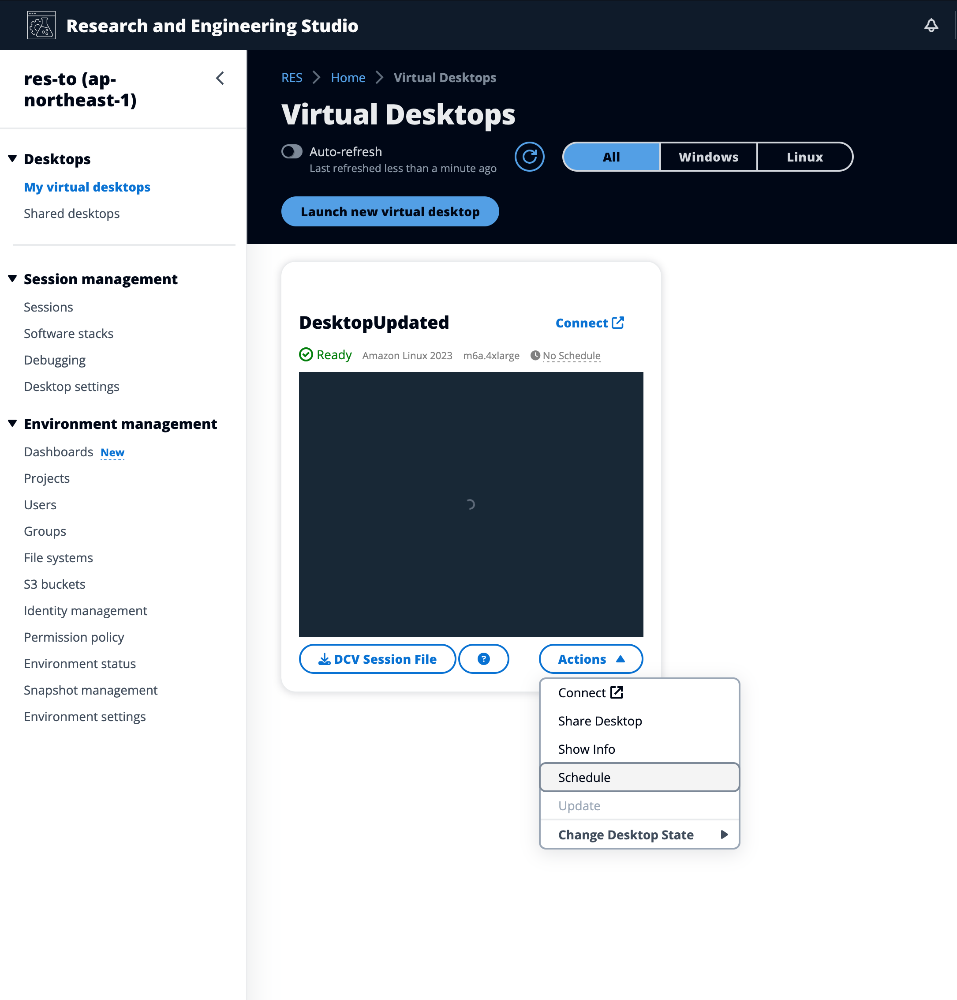
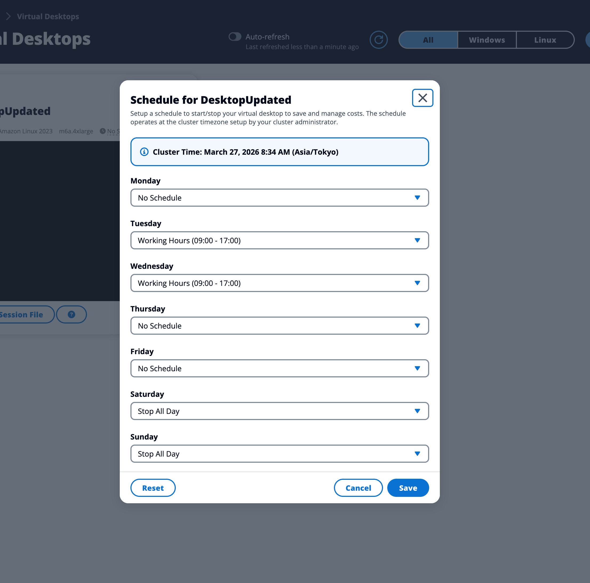

# Reset schedule to default

If you have customized the schedule for a virtual desktop, you can reset it
back to the system default schedule set by your administrator.

1. Select the virtual desktop session you want to reset.
2. Choose **Actions** >
   **Schedule**.

 3. Choose **Reset**.

 4. Choose **Save**.
