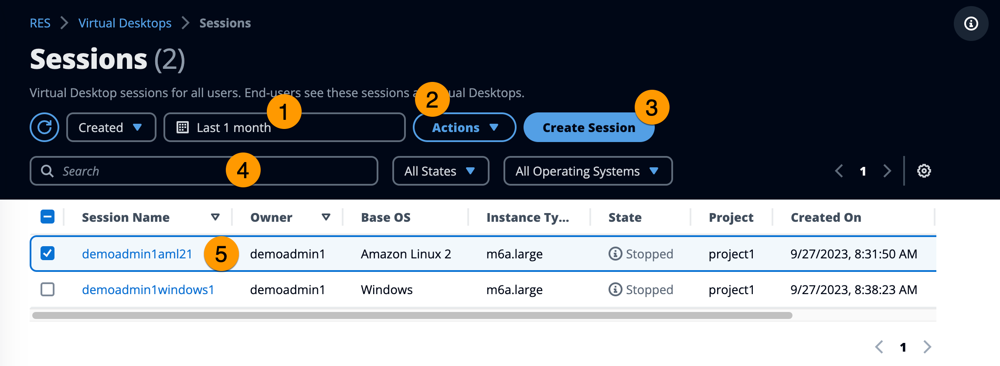
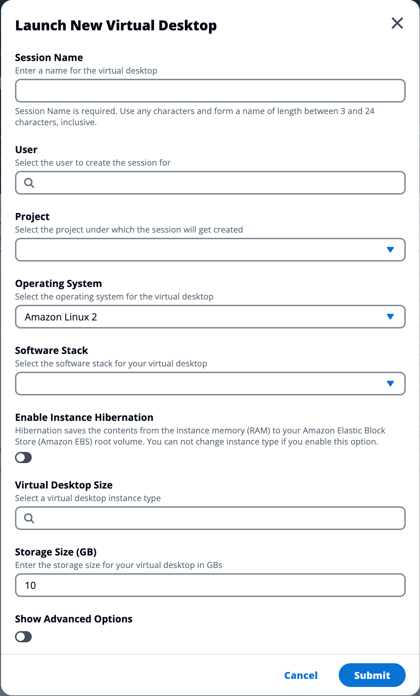
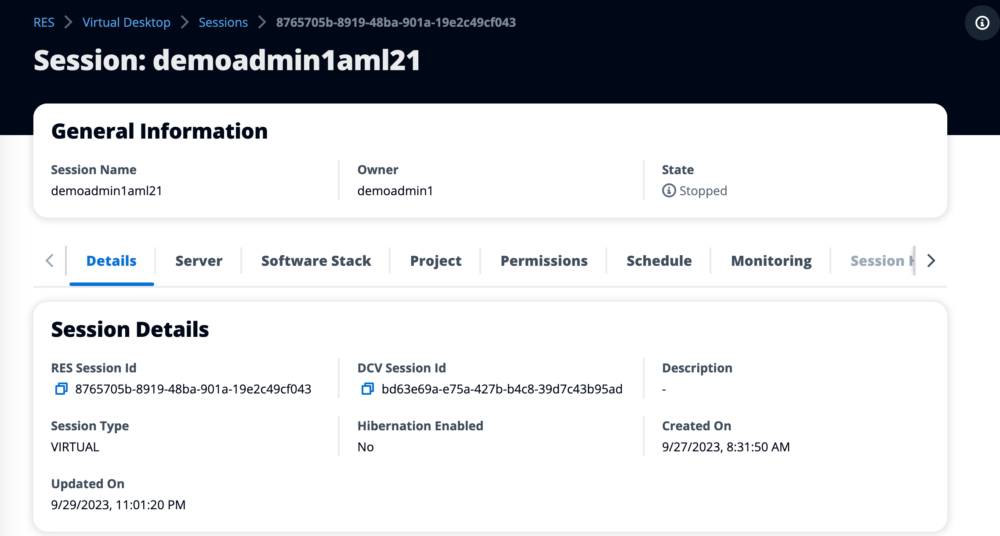

# Sessions

Sessions displays all virtual desktops created within Research and Engineering Studio.
From the Sessions page, you can filter and view session information or create a new session.

1. Use the menu to filter results by sessions created or updated within a specified
   time frame.
2. Select a session and use the Actions menu to:
   1. Resume Session(s)
   2. Stop/Hibernate Session(s)
   3. Force Stop/Hibernate Session(s)
   4. Terminate Session(s)
   5. Force Terminate Session(s)
   6. Session(s) Health
   7. Create Software Stack

3. Choose **Create Session** to create a new session.
4. Search for a session by name and filter by state and operating system.
5. Select the **Session Name** to view more details.

## Create a session

1. Choose **Create Session**. The Launch New Virtual
   Desktop modal opens.
2. Enter details for the new session.
3. (Optional.) Turn on **Show Advanced Options** to
   provide additional details such as subnet ID and DCV session type.
4. Choose **Submit**.

## Session details

From the **Sessions** list, select the **Session Name** to view session details.

