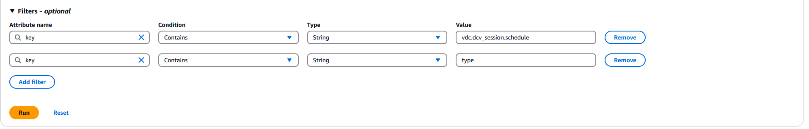

# Setting default schedules across the entire

environment

The default schedule can be updated in [DynamoDB](https://console.aws.amazon.com/dynamodbv2 "https://console.aws.amazon.com/dynamodbv2") :

1. Search for your environment's cluster settings table:
   ``<env-name>`.cluster-settings`.
2. Select **Explore Items**.
3. Under **Filters** enter the following two filters:

Filter 1

    * **Attribute name** = `key`
    * **Condition** = `Contains`
    * **Type** = `String`
    * **Value** = `vdc.dcv_session.schedule`

Filter 2

    * **Attribute name** = `key`
    * **Condition** = `Contains`
    * **Type** = `String`
    * **Value** = `type`

This will display seven entries which represent the default schedule types
for each day of the form `vdc.dcv_session.schedule.`<day>`.type`.
The valid values are:

    * `NO_SCHEDULE`
    * `STOP_ALL_DAY`
    * `START_ALL_DAY`
    * `WORKING_HOURS`
    * `CUSTOM_SCHEDULE`

4.  If `CUSTOM_SCHEDULE` is set, you must provide the customized
    start and stop times. To do this, use the following filter in the cluster-settings
    table:
    - **Attribute name** = `key`
    - **Condition** = `Contains`
    - **Type** = `String`
    - **Value** = `vdc.dcv_session.schedule`

5.  Search for the item formatted as
    `vdc.dcv_session.schedule.`<day>`.start_up_time`
    and `vdc.dcv_session.schedule.`<day>`.shut_down_time`
    for the respective days you want to set your custom schedule. Inside the item,
    delete the Null entry and replace it with a String entry as follows:

        * **Attribute name** = `value`
        * **Value** = ``<The time>``
        * **Type** = `String`

    The time value must be formatted as XX:XX using a 24 hour clock. For example,
    9am would be 09:00 while 5pm would be 17:00. The entered time always corresponds
    to the local time of the AWS region the RES environment is deployed in.
