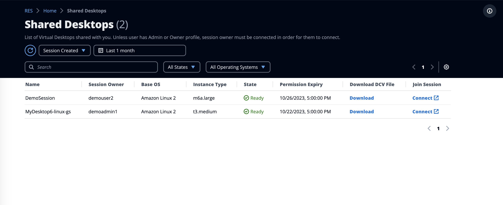

# Shared desktops

On Shared Desktops, you can see the desktops that have been shared with you. In order to
connect to a desktop, the session owner must be connected as well unless you are an Admin
or Owner.

While sharing a session, you can configure permissions for your collaborators. For example,
you can give read-only access to a teammate with whom you are collaborating.

###### Topics

- [Share a desktop](desktop-sharing.md "desktop-sharing.md")
- [Access a shared desktop](access-shared-desktop.md "access-shared-desktop.md")
