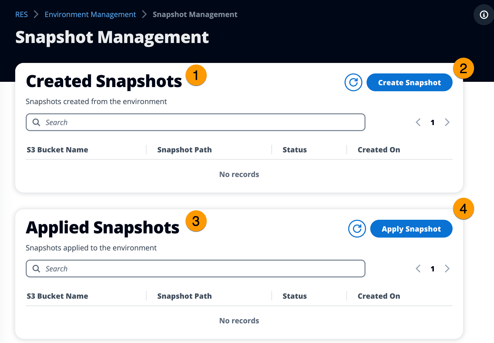

# Snapshot management

Snapshot management simplifies the process of saving and migrating data between environments,
ensuring consistency and accuracy. With snapshots, you can save your environment state and
migrate data into a new environment with the same state.

From the **Snapshot management** page, you can:

1. View all created snapshots and their status.
2. Create a snapshot. Before you can create a snapshot, you will need to create a
   bucket with the appropriate permissions.
3. View all applied snapshots and their status.
4. Apply a snapshot.

###### Topics

- [Create a snapshot](create-snapshot.md "create-snapshot.md")
- [Apply a snapshot](apply-snapshot.md "apply-snapshot.md")
