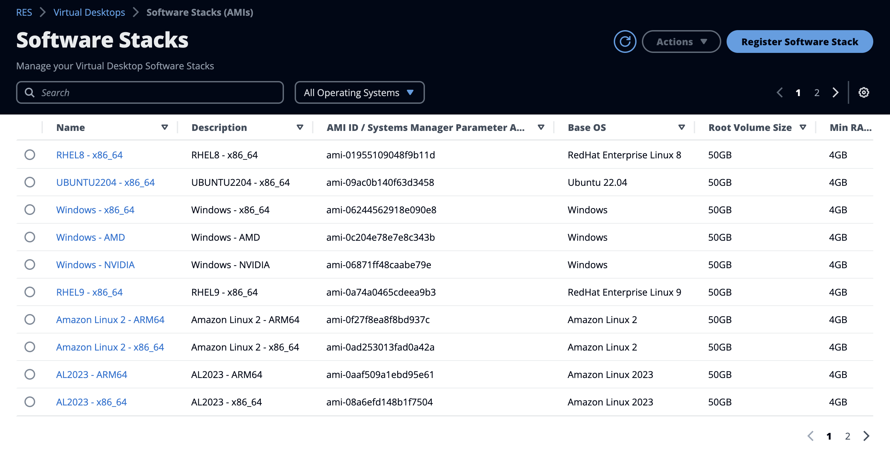
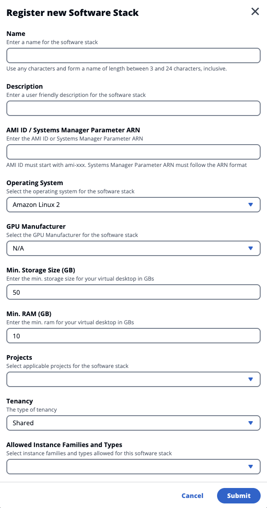
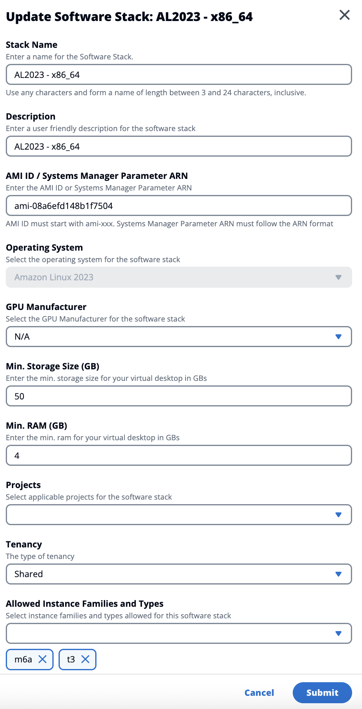
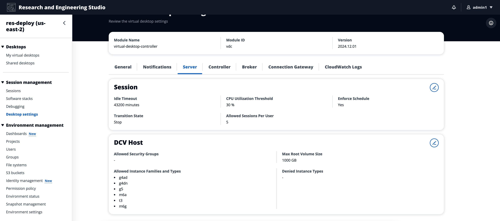
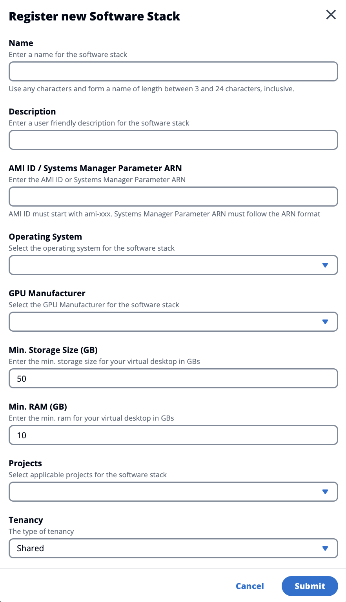
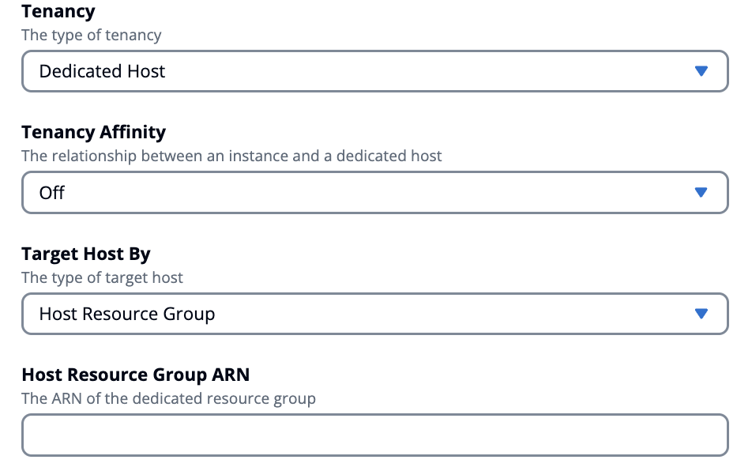
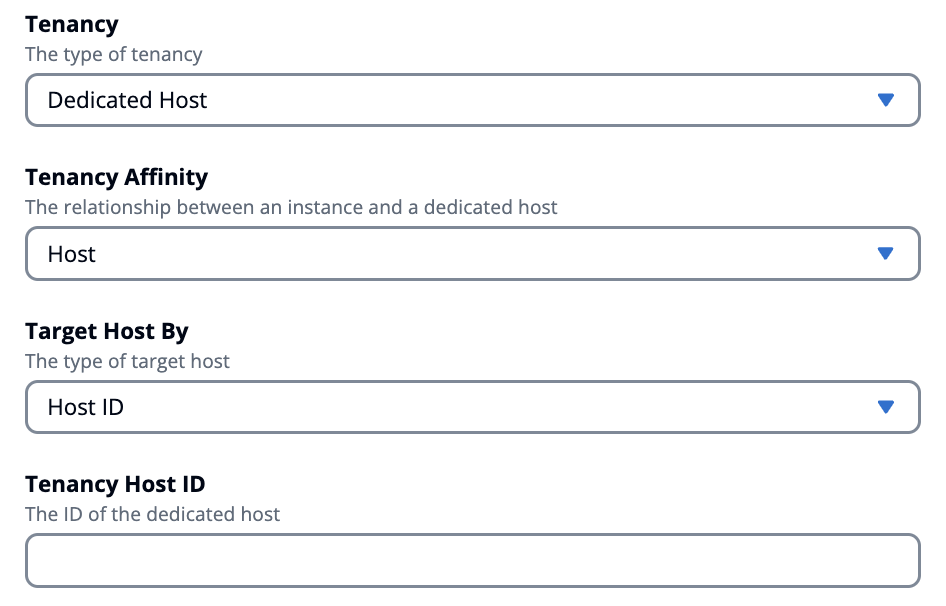
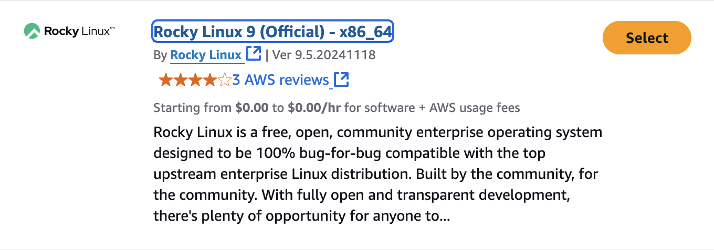
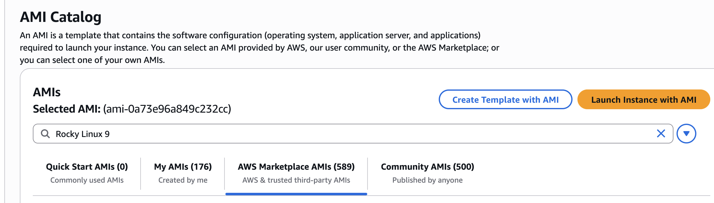

# Software Stacks (AMIs)

From the Software Stacks page, you can configure Amazon Machine Images (AMIs) or manage
existing ones.

1. To search for an existing software stack, use the operating system drop-down to
   filter by OS.
2. Select the name of a software stack to view details about the stack.
3. Choose the radio button next to a software stack, then use the **Actions**
   menu to edit the stack and assign the stack to a project.
4. Choose the **Register Software Stack** button to create a new stack.

## Register a new software stack

The **Register Software Stack** button lets you
create a new stack:

###### Note

You can use an unencrypted Systems Manager parameter as an alias for the software
stack ID.

The Systems Manager parameter will require the following tags for RES to access them:

- key: `res:EnvironmentName`, value: `<your RES environment name>`
- key: `res:ModuleName`, value: `virtual-desktop-controller`

1. Choose **Register Software Stack**.
2. Enter details for the new software stack.
3. Choose **Submit**.

## Assign a software stack to a project

When you create a new software stack, you can assign the stack to projects. But,
if you need to add the stack to a project after the initial creation, do the following:

###### Note

You can only assign software stacks to projects of which you are a member.

1. On the **Software Stacks** page, select the radio button for
   the software stack that you want to add to a project.
2. Choose **Actions**.
3. Choose **Edit**.
4. Use the **Projects** drop-down to select the
   project.

 5. Choose **Submit**.

You can also edit the software stack from the stack details page.

## Modify the software stack's VDI instance list

For each registered software stack, you can choose the allowed instance families and
types. The list of the options for each software stack is filtered by the options defined
in the **Desktop settings**. You can find and modify the global
**Allowed Instance Families and Types** there.

###### To edit the **Allowed Instance Families and Types** attribute

of a software stack:

1. On the **Software Stacks** page, choose the radio button for
   the software stack.
2. Choose **Actions**, then select **Edit Stack**.
3. Choose the desired instance families and types from the drop-down list under
   **Allowed Instance Families and Types**.

 4. Select **Submit**.

###### Note

If the global set of **Allowed Instance Families and Types** includes
an instance family and an instance type within that family (for example `t3` and
`t3.large`), the available options for the **Allowed Instance Families and
Types** attribute of a software stack will only include the instance family.

###### Important

- When an instance type/family is deleted from the Allow list at the environment
  level it should automatically be removed from all software stacks.
- Instance types/families that are added at the environment level are not
  automatically added to software stacks.

## View software stack details

From the **Software Stacks** page, select the software stack name to
view its details. You can also select the radio button for a software stack, choose
**Actions** and select **Edit** to edit the software stack.

## VDI tenancy support

When you register a new software stack or edit an existing software stack, you can select
the tenancy for the VDIs launched from this software stack. The following three tenancies
are supported:

- Shared (Default) - Run VDIs with shared hardware instances
- Dedicated Instance - Run VDIs with dedicated instances
- Dedicated Host - Run VDIs with a dedicated host

When you select the dedicated host tenancy type, you must also select the tenancy affinity
and the target host type. The following target host types are supported:

- Host Resource Group - Host resource group created in AWS License Manager
- Host ID - A specific host ID

To specify any self-managed licenses required by your VDIs when you launch them with
the dedicated host tenancy, associate the licenses with your AMI following [Associating self-managed licenses and AMIs](../../../license-manager/latest/userguide/license-rules.md#ami-associations "../../../license-manager/latest/userguide/license-rules.md#ami-associations") in the _AWS License
Manager User Guide_.

## Adding a Rocky Linux 9 software stack

RES does not have a default software stack for Rocky Linux 9, so this section offers
a recommendation on which Rocky AMI to use and how to use it.

1. Log into the AWS Console, and go to the [AMI Catalog page](https://console.aws.amazon.com/ec2/home#AMICatalog "https://console.aws.amazon.com/ec2/home#AMICatalog") within the EC2 Console.
2. Search for AMIs under the **AWS Marketplace** tab with
   the name **Rocky Linux 9**.
3. Select the AMI named **Rocky Linux 9 (Official) - x86_64**
   from **Rocky Linux**.

 4. Once selected, choose **Subscribe now**. 5. Scroll up, and copy the AMI Id for **Selected AMI**.

 6. Go to the RES portal, and register a new Software Stack under the
**Software Stacks** page using this AMI.
