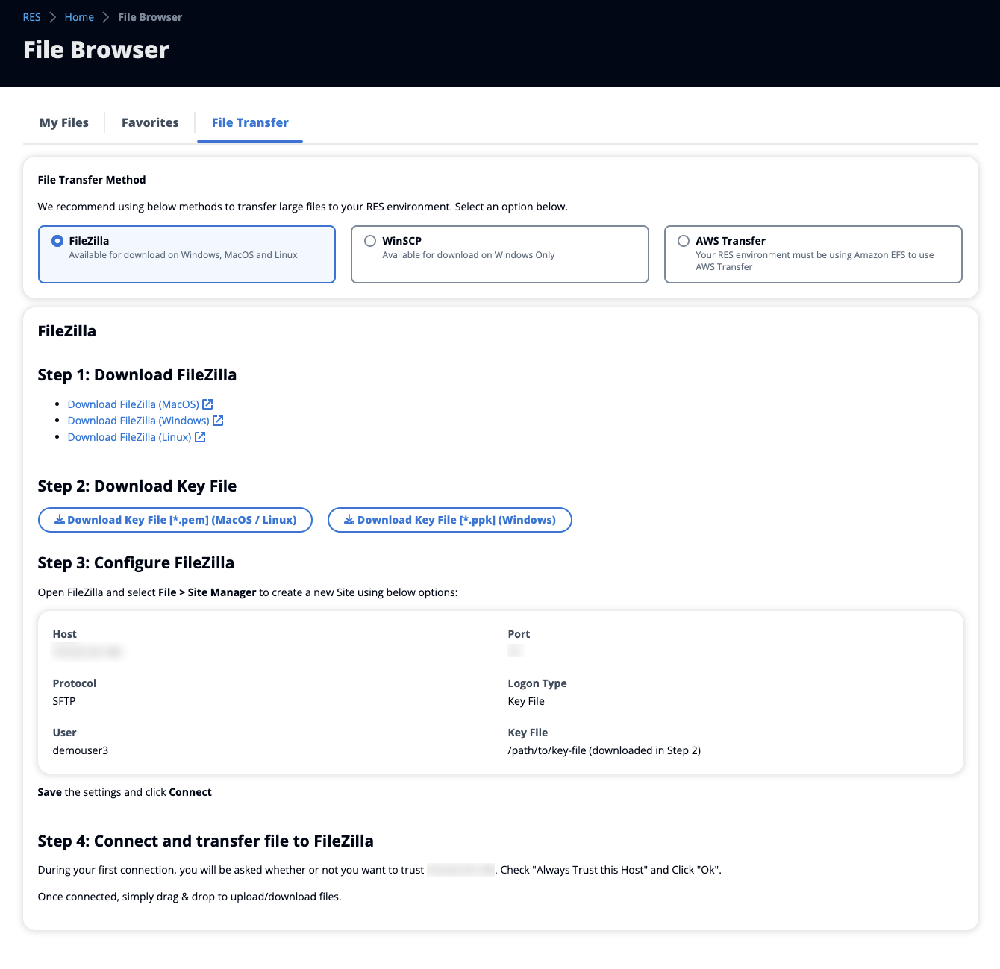

# Transfer files

Use File Transfer to use external file transfer applications to transfer files. You
can select from the following applications and follow the on-screen directions to transfer
files.

- FileZilla (Windows, MacOS, Linux)
- WinSCP (Windows)
- AWS Transfer for FTP (Amazon EFS)

