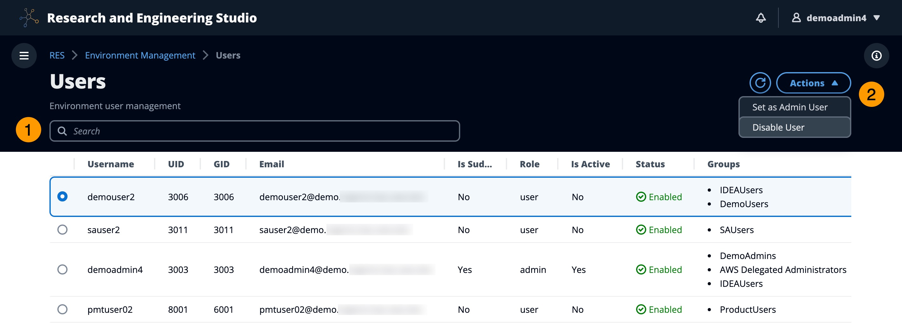

# Users

All users synced from your active directory will appear on the Users page. Users are
synced by the cluster-admin user during configuration of the product. For more information
on initial user configuration, see the [Configuration guide](configuration-guide.md "configuration-guide.md").

###### Note

Administrators can only create sessions for active users. By default, all users will
be in an inactive state until they sign in to the product environment. If a user is
inactive, ask them to sign in prior to creating a session for them.

From the **Users** page, you can:

1. Search for users.
2. When a username is selected, use the **Actions** menu to:
   1. Set as Admin user
   2. Disable user
