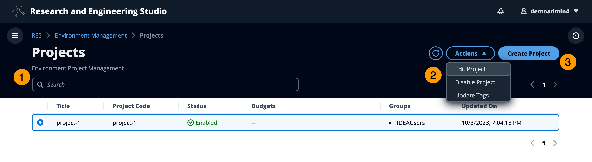

# View projects

The Projects dashboard provides a list of projects available to you. From the Projects
dashboard, you can:

1. You can use the search field to find projects.
2. When a project is selected, you can use the **Actions**
   menu to:
   1. Edit a project
   2. Disable or enable a project
   3. Update project tags
   4. Delete a project

3. You can choose **Create Project** to create a new
   project.
