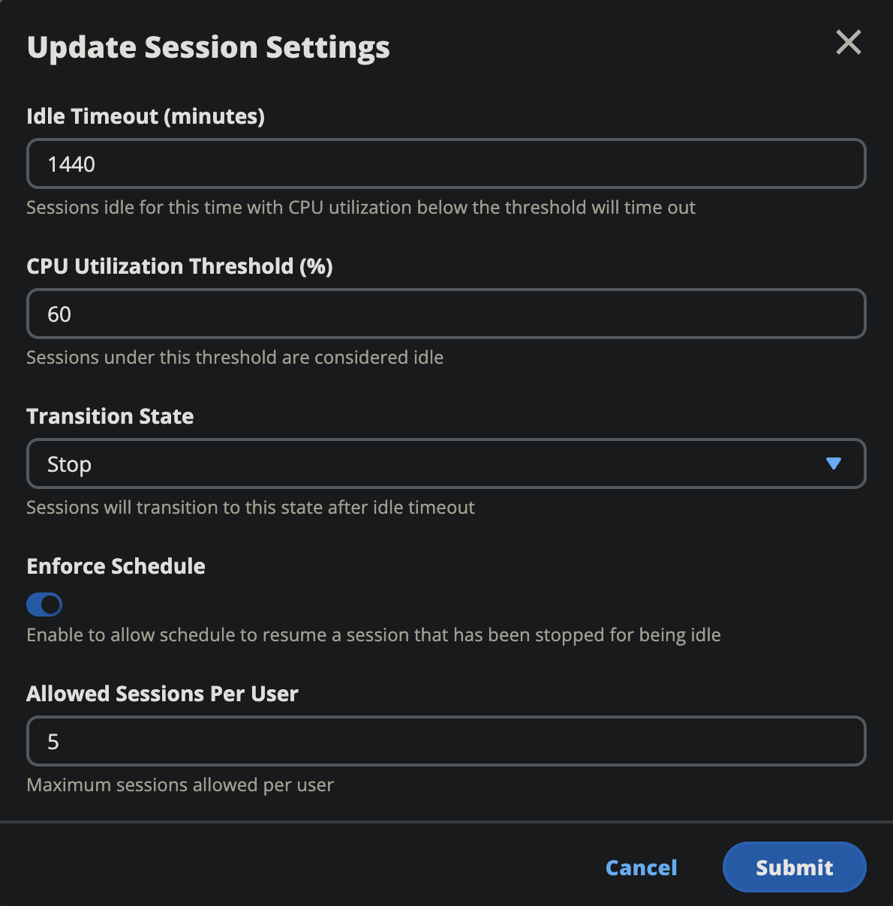

# Virtual desktop interface autostop

Administrators can configure settings to allow idle VDIs to be Stopped or Terminated.
There are 4 configurable settings:

1. Idle Timeout: Sessions idle for this time with CPU utilization below the threshold
   will time out.
2. CPU Utilization Threshold: Sessions with no interaction and under this threshold
   (vCPU usage) are considered idle. If this is set to 0, then sessions will never be
   considered idle.
3. Transition State: After idle timeout, sessions will transition to this state
   (stopped or terminated).
4. Enforce Schedule: If selected, a session that has been stopped for being idle can
   be resumed by its daily schedule.

These settings are present on the **Desktop Settings** page under the
**Server** tab. Once you update the settings according to your requirements,
click on **Submit** to save the settings. New sessions will use the updated
settings, but note that existing sessions will still use the settings which they had when
they were launched.

After they time out, sessions will either terminate or transition into the `STOPPED_IDLE`
state based on their configuration. Users will have the ability to start `STOPPED_IDLE`
sessions from the UI.
