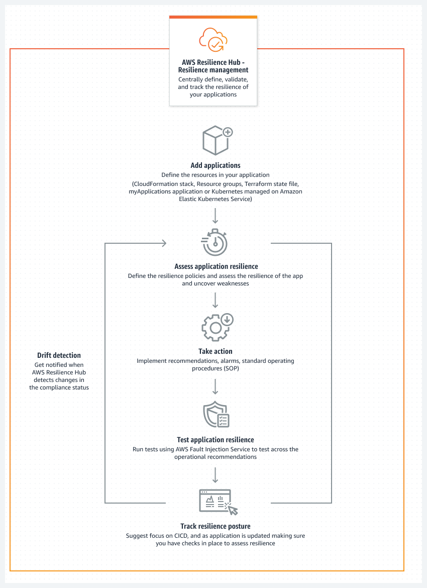

# AWS Resilience Hub – Resilience management

AWS Resilience Hub gives you a central place to define, validate, and track the resiliency of your
AWS application. AWS Resilience Hub helps you to protect your applications from disruptions, and reduce
recovery costs to optimize business continuity to help meet compliance and regulatory
requirements. You can use AWS Resilience Hub to do the following:

- Analyze your infrastructure and get recommendations to improve the resiliency of your
  applications. In addition to architectural guidance for improving your application resiliency,
  the recommendations provide code for meeting your resiliency policy, implementing tests,
  alarms, and standard operating procedures (SOPs) that you can deploy and run with your
  application in your integration and delivery (CI/CD) pipeline.
- Evaluate recovery time objective (RTO) and recovery point objective (RPO) targets under
  different conditions.
- Optimize business continuity while reducing recovery costs.
- Identify and resolve issues before they occur in production.
  After you deploy an application into production, you can add AWS Resilience Hub to your CI/CD
  pipeline to validate every build before it is released into production.

## How AWS Resilience Hub works

The following diagram provides a high-level outline of how AWS Resilience Hub works.

**Describe**

Describe your application by importing resources from AWS CloudFormation stacks, Terraform state
files, AWS Resource Groups, Amazon Elastic Kubernetes Service clusters, or you can choose from applications that are already
defined in myApplications.

**Define**

Define the resilience policies for your applications. These policies include RTO and RPO
targets for applications, infrastructure, Availability Zone, and Region disruptions. These
targets are used to estimate whether the application meets the resiliency policy.

**Assess**

After you describe your application and attach a resiliency policy to it, run a
resiliency assessment. The AWS Resilience Hub assessment uses best practices from the AWS
Well-Architected Framework to analyze the components of an application and uncover potential
resilience weaknesses. These weaknesses can be caused by incomplete infrastructure setup,
misconfiguration, or situations where additional configuration improvements are needed. To
improve resiliency, update your application and resiliency policy according to the
recommendations from the assessment report. Recommendations include configurations of
components, alarms, tests, and recovery SOPs. Then, you can run another assessment and
compare the results with the previous report to see how much resiliency improves. Reiterate
this process until your estimated workload RTO and estimated workload RPO meets your RTO and
RPO targets.

**Validate**

Run tests to measure the resiliency of your AWS resources and the amount of time it
takes to recover from application, infrastructure, Availability Zone, and AWS Region
incidents. To measure resiliency, these tests simulate outages of your AWS resources.
Examples of outages include network unavailable errors, failovers, stopped processes, Amazon RDS
boot recovery, and problems with your Availability Zone.

**View and track**

After you deploy an AWS application into production, you can use AWS Resilience Hub to continue
tracking the resiliency posture of the application. If an outage occurs, the operator can
view the outage in AWS Resilience Hub and launch the associated recovery process.
