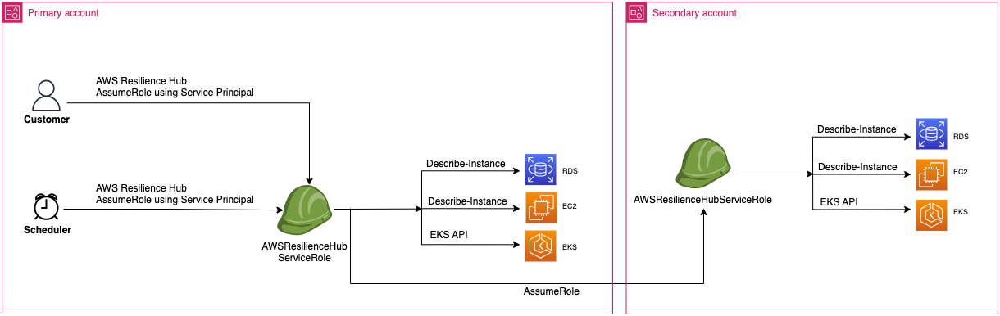

# Enabling AWS Resilience Hub access to your Amazon Elastic Kubernetes Service

cluster

AWS Resilience Hub assesses the resiliency of an Amazon Elastic Kubernetes Service (Amazon EKS) cluster by analyzing the
infrastructure of your Amazon EKS cluster. AWS Resilience Hub uses Kubernetes role-based access
control (RBAC) configuration to assess other Kubernetes (K8s) workload, which are
deployed as a part of the Amazon EKS cluster. For AWS Resilience Hub to query your Amazon EKS cluster
for analyzing and assessing the workload, you must complete the following:

- Create or use an existing AWS Identity and Access Management (IAM) role in the same account as
  the Amazon EKS cluster.
- Enable IAM user and role access to your Amazon EKS cluster and grant
  additional read-only permissions to K8s resources inside the Amazon EKS cluster.
  For more information about enabling IAM user and role access to your Amazon EKS
  cluster, see [Enabling IAM user and role access to your cluster - Amazon
  EKS](../../../eks/latest/userguide/add-user-role.md "../../../eks/latest/userguide/add-user-role.md").
  Access to your Amazon EKS cluster using IAM entities are enabled by the [AWS
  IAM Authenticator for Kubernetes](https://github.com/kubernetes-sigs/aws-iam-authenticator#readme "https://github.com/kubernetes-sigs/aws-iam-authenticator#readme"), which runs on the Amazon EKS control
  plane. The Authenticator obtains the configuration information from `aws-auth
 ConfigMap`.

###### Note

- For more information about all the `aws-auth ConfigMap`
  settings, see [Full Configuration Format](https://github.com/kubernetes-sigs/aws-iam-authenticator#full-configuration-format "https://github.com/kubernetes-sigs/aws-iam-authenticator#full-configuration-format") on GitHub.
- For more information about different IAM identities, see [Identities (Users, Groups, and Roles)](../../../IAM/latest/UserGuide/id.md "../../../IAM/latest/UserGuide/id.md") in the IAM User
  Guide.
- For more information about Kubernetes role-based access control (RBAC)
  configuration, see [Using RBAC Authorization](https://kubernetes.io/docs/reference/access-authn-authz/rbac/ "https://kubernetes.io/docs/reference/access-authn-authz/rbac/").
  AWS Resilience Hub queries resources inside your Amazon EKS cluster using an IAM role in your
  account. For AWS Resilience Hub to access resources within your Amazon EKS cluster, the IAM role
  used by AWS Resilience Hub must be mapped to a Kubernetes group with sufficient read-only
  permissions to resources inside your Amazon EKS cluster.

AWS Resilience Hub allows to access your Amazon EKS cluster resources by using one of the
following IAM role options:

- If your application is configured to use role-based access for accessing
  resources, the invoker role or secondary account role passed to AWS Resilience Hub
  while creating an application will be used for accessing your Amazon EKS cluster
  during assessment.

The following conceptual diagram shows how AWS Resilience Hub accesses Amazon EKS
clusters when the application is configured as a role-based
application.

- If your application is configured to use the current IAM user for
  accessing resource, you must create a new IAM role with the name
  `AwsResilienceHubAssessmentEKSAccessRole` in the same account
  as that of the Amazon EKS cluster. This IAM role will then be used for
  accessing your Amazon EKS cluster.

The following conceptual diagram shows how AWS Resilience Hub accesses Amazon EKS
clusters deployed in your primary account when the application is configured
to use the current IAM user permissions.

The following conceptual diagram shows how AWS Resilience Hub accesses Amazon EKS
clusters deployed on a secondary account when the application is configured
to use the current IAM user permissions.

