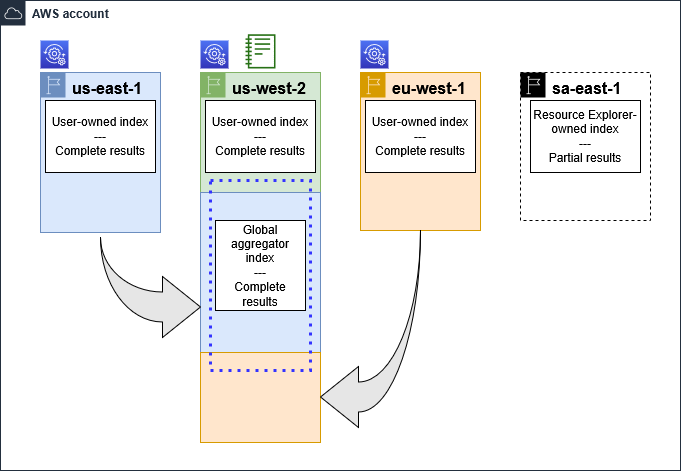

AWS Resource Explorer now provides immediate access to resource search and
discovery capabilities in a Region. With this launch, you no longer need to activate
Resource Explorer to discover your resources. [Learn more](manage-immediate-resource-discovery-experience.md "manage-immediate-resource-discovery-experience.md")

# Enabling cross-Region search by creating an

aggregator index

With cross-region search enabled, you can search for resources across all of the Regions
in your AWS account.

###### Topics

- [About the aggregator index](#manage-aggregator-region-about "#manage-aggregator-region-about")
- [Promoting a local index to be the
  aggregator index for the account](manage-aggregator-region-turn-on.md "manage-aggregator-region-turn-on.md")
- [Demoting the aggregator index to a local
  index](manage-aggregator-region-turn-off.md "manage-aggregator-region-turn-off.md")

## About the aggregator index

AWS Resource Explorer stores the information it collects about the resources in an AWS Region
to a _user-owned (local) index_ that Resource Explorer creates and
maintains in that Region. For example, assume that you have an Amazon EC2 instance in the
US West (Oregon) Region. Resource Explorer stores the details about that resource in the
user-owned (local) index in the US West (Oregon) Region.

To support searching for resources across all AWS Regions in your account, you can
convert the user-owned (local) index in _one_ Region to
be the aggregator index for your account.

Resource Explorer automatically creates user-owned indexes when users with appropriate
permissions perform search operations in a Region. This automatic creation occurs when
users have both, at minimum, the permissions in the `AWSResourceExplorerReadOnlyAccess` managed policy and the
`iam:CreateServiceLinkedRole` permission, or when the service-linked role
already exists in the account and users have search permissions.

The aggregator index contains a replicated copy of the user-owned (local) index in every
other Region where you have a user-owned index for Resource Explorer. This lets you create views in
the Region that contains the aggregator index whose results can include resources from all
AWS Regions in the account.

The following diagram shows an example of how the aggregator index works. In this example
AWS account, the administrator does the following:

- Completes setup of Resource Explorer in three AWS Regions (`us-east-1`,
  `us-west-2`, and `eu-west-1`) by searching in or
  directly creating indexes in those Regions. Each Region contains its own
  user-owned (local) index.
- Does not create a user-owned index in the `sa-east-1` Region.
  Resources from `sa-east-1` will not appear in cross-region search
  results from other Regions.
- Creates the aggregator index for the account in the `us-west-2` Region.
  This causes Resource Explorer to replicate information from the user-owned (local) indexes
  in all other Regions where Resource Explorer where a user-owned (local) index exists. This
  allows searches performed in `us-west-2` to include resources from
  all three Regions in which Resource Explorer setup is complete.

This configuration means that a user can perform cross-Region searches in **_only_**
`us-west-2`, which contains the aggregator index. Only views from that Region can
return results from all Regions in the account.

|                                                                                        |
| -------------------------------------------------------------------------------------- | ------------------------------------------------------------------------------------------------------------------------------------------------------------------------------------------------------------------------------------------------------------------------------------------------------------------------------------------------------------------------------------------------- |
| **Legend**                                                                             |
| Gear icon with magnifying glass, representing system configuration or search settings. | Resource Explorer is set up with a user-owned (local) index in this AWS Region. Information about the Region's resources is stored in a local index in that Region. Every Region's user-owned (local) index is also replicated (indicated by the arrows) to the Region that contains the aggregator index.                                                                |
| Notebook icon representing a document or file with lined pages.                        | The index in this AWS Region is configured to be the aggregator index for the account. Resource Explorer replicates the resource information collected in the user-owned (local) indexes of all other Regions into the aggregator index in this Region. Searches made in this Region can include results from all Regions with user-owned (local) indexes in the account. |
| Blue square border with white interior, representing a placeholder for an image.       | The default view created by \*_Quick Setup_ • includes all resources in all AWS Regions with user-owned (local) indexes.                                                                                                                                                                                                                                                              |
