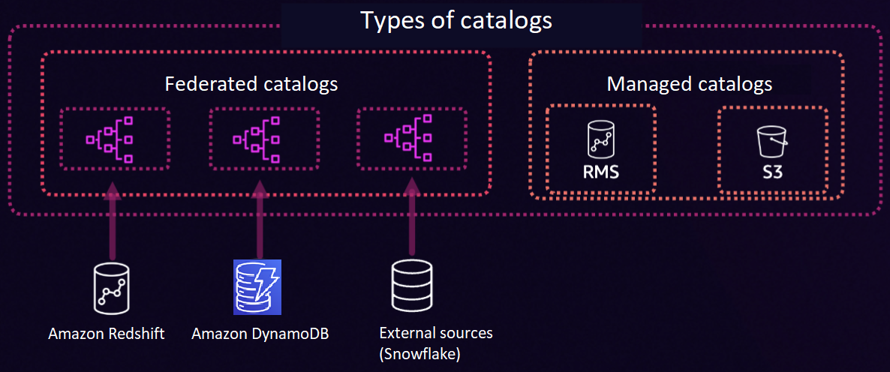
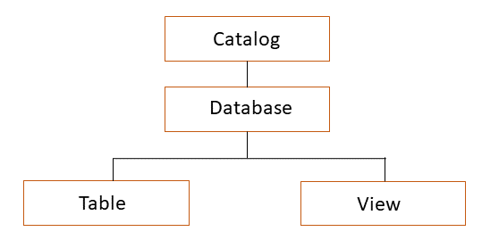

# Key components of the lakehouse architecture of Amazon SageMaker

The lakehouse architecture has the following key components, in addition to the components of AWS Glue Data Catalog and AWS Lake Formation.

**Storage**

You can read and write data into Amazon S3 or Redshift Managed Storage (RMS) based on the
storage type you choose to store data in the lakehouse.

**Catalog**

A catalog is a logical container that organizes objects from a data store, such as
schemas, tables, views, or materialized views such as from Amazon Redshift. You can create nested
catalogs to mirror the hierarchical structure of your data sources within the lakehouse architecture.

There are two types of catalogs in Lakehouse: federated catalogs and managed
catalogs. A federated catalog mounts existing data sources you add to the lakehouse. A
federated catalog can bring existing data in data sources such as Amazon Redshift, Amazon DynamoDB, and
Snowflake. A managed catalog refers to a new catalog you create using Lakehouse. A
managed catalog manages data using RMS or S3, as shown in the following diagram.

**Database**

Databases organize metadata tables in a catalog in the lakehouse architecture.

**Table/View**

Tables and views are database objects that define how to access and represent the
underlying data. They specify details such as schema, partitions, storage location,
storage format, and the SQL query required to access the data.

The following is a diagram of how catalogs, databases, tables/views work in
Lakehouse.

