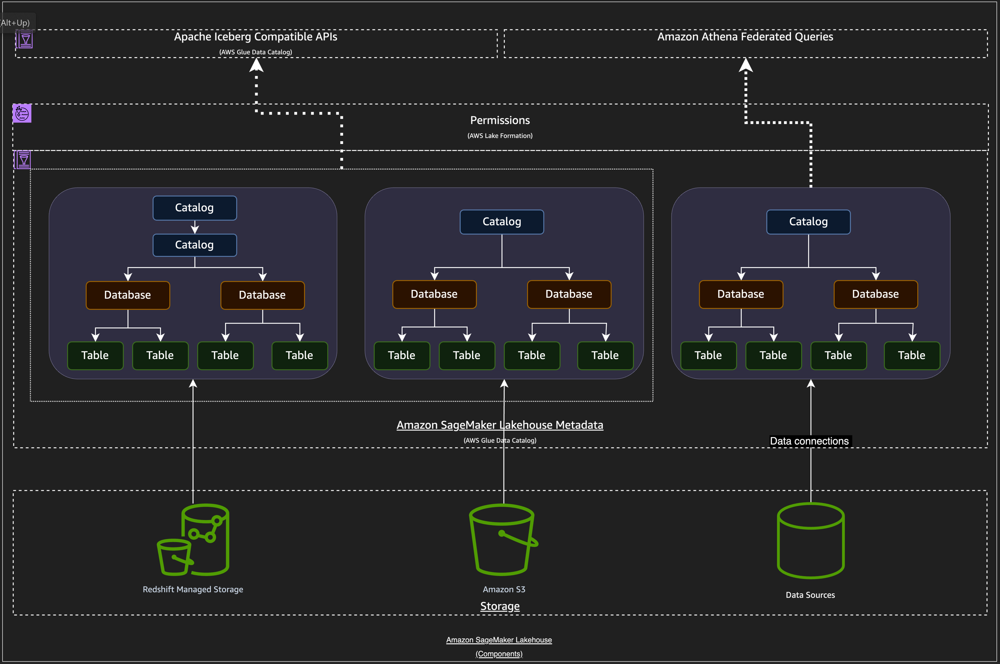

# How the lakehouse architecture of Amazon SageMaker works

The lakehouse architecture organizes data from various sources into catalogs. Each catalog represents data from existing sources like Amazon Redshift data
warehouses, Amazon S3 data lakes, databases, or business applications. You can also create new
catalogs in the lakehouse to store data in S3 or Redshift Managed Storage (RMS). Additionally, these catalogs are mounted as databases in Amazon Redshift, so you can connect and analyze your lakehouse data using SQL tools.

You can access the data as Apache Iceberg tables and query it using analytics engines that are integrated with the lakehouse architecture. These include Amazon Athena, Amazon Redshift Spectrum, Spark in Amazon EMR and AWS Glue 5.0 ETL, Amazon SageMaker Unified Studio, and other Iceberg compatible engines.

The lakehouse architecture is built on AWS Glue Data Catalog and AWS Lake Formation in your AWS account. With the lakehouse architecture, you
can access and query your existing data in Amazon Redshift data warehouses and store new data in RMS from
any Apache Iceberg compatible engine.

The following diagram shows how the lakehouse architecture works.

