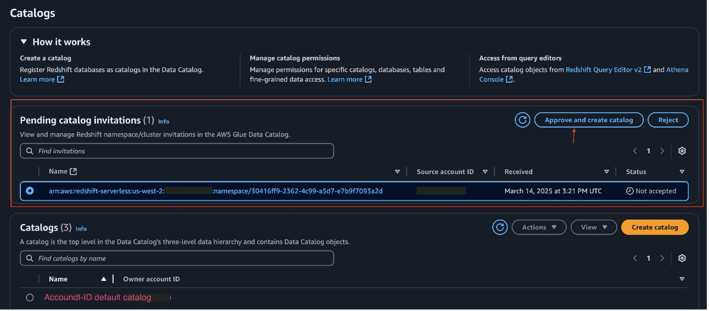
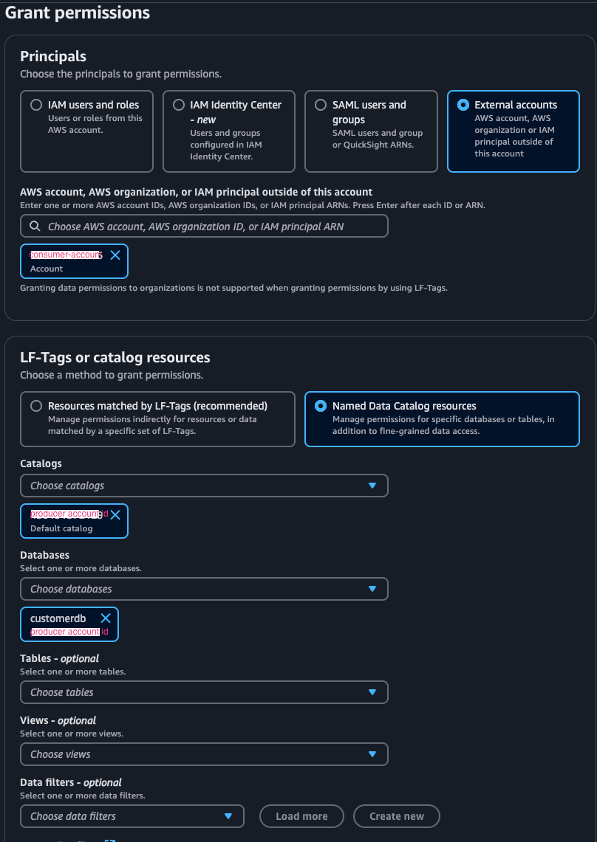

# Configure account A

In account A, configure the catalog, grant permissions to account B, and register the
object storage location with fine-grained permissions. You can use either your IAM
administrator role (added as administrator) or a role with the permissions described in the
prerequisites.

## Configure your catalog

To configure your catalog in account A:

1. Log in to the [AWS Management Console](https://aws.amazon.com/console/ "https://aws.amazon.com/console/") as an
   administrator.
2. Open the Amazon Redshift console, [register your Amazon Redshift clusters and namespaces](../../../redshift/latest/dg/iceberg-integration-register.md "../../../redshift/latest/dg/iceberg-integration-register.md") to the Data Catalog.
3. After the registration is initiated, you will see an invite from Amazon Redshift on the Lake Formation console.
4. Select the pending catalog invitation and choose **Approve and create catalog**.

 5. On the **Set catalog details** page, configure your
catalog:

    1. For **Name**, enter a name.
    2. Select **Access this catalog from Apache Iceberg compatible
     engines**.
    3. Choose the IAM role you created for the data transfer and choose **Next**.

6. On the **Grant permissions – optional** page, choose
   **Add permissions**.
   1. For **IAM users and roles**, choose **Admin**
   2. For **Catalog permissions**, grant **Super user** to
      catalog permissions and grantable permissions.
   3. Choose **Add**.

7. Review the details on the **Review and create** page and
   choose **Create catalog**.
8. Verify that the catalog is created.
9. Explore the catalog detail page to verify the database and table structure.
10. On the database **View** dropdown menu, view the table and verify that
    the table shows up.

###### Note

As the **Admin** role, you can also query the table in [Amazon Athena](http://aws.amazon.com/athena "http://aws.amazon.com/athena") and confirm that the data
is available.

## Grant permissions on the tables from account A to

account B

Share the data warehouse federated catalog database and table, as well as the object
storage-based Iceberg table and its database from the default catalog to account B.

###### Note

You cannot share the entire catalog to external accounts as a catalog-level permission;
you can only share the database and table.

To grant permissions:

1. On the Lake Formation console, choose **Data permissions** in the navigation pane.
2. Choose **Grant**.
3. Under **Principals**, select **External accounts** and
   provide the account ID of account B.
4. Under **LF-Tags or catalog resources**, select **Named Data Catalog resources**.
5. For **Catalogs**, choose the account ID that represents the default catalog.
6. For **Databases**, choose the database you want to share
   (for example, `customerdb`).

 7. Under **Database permissions**, select **Describe** under both **Database permissions** and **Grantable permissions**. 8. Choose **Grant**. 9. Repeat these steps to grant table-level **Select** and
**Describe** permissions on the tables you want to share. 10. Repeat these steps again to grant database and table level permissions for the
federated catalog database. 11. Choose **Data permissions** in the navigation pane and verify
that account B has been granted database and table level permissions for both tables
from the federated catalog and from the default catalog.

## Register the Amazon S3 location

Register the object storage-based Iceberg table data location with fine-grained permissions
so that it can be managed by permissions.

1. On the Lake Formation console, choose **Data lake locations** in the navigation pane.
2. Choose **Register location**.
3. For **Amazon S3 path**, enter the path for your storage bucket that contains
   the Iceberg table data.
4. For **IAM role**, provide the user-defined role
   `LakeFormationS3Registration_custom` that you created
   as a prerequisite.
5. For **Permission mode**, choose **Lake Formation**. Choose
   **Register location**.
6. Choose **Data lake locations** in the navigation pane to
   verify the S3 registration.
