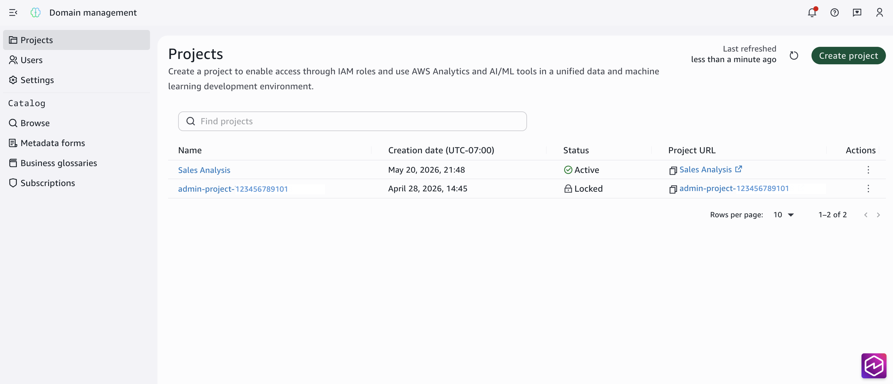

# Domain administration for Identity Center-based domains

The domain administration page in Amazon SageMaker Unified Studio provides administrators with
centralized management capabilities for domains, projects, and settings. Domain
administrators can create and manage projects, configure domain-level settings including
networking, and manage users and permissions.

Access to the domain administration page is restricted to domain users with the
designation Administrator. The IAM role used to create the domain will have this
designation by default and access to the domain administration page.

1. Log in to your Amazon SageMaker Unified Studio Identity Center-based domain.
2. From the Amazon SageMaker Unified Studio left navigation, choose **Domain
   management**.
   From the domain administration page, you can access:

- **Projects** — Manage existing projects and
  create new projects
- **Users** — Manage user access and
  permissions
- **Settings** — Configure network settings and
  account associations

###### Topics

- [Set up projects within an Identity Center-based domain](setup-projects-idc-based-domains.md "setup-projects-idc-based-domains.md")
- [View and manage project details](view-manage-project-details-idc.md "view-manage-project-details-idc.md")
- [Edit project configuration](edit-project-configuration-idc.md "edit-project-configuration-idc.md")
- [Delete a project](delete-project-idc.md "delete-project-idc.md")
