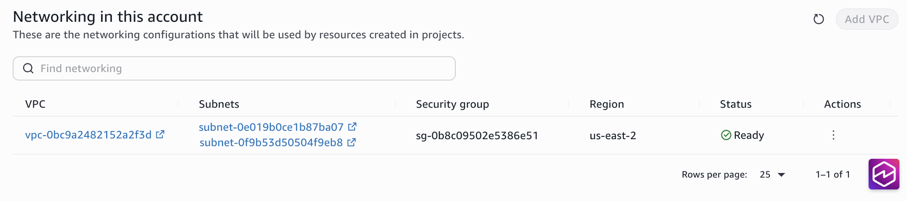

# View VPC networking details

After configuring VPC networking for your Amazon SageMaker Unified Studio domain, you can view the VPC and
subnet details from the domain settings. This information shows the current networking
configuration that will be used by projects and compute resources.

## View VPC configuration

To view VPC configurations, complete the following steps:

1. From the domain administration page, choose **Settings** in the
   left navigation pane.
2. In the **Networking** section, review the configured VPC
   details:

   - VPC - Shows the VPC ID and provides a link to view the VPC in the Amazon VPC
     console
   - Subnets - Lists all configured subnets with links to view each subnet in the
     Amazon VPC console
   - Security group - The security group that was either chosen at the time the VPC
     configuration was saved or the security group that was automatically created if one
     was not provided at the time the VPC configuration was saved.
   - Region - The Region where the VPC exists. Projects created in the same Region
     will use this VPC.
   - Status - The status of the VPC configuration. A status of Ready means the VPC
     will apply to projects.

3. To view additional VPC configuration details, choose the VPC ID link to open the
   Amazon VPC console.
4. To view subnet configuration details, choose any subnet ID link to open the specific
   subnet in the Amazon VPC console.
