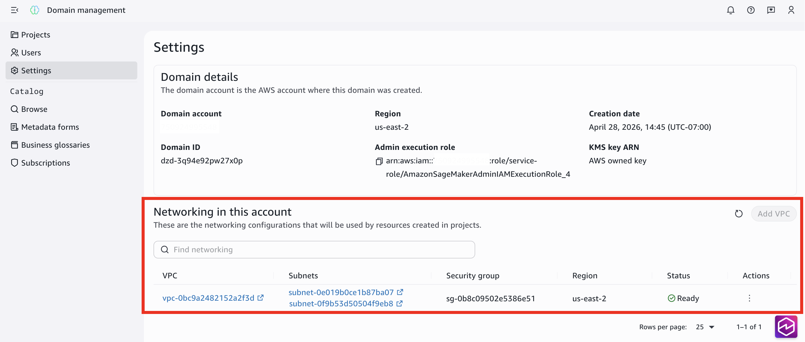

# Configure VPC Networking for Amazon SageMaker Unified Studio Domain

Amazon Virtual Private Cloud (Amazon VPC) networking with subnets is required when using
certain compute services within Amazon SageMaker Unified Studio. You configure VPC networking at the domain
level to provide network isolation and connectivity for compute resources, database
connections, and other AWS services.

###### Topics

- [Network settings](configure-vpc-networking-iam-based-domains.md "configure-vpc-networking-iam-based-domains.md")
- [Update VPC configuration and projects](update-individual-projects-vpc.md "update-individual-projects-vpc.md")
- [View VPC networking details](view-vpc-networking-details.md "view-vpc-networking-details.md")
