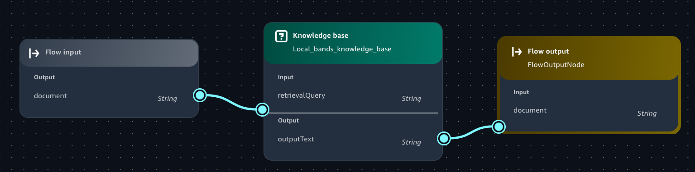

# Add a Knowledge Base component to a flow app

In this procedure, you add a Knowledge Base component to an existing [flow app](create-flows-app.md "create-flows-app.md").

1. Navigate to the Amazon SageMaker Unified Studio landing page by using the URL from your administrator.
2. Access Amazon SageMaker Unified Studio using your IAM or single sign-on (SSO) credentials. For more information, see [Access Amazon SageMaker Unified Studio](getting-started-access-the-portal.md "getting-started-access-the-portal.md").
3. From the project selector dropdown at the top of the page, choose the project that you want to use.
4. In the left navigation pane, under **Generative AI**, choose **AI apps**.
5. In **Apps** choose the flow app that you want to add the knowledge base component to.
6. In the **Flow app builder** pane, select the
   **Nodes** tab.
7. From the **Data** section, drag a **Knowledge Base**
   node onto the flow builder canvas.
8. The circles on the nodes are connection points. Draw a line from the circle on the
   upstream node (such as the **Flow input** node) to the circle on the **Input** section
   of the Knowledge Base node that you just added.
9. Connect the **Output** of the Knowledge Base node to the downstream node that you
   want the Knowledge Base to send its output to. The flow should look similar to the following image:

 10. In the the flow builder, select the Knowledge Base node that you just added. 11. In the **flow
builder** pane, choose the **Configure** tab and do the following:

    1. For **Node name**, enter a name for the Knowledge Base node.
    2. For **Select Knowledge Base** in the **Knowledge Base
     Details** section, select the Knowledge Base that you just created.
    3. For **Select response generation model**, select the
     model that you want the Knowledge Base to generate responses with.
    4. (Optional) In **Select guardrail** select an existing
     guardrail. For more information, see [Safeguard your Amazon Bedrock app with a guardrail](guardrails.md "guardrails.md").

12. Choose **Save** to save your changes.
