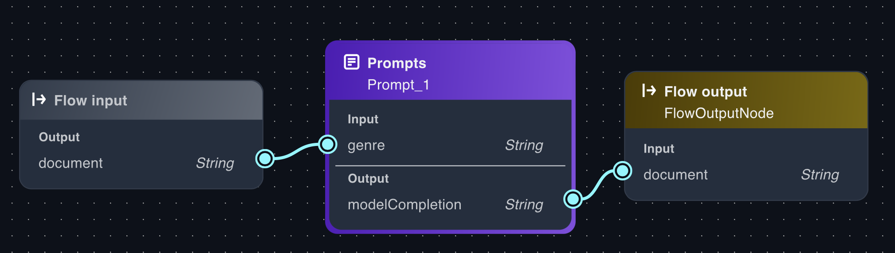

# Add an Amazon Bedrock prompt to a flow app

In this procedure, you add a prompt to an existing [flow app](create-flows-app.md "create-flows-app.md").

###### To add a prompt to a flow app

1. Navigate to the Amazon SageMaker Unified Studio landing page by using the URL from your administrator.
2. Access Amazon SageMaker Unified Studio using your IAM or single sign-on (SSO) credentials. For more information, see [Access Amazon SageMaker Unified Studio](getting-started-access-the-portal.md "getting-started-access-the-portal.md").
3. If the project that you want to use isn't already open, do the following:
   1. Choose the current project at the top of the page. If a project isn't already open, choose **Select a project**.
   2. Select **Browse all projects**.
   3. In **Projects** select the project that you want
      to use.

4. Choose the **Build** menu option at the top of the page.
5. In **MACHINE LEARNING & GENERATIVE AI** choose **My apps**.
6. In **Apps** choose the flow app that you want to add the prompt to.
7. In the **flow builder** pane, select the
   **Nodes** tab.
8. From the **Orchestration** section, drag a **Prompt**
   node onto the flow builder canvas.
9. In the the flow builder, select the Prompt node that you just added.
10. In the **flow
    builder** pane, choose the **Configure** tab and do the following:
    1. For **Node name**, enter a name for the Prompt node.
    2. For **Prompt** in the **Prompt details** section, select the prompt that you want to add.
    3. For **Version**, select the
       version of the prompt that you want to add.
    4. (Optional) In **Select guardrail** select an existing
       guardrail. For more information, see [Safeguard your Amazon Bedrock app with a guardrail](guardrails.md "guardrails.md").
    5. If you want to identify specific data from the upstream node that the prompt should
       use, change the value in **Expression**. For more information, see [Define inputs with expressions](flows-expressions.md "flows-expressions.md").

11. The circles on the nodes are connection points. For each variable, draw a line from the circle on the
    upstream node (such as the **Flow input** node) to the circle for the variable in the **Input** section
    of the prompt node.
12. Connect the **Output** of the prompt node to the downstream node that you
    want the prompt to send its output to. The flow should look similar to the following image:

 13. Choose **Save** to save your changes.
