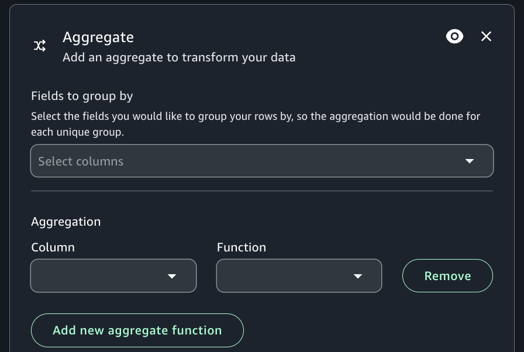

# Aggregate transform

You may use the Aggregate transform to perform summary calculations on selected
fields.

###### To use the Aggregate transform

1. Add the Aggregate node to the visual job diagram.
2. (Optional) Click on the rename node icon to enter a new name for the node in the job
   diagram.
3. On the Node properties view, choose the "fields to group by", selecting the
   drop-down field (optional). You can select more than one field at a time or search for a
   field name by typing in the search bar.

When fields are selected, the name and datatype are shown. To remove a field, click
'X' on the field. 4. Choose Aggregate another column. It is required to select at least one field. 5. Choose a field in the Field to aggregate drop-down. 6. Choose the aggregation function to apply to the chosen field:

    * avg - calculates the average
    * count - calculates the number of non-null values
    * max - returns the highest value that satisfies the 'group by' criteria
    * min - returns the lowest value that satisfies the 'group by' criteria
    * sum - the sum of all values in the group

